# Go语言的核心特性

Go语言，作为编程语言的后生，站在巨人的肩膀上，吸收了其他一些编程语言的特点。

Go 编程语言是一个开源项目，它使程序员更具生产力。Go 语言具有很强的表达能力，它简洁、清晰而高效。得益于其并发机制， 用它编写的程序能够非常有效地利用多核与联网的计算机，其新颖的类型系统则使程序结构变得灵活而模块化。 Go 代码编译成机器码不仅非常迅速，还具有方便的垃圾收集机制和强大的运行时反射机制。 它是一个快速的、静态类型的编译型语言，感觉却像动态类型的解释型语言。(摘取自官网)


##  一、思想

Less can be more

大道至简,小而蕴真

让事情变得复杂很容易，让事情变得简单才难

深刻的工程文化


## 二、核心特性

Go语言之所以厉害，是因为它在服务端的开发中，总能抓住程序员的痛点，以最直接、简单、高效、稳定的方式来解决问题。这里我们并不会深入讨论GO语言的具体语法，只会将语言中关键的、对简化编程具有重要意义的方面介绍给大家，体验Go的核心特性。

### 2.1 并发编程

Go语言在并发编程方面比绝大多数语言要简洁不少，这一点是其最大亮点之一，也是其在未来进入高并发高性能场景的重要筹码。


不同于传统的多进程或多线程，golang的并发执行单元是一种称为goroutine的协程。

由于在共享数据场景中会用到锁，再加上GC，其并发性能有时不如异步复用IO模型，因此相对于大多数语言来说，golang的并发编程简单比并发性能更具卖点。


在当今这个多核时代，并发编程的意义不言而喻。当然，很多语言都支持多线程、多进程编程，但遗憾的是，实现和控制起来并不是那么令人感觉轻松和愉悦。Golang不同的是，语言级别支持协程(goroutine)并发（协程又称微线程，比线程更轻量、开销更小，性能更高），操作起来非常简单，语言级别提供关键字（go）用于启动协程，并且在同一台机器上可以启动成千上万个协程。协程经常被理解为轻量级线程，一个线程可以包含多个协程，共享堆不共享栈。协程间一般由应用程序显式实现调度，上下文切换无需下到内核层，高效不少。协程间一般不做同步通讯，而golang中实现协程间通讯有两种：1）共享内存型，即使用全局变量+mutex锁来实现数据共享；2）消息传递型，即使用一种独有的channel机制进行异步通讯。

对比JAVA的多线程和GO的协程实现，明显更直接、简单。这就是GO的魅力所在，以简单、高效的方式解决问题，关键字go，或许就是GO语言最重要的标志。

**高并发是Golang语言最大的亮点**


### 2.2 内存回收(GC)

从C到C++，从程序性能的角度来考虑，这两种语言允许程序员自己管理内存，包括内存的申请和释放等。因为没有垃圾回收机制所以C/C++运行起来速度很快，但是随着而来的是程序员对内存使用上的很谨小慎微的考虑。因为哪怕一点不小心就可能会导致“内存泄露”使得资源浪费或者“野指针”使得程序崩溃等，尽管C++11后来使用了智能指针的概念，但是程序员仍然需要很小心的使用。后来为了提高程序开发的速度以及程序的健壮性，java和C#等高级语言引入了GC机制，即程序员不需要再考虑内存的回收等，而是由语言特性提供垃圾回收器来回收内存。但是随之而来的可能是程序运行效率的降低。 

GC过程是：先stop the world，扫描所有对象判活，把可回收对象在一段bitmap区中标记下来，接着立即start the world，恢复服务，同时起一个专门gorountine回收内存到空闲list中以备复用，不物理释放。物理释放由专门线程定期来执行。

GC瓶颈在于每次都要扫描所有对象来判活，待收集的对象数目越多，速度越慢。一个经验值是扫描10w个对象需要花费1ms，所以尽量使用对象少的方案，比如我们同时考虑链表、map、slice、数组来进行存储，链表和map每个元素都是一个对象，而slice或数组是一个对象，因此slice或数组有利于GC。

GC性能可能随着版本不断更新会不断优化，这块没仔细调研，团队中有HotSpot开发者，应该会借鉴jvm gc的设计思想，比如分代回收、safepoint等。

- 内存自动回收，再也不需要开发人员管理内存
- 开发人员专注业务实现，降低了心智负担
- 只需要new分配内存，不需要释放


### 2.3 内存分配

初始化阶段直接分配一块大内存区域，大内存被切分成各个大小等级的块，放入不同的空闲list中，对象分配空间时从空闲list中取出大小合适的内存块。内存回收时，会把不用的内存重放回空闲list。空闲内存会按照一定策略合并，以减少碎片。


### 2.4 编译

编译涉及到两个问题：编译速度和依赖管理

目前Golang具有两种编译器，一种是建立在GCC基础上的Gccgo，另外一种是分别针对64位x64和32位x86计算机的一套编译器(6g和8g)。

依赖管理方面，由于golang绝大多数第三方开源库都在github上，在代码的import中加上对应的github路径就可以使用了，库会默认下载到工程的pkg目录下。

另外，编译时会默认检查代码中所有实体的使用情况，凡是没使用到的package或变量，都会编译不通过。这是golang挺严谨的一面。


### 2.5 网络编程

由于golang诞生在互联网时代，因此它天生具备了去中心化、分布式等特性，具体表现之一就是提供了丰富便捷的网络编程接口，比如socket用net.Dial(基于tcp/udp，封装了传统的connect、listen、accept等接口)、http用http.Get/Post()、rpc用client.Call('class_name.method_name', args, &reply)，等等。

> 高性能HTTP Server


### 2.6 函数多返回值

在C，C++中，包括其他的一些高级语言是不支持多个函数返回值的。但是这项功能又确实是需要的，所以在C语言中一般通过将返回值定义成一个结构体，或者通过函数的参数引用的形式进行返回。而在Go语言中，作为一种新型的语言，目标定位为强大的语言当然不能放弃对这一需求的满足，所以支持函数多返回值是必须的。

函数定义时可以在入参后面再加(a,b,c)，表示将有3个返回值a、b、c。这个特性在很多语言都有，比如python。

这个语法糖特性是有现实意义的，比如我们经常会要求接口返回一个三元组（errno,errmsg,data），在大多数只允许一个返回值的语言中，我们只能将三元组放入一个map或数组中返回，接收方还要写代码来检查返回值中包含了三元组，如果允许多返回值，则直接在函数定义层面上就做了强制，使代码更简洁安全。


### 2.7 语言交互性

语言交互性指的是本语言是否能和其他语言交互，比如可以调用其他语言编译的库。

在Go语言中直接重用了大部份的C模块，这里称为Cgo.Cgo允许开发者混合编写C语言代码，然后Cgo工具可以将这些混合的C代码提取并生成对于C功能的调用包装代码。开发者基本上可以完全忽略这个Go语言和C语言的边界是如何跨越的。

 golang可以和C程序交互，但不能和C++交互。可以有两种替代方案：1）先将c++编译成动态库，再由go调用一段c代码，c代码通过dlfcn库动态调用动态库（记得export LD_LIBRARY_PATH）；2）使用swig(没玩过)

### 2.8 异常处理

golang不支持try...catch这样的结构化的异常解决方式，因为觉得会增加代码量，且会被滥用，不管多小的异常都抛出。golang提倡的异常处理方式是：

- 普通异常：被调用方返回error对象，调用方判断error对象。
- 严重异常：指的是中断性panic（比如除0），使用defer...recover...panic机制来捕获处理。严重异常一般由golang内部自动抛出，不需要用户主动抛出，避免传统try...catch写得到处都是的情况。当然，用户也可以使用panic('xxxx')主动抛出，只是这样就使这一套机制退化成结构化异常机制了。


### 2.9 其他一些有趣的特性

- 类型推导：类型定义：支持`var abc = 10`这样的语法，让golang看上去有点像动态类型语言，但golang实际上时强类型的，前面的定义会被自动推导出是int类型。

  > 作为强类型语言，隐式的类型转换是不被允许的，记住一条原则：让所有的东西都是显式的。
  >
  > 简单来说，Go是一门写起来像动态语言，有着动态语言开发效率的静态语言。

- 一个类型只要实现了某个interface的所有方法，即可实现该interface，无需显式去继承。

  > Go编程规范推荐每个Interface只提供一到两个的方法。这样使得每个接口的目的非常清晰。另外Go的隐式推导也使得我们组织程序架构的时候更加灵活。在写JAVA／C++程序的时候，我们一开始就需要把父类／子类／接口设计好，因为一旦后面有变更，修改起来会非常痛苦。而Go不一样，当你在实现的过程中发现某些方法可以抽象成接口的时候，你直接定义好这个接口就OK了，其他代码不需要做任何修改，编译器的自动推导会帮你做好一切。

- 不能循环引用：即如果a.go中import了b，则b.go要是import a会报import cycle not allowed。好处是可以避免一些潜在的编程危险，比如a中的func1()调用了b中的func2()，如果func2()也能调用func1()，将会导致无限循环调用下去。

- defer机制：在Go语言中，提供关键字defer，可以通过该关键字指定需要延迟执行的逻辑体，即在函数体return前或出现panic时执行。这种机制非常适合善后逻辑处理，比如可以尽早避免可能出现的资源泄漏问题。

  可以说，defer是继goroutine和channel之后的另一个非常重要、实用的语言特性，对defer的引入，在很大程度上可以简化编程，并且在语言描述上显得更为自然，极大的增强了代码的可读性。

- “包”的概念：和python一样，把相同功能的代码放到一个目录，称之为包。包可以被其他包引用。main包是用来生成可执行文件，每个程序只有一个main包。包的主要用途是提高代码的可复用性。通过package可以引入其他包。

- 编程规范：GO语言的编程规范强制集成在语言中，比如明确规定花括号摆放位置，强制要求一行一句，不允许导入没有使用的包，不允许定义没有使用的变量，提供gofmt工具强制格式化代码等等。奇怪的是，这些也引起了很多程序员的不满，有人发表GO语言的XX条罪状，里面就不乏对编程规范的指责。要知道，从工程管理的角度，任何一个开发团队都会对特定语言制定特定的编程规范，特别像Google这样的公司，更是如此。GO的设计者们认为，与其将规范写在文档里，还不如强制集成在语言里，这样更直接，更有利用团队协作和工程管理。

- 交叉编译：比如说你可以在运行 Linux 系统的计算机上开发运行 Windows 下运行的应用程序。这是第一门完全支持 UTF-8 的编程语言，这不仅体现在它可以处理使用 UTF-8 编码的字符串，就连它的源码文件格式都是使用的 UTF-8 编码。Go 语言做到了真正的国际化！


## 三、功能

此处我们说个小段子：(引自网上某篇文章，具体是哪一篇想不起来了)

很久以前，有一个IT公司，这公司有个传统，允许员工拥有20%自由时间来开发实验性项目。在2007的某一天，公司的几个大牛，正在用c++开发一些比较繁琐但是核心的工作，主要包括庞大的分布式集群，大牛觉得很闹心，后来c++委员会来他们公司演讲，说c++将要添加大概35种新特性。这几个大牛的其中一个人，名为：Rob Pike，听后心中一万个xxx飘过，“c++特性还不够多吗？简化c++应该更有成就感吧”。于是乎，Rob Pike和其他几个大牛讨论了一下，怎么解决这个问题，过了一会，Rob Pike说要不我们自己搞个语言吧，名字叫“go”，非常简短，容易拼写。其他几位大牛就说好啊，然后他们找了块白板，在上面写下希望能有哪些功能。接下来的时间里，大牛们开心的讨论设计这门语言的特性，经过漫长的岁月，他们决定，以c语言为原型，以及借鉴其他语言的一些特性，来解放程序员，解放自己，然后在2009年，go语言诞生。

以下就是这些大牛所罗列出的Go要有的功能：

- 规范的语法（不需要符号表来解析）
- 垃圾回收（独有）
- 无头文件
- 明确的依赖
- 无循环依赖
- 常量只能是数字
- int和int32是两种类型
- 字母大小写设置可见性（letter case sets visibility）
- 任何类型（type）都有方法（不是类型）
- 没有子类型继承（不是子类）
- 包级别初始化以及明确的初始化顺序
- 文件被编译到一个包里
- 包package-level globals presented in any order
- 没有数值类型转换（常量起辅助作用）
- 接口隐式实现（没有“implement”声明）
- 嵌入（不会提升到超类）
- 方法按照函数声明（没有特别的位置要求）
- 方法即函数
- 接口只有方法（没有数据）
- 方法通过名字匹配（而非类型）
- 没有构造函数和析构函数
- postincrement（如++i）是状态，不是表达式
- 没有preincrement(i++)和predecrement
- 赋值不是表达式
- 明确赋值和函数调用中的计算顺序（没有“sequence point”）
- 没有指针运算
- 内存一直以零值初始化
- 局部变量取值合法
- 方法中没有“this”
- 分段的堆栈
- 没有静态和其它类型的注释
- 没有模板
- 内建string、slice和map
- 数组边界检查


# 编码规范
## 一、 命名规范

命名是代码规范中很重要的一部分，统一的命名规则有利于提高的代码的可读性，好的命名仅仅通过命名就可以获取到足够多的信息。

Go在命名时以字母a到Z或a到Z或下划线开头，后面跟着零或更多的字母、下划线和数字(0到9)。Go不允许在命名时中使用@、$和%等标点符号。Go是一种区分大小写的编程语言。因此，Manpower和manpower是两个不同的命名。

> 1. 当命名（包括常量、变量、类型、函数名、结构字段等等）以一个大写字母开头，如：Group1，那么使用这种形式的标识符的对象就**可以被外部包的代码所使用**（客户端程序需要先导入这个包），这被称为导出（像面向对象语言中的 public）；
> 2. **命名如果以小写字母开头，则对包外是不可见的，但是他们在整个包的内部是可见并且可用的**（像面向对象语言中的 private ）


### 1、包命名：package

保持package的名字和目录保持一致，尽量采取有意义的包名，简短，有意义，尽量和标准库不要冲突。包名应该为**小写**单词，不要使用下划线或者混合大小写。

```go
package demo

package main
```


### 2、 文件命名

尽量采取有意义的文件名，简短，有意义，应该为**小写**单词，使用**下划线**分隔各个单词。

```go
my_test.go
```


### 3、 结构体命名
- 采用驼峰命名法，首字母根据访问控制大写或者小写

- struct 申明和初始化格式采用多行，例如下面：

```go
// 多行申明
type User struct{
    Username  string
    Email     string
}

// 多行初始化
u := User{
    Username: "astaxie",
    Email:    "astaxie@gmail.com",
}

```


### 4、 接口命名

- 命名规则基本和上面的结构体类型
- 单个函数的结构名以 “er” 作为后缀，例如 Reader , Writer 。

```go
type Reader interface {
        Read(p []byte) (n int, err error)
}

```


### 5、变量命名

- 和结构体类似，变量名称一般遵循驼峰法，首字母根据访问控制原则大写或者小写，但遇到特有名词时，需要遵循以下规则： 
  - 如果变量为私有，且特有名词为首个单词，则使用小写，如 apiClient
  - 其它情况都应当使用该名词原有的写法，如 APIClient、repoID、UserID
  - 错误示例：UrlArray，应该写成 urlArray 或者 URLArray
- 若变量类型为 bool 类型，则名称应以 Has, Is, Can 或 Allow 开头

```go
var isExist bool
var hasConflict bool
var canManage bool
var allowGitHook bool
```


### 6、常量命名

常量均需使用全部大写字母组成，并使用下划线分词

```go
const APP_VER = "1.0"
```


如果是枚举类型的常量，需要先创建相应类型：

```go
type Scheme string

const (
    HTTP  Scheme = "http"
    HTTPS Scheme = "https"
)

```


### 7、 关键字

下面的列表显示了Go中的保留字。这些保留字不能用作常量或变量或任何其他标识符名称。


## 二、注释

Go提供C风格的`/* */`块注释和C ++风格的`//`行注释。行注释是常态；块注释主要显示为包注释，但在表达式中很有用或禁用大量代码。

- 单行注释是最常见的注释形式，你可以在任何地方使用以 // 开头的单行注释
- 多行注释也叫块注释，均已以 /* 开头，并以 */ 结尾，且不可以嵌套使用，多行注释一般用于包的文档描述或注释成块的代码片段

go 语言自带的 godoc 工具可以根据注释生成文档，生成可以自动生成对应的网站（ golang.org 就是使用 godoc 工具直接生成的），注释的质量决定了生成的文档的质量。每个包都应该有一个包注释，在package子句之前有一个块注释。对于多文件包，包注释只需要存在于一个文件中，任何一个都可以。包评论应该介绍包，并提供与整个包相关的信息。它将首先出现在`godoc`页面上，并应设置下面的详细文档。

详细的如何写注释可以
参考：<http://golang.org/doc/effective_go.html#commentary>


### 1、包注释

每个包都应该有一个包注释，一个位于package子句之前的块注释或行注释。包如果有多个go文件，只需要出现在一个go文件中（一般是和包同名的文件）即可。 包注释应该包含下面基本信息(请严格按照这个顺序，简介，创建人，创建时间）：

- 包的基本简介（包名，简介）
- 创建者，格式： 创建人： rtx 名
- 创建时间，格式：创建时间： yyyyMMdd

例如 util 包的注释示例如下

```go
// util 包， 该包包含了项目共用的一些常量，封装了项目中一些共用函数。
// 创建人： hanru
// 创建时间： 20190419
```


### 2、结构（接口）注释

每个自定义的结构体或者接口都应该有注释说明，该注释对结构进行简要介绍，放在结构体定义的前一行，格式为： 结构体名， 结构体说明。同时结构体内的每个成员变量都要有说明，该说明放在成员变量的后面（注意对齐），实例如下：

```go
// User ， 用户对象，定义了用户的基础信息
type User struct{
    Username  string // 用户名
    Email     string // 邮箱
}
```


### 3、函数（方法）注释

每个函数，或者方法（结构体或者接口下的函数称为方法）都应该有注释说明，函数的注释应该包括三个方面（严格按照此顺序撰写）：

- 简要说明，格式说明：以函数名开头，“，”分隔说明部分
- 参数列表：每行一个参数，参数名开头，“，”分隔说明部分
- 返回值： 每行一个返回值

示例如下：

```go
// NewtAttrModel ， 属性数据层操作类的工厂方法
// 参数：
//      ctx ： 上下文信息
// 返回值：
//      属性操作类指针
func NewAttrModel(ctx *common.Context) *AttrModel {
}
```


### 4、代码逻辑注释

对于一些关键位置的代码逻辑，或者局部较为复杂的逻辑，需要有相应的逻辑说明，方便其他开发者阅读该段代码，实例如下：

```go
// 从 Redis 中批量读取属性，对于没有读取到的 id ， 记录到一个数组里面，准备从 DB 中读取
xxxxx
xxxxxxx
xxxxxxx
```


### 5、注释风格

统一使用中文注释，对于中英文字符之间严格使用空格分隔， 这个不仅仅是中文和英文之间，英文和中文标点之间也都要使用空格分隔，例如：

```go
// 从 Redis 中批量读取属性，对于没有读取到的 id ， 记录到一个数组里面，准备从 DB 中读取
```


上面 Redis 、 id 、 DB 和其他中文字符之间都是用了空格分隔。 

* 建议全部使用单行注释
* 和代码的规范一样，单行注释不要过长，禁止超过 120 字符。


## 三、代码风格

### 1、缩进和折行

- 缩进直接使用 gofmt 工具格式化即可（gofmt 是使用 tab 缩进的）；
- 折行方面，一行最长不超过120个字符，超过的请使用换行展示，尽量保持格式优雅。

我们使用Goland开发工具，可以直接使用快捷键：ctrl+alt+L，即可。


### 2、语句的结尾

Go语言中是不需要类似于Java需要冒号结尾，默认一行就是一条数据

如果你打算将多个语句写在同一行，它们则必须使用 **;** 


### 3、括号和空格

括号和空格方面，也可以直接使用 gofmt 工具格式化（go 会强制左大括号不换行，换行会报语法错误），所有的运算符和操作数之间要留空格。

```go
// 正确的方式
if a > 0 {

} 

// 错误的方式
if a>0  // a ，0 和 > 之间应该空格
{       // 左大括号不可以换行，会报语法错误

}

```


### 4、import 规范

import在多行的情况下，goimports会自动帮你格式化，但是我们这里还是规范一下import的一些规范，如果你在一个文件里面引入了一个package，还是建议采用如下格式：

```go
import (
    "fmt"
)
```

如果你的包引入了三种类型的包，标准库包，程序内部包，第三方包，建议采用如下方式进行组织你的包：

```go
import (
    "encoding/json"
    "strings"

    "myproject/models"
    "myproject/controller"
    "myproject/utils"

    "github.com/astaxie/beego"
    "github.com/go-sql-driver/mysql"
)   
```

有顺序的引入包，不同的类型采用空格分离，第一种实标准库，第二是项目包，第三是第三方包。

在项目中不要使用相对路径引入包：

```go
// 这是不好的导入
import “../net”

// 这是正确的做法
import “github.com/repo/proj/src/net”
```

但是如果是引入本项目中的其他包，最好使用相对路径。

### 5、错误处理

- 错误处理的原则就是不能丢弃任何有返回err的调用，不要使用 _ 丢弃，必须全部处理。接收到错误，要么返回err，或者使用log记录下来
- 尽早return：一旦有错误发生，马上返回
- 尽量不要使用panic，除非你知道你在做什么
- 错误描述如果是英文必须为小写，不需要标点结尾
- 采用独立的错误流进行处理

```go
// 错误写法
if err != nil {
    // error handling
} else {
    // normal code
}

// 正确写法
if err != nil {
    // error handling
    return // or continue, etc.
}
// normal code

```


### 6、测试

单元测试文件名命名规范为 example_test.go
测试用例的函数名称必须以 Test 开头，例如：TestExample
每个重要的函数都要首先编写测试用例，测试用例和正规代码一起提交方便进行回归测试


## 四、常用工具

上面提到了很过规范， go 语言本身在代码规范性这方面也做了很多努力，很多限制都是强制语法要求，例如左大括号不换行，引用的包或者定义的变量不使用会报错，此外 go 还是提供了很多好用的工具帮助我们进行代码的规范，

**gofmt**
大部分的格式问题可以通过gofmt解决， gofmt 自动格式化代码，保证所有的 go 代码与官方推荐的格式保持一致，于是所有格式有关问题，都以 gofmt 的结果为准。

**goimport**
我们强烈建议使用 goimport ，该工具在 gofmt 的基础上增加了自动删除和引入包.

```shell
go get golang.org/x/tools/cmd/goimports
```

**go vet**
vet工具可以帮我们静态分析我们的源码存在的各种问题，例如多余的代码，提前return的逻辑，struct的tag是否符合标准等。

```shell
go get golang.org/x/tools/cmd/vet
```


使用如下：

```go
go vet .
```

# 一、基本语法
## 1.变量
### 1.1 什么是变量

变量是为存储特定类型的值而提供给内存位置的名称。在go中声明变量有多种语法。

所以变量的本质就是一小块内存，用于存储数据，在程序运行过程中数值可以改变


### 1.2 声明变量

var名称类型是声明单个变量的语法。

> 以字母或下划线开头，由一个或多个字母、数字、下划线组成

声明一个变量

第一种，指定变量类型，声明后若不赋值，使用默认值

```go
var name type
name = value
```

第二种，根据值自行判定变量类型(类型推断Type inference)

如果一个变量有一个初始值，Go将自动能够使用初始值来推断该变量的类型。因此，如果变量具有初始值，则可以省略变量声明中的类型。

```go
var name = value
```

第三种，省略var, 注意 :=左侧的变量不应该是已经声明过的(多个变量同时声明时，至少保证一个是新变量)，否则会导致编译错误(简短声明)


```go
name := value

// 例如
var a int = 10
var b = 10
c : = 10
```

> 这种方式它只能被用在函数体内，而不可以用于全局变量的声明与赋值

示例代码：

```go
package main
var a = "Hello"
var b string = "World"
var c bool

func main(){
    println(a, b, c)
}
```

运行结果：

```go
Hello World false
```

#### 多变量声明

第一种，以逗号分隔，声明与赋值分开，若不赋值，存在默认值

```go
var name1, name2, name3 type
name1, name2, name3 = v1, v2, v3
```

第二种，直接赋值，下面的变量类型可以是不同的类型

```go
var name1, name2, name3 = v1, v2, v3
```

第三种，集合类型

```go
var (
    name1 type1
    name2 type2
)
```

### 1.3 注意事项

- 变量必须先定义才能使用
- go语言是静态语言，要求变量的类型和赋值的类型必须一致。
- 变量名不能冲突。(同一个作用于域内不能冲突)
- 简短定义方式，左边的变量名至少有一个是新的
- 简短定义方式，不能定义全局变量。
- 变量的零值。也叫默认值。
- 变量定义了就要使用，否则无法通过编译。

如果在相同的代码块中，我们不可以再次对于相同名称的变量使用初始化声明，例如：a := 20 就是不被允许的，编译器会提示错误 no new variables on left side of :=，但是 a = 20 是可以的，因为这是给相同的变量赋予一个新的值。

如果你在定义变量 a 之前使用它，则会得到编译错误 undefined: a。如果你声明了一个局部变量却没有在相同的代码块中使用它，同样会得到编译错误，例如下面这个例子当中的变量 a：

```go
func main() {
   var a string = "abc"
   fmt.Println("hello, world")
}
```

尝试编译这段代码将得到错误 a declared and not used

此外，单纯地给 a 赋值也是不够的，这个值必须被使用，所以使用

在同一个作用域中，已存在同名的变量，则之后的声明初始化，则退化为赋值操作。但这个前提是，最少要有一个新的变量被定义，且在同一作用域，例如，下面的y就是新定义的变量

```go
package main

import (
	"fmt"
)

func main() {
	x := 140
	fmt.Println(&x)
	x, y := 200, "abc"
	fmt.Println(&x, x)
	fmt.Print(y)
}
```

运行结果：

```go
0xc04200a2b0
0xc04200a2b0 200
abc
```
## 2.数据类型

### 2.1 基本数据类型

以下是go中可用的基本数据类型

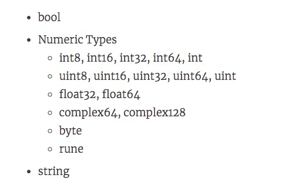


### 2.2 布尔型bool

布尔型的值只可以是常量 true 或者 false。一个简单的例子：var b bool = true

### 2.3 数值型

1、整数型

- int8
  有符号 8 位整型 (-128 到 127)
长度：8bit

- int16
  有符号 16 位整型 (-32768 到 32767)
- int32
  有符号 32 位整型 (-2147483648 到 2147483647)
- int64
  有符号 64 位整型 (-9223372036854775808 到 9223372036854775807)
- uint8
  无符号 8 位整型 (0 到 255)
8位都用于表示数值：

- uint16
  无符号 16 位整型 (0 到 65535)
- uint32
  无符号 32 位整型 (0 到 4294967295)
- uint64
  无符号 64 位整型 (0 到 18446744073709551615)
> int和uint:根据底层平台，表示32或64位整数。除非需要使用特定大小的整数，否则通常应该使用int来表示整数。
> 大小:32位系统32位，64位系统64位。
> 范围:-2147483648到2147483647的32位系统和-9223372036854775808到9223372036854775807的64位系统。

**2、浮点型**

- float32

  IEEE-754 32位浮点型数

- float64

  IEEE-754 64位浮点型数

- complex64

  32 位实数和虚数

- complex128

  64 位实数和虚数

**3、其他**

- byte

  类似 uint8

- rune

  类似 int32

- uint

  32 或 64 位

- int

  与 uint 一样大小

- uintptr

  无符号整型，用于存放一个指针

### 2.4 字符串型

字符串就是一串固定长度的字符连接起来的字符序列。Go的字符串是由单个字节连接起来的。Go语言的字符串的字节使用UTF-8编码标识Unicode文本

```go
	var str string
	str = "Hello World"
```


### 2.5 数据类型转换：Type Convert

语法格式：Type(Value)

常数：在有需要的时候，会自动转型

变量：需要手动转型	T(V)


注意点：兼容类型可以转换


## 3.复合类型(派生类型)

1、指针类型（Pointer）
2、数组类型
3、结构化类型(struct)
4、Channel 类型
5、函数类型
6、切片类型
7、接口类型（interface）
8、Map 类型


# 运算符

表达式：(a + b) * c

	a,b,c叫做操作数
	
	+，*，叫做运算符

## 一、运算符

### 1.1  算术运算符

```go
+ - * / %(求余) ++ --
```

### 1.2 关系运算符

```go
== != > < >= <=
```

### 1.3 逻辑运算符

| 运算符 | 描述                                                         |
| ------ | ------------------------------------------------------------ |
| &&     | 所谓逻辑与运算符。如果两个操作数都非零，则条件变为真         |
| \|\|   | 所谓的逻辑或操作。如果任何两个操作数是非零，则条件变为真     |
| !      | 所谓逻辑非运算符。使用反转操作数的逻辑状态。如果条件为真，那么逻辑非操后结果为假 |

### 1.4 位运算符

| A    | B    | A&B  | A\|B | A^B  |
| ---- | ---- | ---- | ---- | ---- |
| 0    | 0    | 0    | 0    | 0    |
| 0    | 1    | 0    | 1    | 1    |
| 1    | 1    | 1    | 1    | 0    |
| 1    | 0    | 0    | 1    | 1    |

这里最难理解的就是^了，只要认为AB两者都相同的时候，为0，其他都为1

假设A为60，B为13

| 运算 | 描述                                                         | 示例                            |
| ---- | ------------------------------------------------------------ | ------------------------------- |
| &    | 二进制与操作副本位的结果，如果它存在于两个操作数             | (A & B) = 12, 也就是 0000 1100  |
| \|   | 二进制或操作副本，如果它存在一个操作数                       | (A \| B) = 61, 也就是 0011 1101 |
| ^    | 二进制异或操作副本，如果它被设置在一个操作数就是按位取非     | (A ^ B) = 49, 也就是 0011 0001  |
| &^   | 二进制位清空&^                                               | (A&^B)=48，也就是110000         |
| <<   | 二进制左移位运算符。左边的操作数的值向左移动由右操作数指定的位数 | A << 2 =240 也就是 1111 0000    |
| >>   | 二进制向右移位运算符。左边的操作数的值由右操作数指定的位数向右移动 | A >> 2 = 15 也就是 0000 1111    |

### 1.5 赋值运算符

| 运算符 | 描述                                                         | 示例                         |
| ------ | ------------------------------------------------------------ | ---------------------------- |
| =      | 简单的赋值操作符，分配值从右边的操作数左侧的操作数           | C = A + B 将分配A + B的值到C |
| +=     | 相加并赋值运算符，它增加了右操作数左操作数和分配结果左操作数 | C += A 相当于 C = C + A      |
| -=     | 减和赋值运算符，它减去右操作数从左侧的操作数和分配结果左操作数 | C -= A 相当于 C = C - A      |
| *=     | 乘法和赋值运算符，它乘以右边的操作数与左操作数和分配结果左操作数 | C *= A 相当于 C = C * A      |
| /=     | 除法赋值运算符，它把左操作数与右操作数和分配结果左操作数     | C /= A 相当于 C = C / A      |
| %=     | 模量和赋值运算符，它需要使用两个操作数的模量和分配结果左操作数 | C %= A 相当于 C = C % A      |
| <<=    | 左移位并赋值运算符                                           | C <<= 2 相同于 C = C << 2    |
| >>=    | 向右移位并赋值运算符                                         | C >>= 2 相同于 C = C >> 2    |
| &=     | 按位与赋值运算符                                             | C &= 2 相同于 C = C & 2      |
| ^=     | 按位异或并赋值运算符                                         | C ^= 2 相同于 C = C ^ 2      |
| \|=    | 按位或并赋值运算符                                           | C \|= 2 相同于 C = C \| 2    |

### 1.6优先级运算符优先级

有些运算符拥有较高的优先级，二元运算符的运算方向均是从左至右。下表列出了所有运算符以及它们的优先级，由上至下代表优先级由高到低：

| 优先级 | 运算符           |
| ------ | ---------------- |
| 7      | ~ ! ++ --        |
| 6      | * / % << >> & &^ |
| 5      | + -  ^           |
| 4      | == != < <= >= >  |
| 3      | <-               |
| 2      | &&               |
| 1      | \|\|             |

当然，你可以通过使用括号来临时提升某个表达式的整体运算优先级。


# 程序的流程结构

程序的流程控制结构一共有三种：顺序结构，选择结构，循环结构。

顺序结构：从上向下，逐行执行。

选择结构：条件满足，某些代码才会执行。0-1次

​	分支语句：if，switch，select

循环结构：条件满足，某些代码会被反复的执行多次。0-N次

​	循环语句：for


# 二、条件语句

## 2.1 if 语句

语法格式：

```go
if 布尔表达式 {
   /* 在布尔表达式为 true 时执行 */
}
```

```go
if 布尔表达式 {
   /* 在布尔表达式为 true 时执行 */
} else {
  /* 在布尔表达式为 false 时执行 */
}
```

```go
if 布尔表达式1 {
   /* 在布尔表达式1为 true 时执行 */
} else if 布尔表达式2{
   /* 在布尔表达式1为 false ,布尔表达式2为true时执行 */
} else{
   /* 在上面两个布尔表达式都为false时，执行*/
}
```


示例代码：

```go
package main

import "fmt"

func main() {
   /* 定义局部变量 */
   var a int = 10
 
   /* 使用 if 语句判断布尔表达式 */
   if a < 20 {
       /* 如果条件为 true 则执行以下语句 */
       fmt.Printf("a 小于 20\n" )
   }
   fmt.Printf("a 的值为 : %d\n", a)
}
```

## 2.2 if 变体


如果其中包含一个可选的语句组件(在评估条件之前执行)，则还有一个变体。它的语法是

```go
if statement; condition {  
}

if condition{
    
    
}
```

示例代码：

```go
package main

import (  
    "fmt"
)

func main() {  
    if num := 10; num % 2 == 0 { //checks if number is even
        fmt.Println(num,"is even") 
    }  else {
        fmt.Println(num,"is odd")
    }
}
```

>需要注意的是，num的定义在if里，那么只能够在该if..else语句块中使用，否则编译器会报错的。


## 2.3 switch语句：“开关”

switch是一个条件语句，它计算表达式并将其与可能匹配的列表进行比较，并根据匹配执行代码块。它可以被认为是一种惯用的方式来写多个if else子句。

switch 语句用于基于不同条件执行不同动作，每一个 case 分支都是唯一的，从上直下逐一测试，直到匹配为止。
switch 语句执行的过程从上至下，直到找到匹配项，匹配项后面也不需要再加break。

而如果switch没有表达式，它会匹配true

Go里面switch默认相当于每个case最后带有break，匹配成功后不会自动向下执行其他case，而是跳出整个switch, 但是可以使用fallthrough强制执行后面的case代码。

变量 var1 可以是任何类型，而 val1 和 val2 则可以是同类型的任意值。类型不被局限于常量或整数，但必须是相同的类型；或者最终结果为相同类型的表达式。
您可以**同时测试多个可能符合条件的值，使用逗号分割它们**，例如：case val1, val2, val3。

```go
switch var1 {
    case val1:
        ...
    case val2:
        ...
    default:
        ...
}
```


示例代码：

```go
package main

import "fmt"

func main() {
   /* 定义局部变量 */
   var grade string = "B"
   var marks int = 90

   switch marks {
      case 90: grade = "A"
      case 80: grade = "B"
      case 50,60,70 : grade = "C"  //case 后可以由多个数值
      default: grade = "D"  
   }

   switch {
      case grade == "A" :
         fmt.Printf("优秀!\n" )     
      case grade == "B", grade == "C" :
         fmt.Printf("良好\n" )      
      case grade == "D" :
         fmt.Printf("及格\n" )      
      case grade == "F":
         fmt.Printf("不及格\n" )
      default:
         fmt.Printf("差\n" );
   }
   fmt.Printf("你的等级是 %s\n", grade );      
}
```


## 2.4 fallthrough

如需贯通后续的case，就添加fallthrough

```go
package main

import (
	"fmt"
)

type data [2]int

func main() {
	switch x := 5; x {
	default:
		fmt.Println(x)
	case 5:
		x += 10
		fmt.Println(x)
		fallthrough
	case 6:
		x += 20
		fmt.Println(x)

	}

}

```

运行结果：

```go
15
35
```


case中的表达式是可选的，可以省略。如果该表达式被省略，则被认为是switch true，并且每个case表达式都被计算为true，并执行相应的代码块。

示例代码：

```go
package main

import (  
    "fmt"
)

func main() {  
    num := 75
    switch { // expression is omitted
    case num >= 0 && num <= 50:
        fmt.Println("num is greater than 0 and less than 50")
    case num >= 51 && num <= 100:
        fmt.Println("num is greater than 51 and less than 100")
    case num >= 101:
        fmt.Println("num is greater than 100")
    }

}
```


> switch的注意事项
>
> 1. case后的常量值不能重复
> 2. case后可以有多个常量值
> 3. fallthrough应该是某个case的最后一行。如果它出现在中间的某个地方，编译器就会抛出错误。

## 2.5 Type Switch

switch 语句还可以被用于 type-switch 来判断某个 interface 变量中实际存储的变量类型。

```go
switch x.(type){
    case type:
       statement(s);      
    case type:
       statement(s); 
    /* 你可以定义任意个数的case */
    default: /* 可选 */
       statement(s);
}
```

```go
package main

import "fmt"

func main() {
   var x interface{}
     
   switch i := x.(type) {
      case nil:	  
         fmt.Printf(" x 的类型 :%T",i)                
      case int:	  
         fmt.Printf("x 是 int 型")                       
      case float64:
         fmt.Printf("x 是 float64 型")           
      case func(int) float64:
         fmt.Printf("x 是 func(int) 型")                      
      case bool, string:
         fmt.Printf("x 是 bool 或 string 型" )       
      default:
         fmt.Printf("未知型")     
   }   
}
```

运行结果：

```go
x 的类型 :<nil>
```


# 二、循环语句

循环语句表示条件满足，可以反复的执行某段代码。

for是唯一的循环语句。(Go没有while循环)

## 2.1 for语句

语法结构：

```
for init; condition; post { }
```

> 初始化语句只执行一次。在初始化循环之后，将检查该条件。如果条件计算为true，那么{}中的循环体将被执行，然后是post语句。post语句将在循环的每次成功迭代之后执行。在执行post语句之后，该条件将被重新检查。如果它是正确的，循环将继续执行，否则循环终止。

示例代码：

```go
package main

import (  
    "fmt"
)

func main() {  
    for i := 1; i <= 10; i++ {
        fmt.Printf(" %d",i)
    }
}
```

>在for循环中声明的变量仅在循环范围内可用。因此，i不能在外部访问循环。


## 2.2 for循环变体

**所有的三个组成部分，即初始化、条件和post都是可选的。**

```
for condition { }
```

效果与while相似

```
for { }
```

效果与for(;;) 一样

for 循环的 range 格式可以对 slice、map、数组、字符串等进行迭代循环

```
for key, value := range oldMap {
    newMap[key] = value
}
```

```go
package main

import "fmt"

func main() {

   var b int = 15
   var a int

   numbers := [6]int{1, 2, 3, 5} 

   /* for 循环 */
   for a := 0; a < 10; a++ {
      fmt.Printf("a 的值为: %d\n", a)
   }

   for a < b {
      a++
      fmt.Printf("a 的值为: %d\n", a)
      }

   for i,x:= range numbers {
      fmt.Printf("第 %d 位 x 的值 = %d\n", i,x)
   }   
}
```

运行结果：

```
a 的值为: 0
a 的值为: 1
a 的值为: 2
a 的值为: 3
a 的值为: 4
a 的值为: 5
a 的值为: 6
a 的值为: 7
a 的值为: 8
a 的值为: 9
a 的值为: 1
a 的值为: 2
a 的值为: 3
a 的值为: 4
a 的值为: 5
a 的值为: 6
a 的值为: 7
a 的值为: 8
a 的值为: 9
a 的值为: 10
a 的值为: 11
a 的值为: 12
a 的值为: 13
a 的值为: 14
a 的值为: 15
第 0 位 x 的值 = 1
第 1 位 x 的值 = 2
第 2 位 x 的值 = 3
第 3 位 x 的值 = 5
第 4 位 x 的值 = 0
第 5 位 x 的值 = 0
```


## 2.2 多层for循环

for循环中又有循环嵌套，就表示多层循环了。


# 三、跳出循环的语句

## 1、 break语句

break：跳出循环体。break语句用于在结束其正常执行之前突然终止for循环

示例代码：

```go
package main

import (  
    "fmt"
)

func main() {  
    for i := 1; i <= 10; i++ {
        if i > 5 {
            break //loop is terminated if i > 5
        }
        fmt.Printf("%d ", i)
    }
    fmt.Printf("\nline after for loop")
}
```

##  2、continue语句

continue：跳出一次循环。continue语句用于跳过for循环的当前迭代。在continue语句后面的for循环中的所有代码将不会在当前迭代中执行。循环将继续到下一个迭代。

示例代码：

```go
package main

import (  
    "fmt"
)

func main() {  
    for i := 1; i <= 10; i++ {
        if i%2 == 0 {
            continue
        }
        fmt.Printf("%d ", i)
    }
}
```


# 四、goto语句

goto：可以无条件地转移到过程中指定的行。

语法结构：

```go
goto label;
..
..
label: statement;
```


```go
package main

import "fmt"

func main() {
   /* 定义局部变量 */
   var a int = 10

   /* 循环 */
   LOOP: for a < 20 {
      if a == 15 {
         /* 跳过迭代 */
         a = a + 1
         goto LOOP
      }
      fmt.Printf("a的值为 : %d\n", a)
      a++     
   }  
}
```


统一错误处理
多处错误处理存在代码重复时是非常棘手的，例如：

```go
		err := firstCheckError()
    if err != nil {
        goto onExit
    }
    err = secondCheckError()
    if err != nil {
        goto onExit
    }
    fmt.Println("done")
    return
onExit:
    fmt.Println(err)
    exitProcess()


```


# 一、数组(Array)

## 1.1 什么是数组

Go 语言提供了数组类型的数据结构。
数组是具有相同唯一类型的一组已编号且长度固定的数据项序列，这种类型可以是任意的原始类型例如整形、字符串或者自定义类型。

数组元素可以通过索引（位置）来读取（或者修改），索引从0开始，第一个元素索引为 0，第二个索引为 1，以此类推。数组的下标取值范围是从0开始，到长度减1。

数组一旦定义后，大小不能更改。

## 1.2 数组的语法

**声明和初始化数组**

需要指明数组的大小和存储的数据类型。

```go
var variable_name [SIZE] variable_type
```

示例代码：

```go
var balance [10] float32
var balance = [5]float32{1000.0, 2.0, 3.4, 7.0, 50.0}
```

初始化数组中 {} 中的元素个数不能大于 [] 中的数字。
如果忽略 [] 中的数字不设置数组大小，Go 语言会根据元素的个数来设置数组的大小：

```go
var balance = []float32{1000.0, 2.0, 3.4, 7.0, 50.0}
```

```go
balance[4] = 50.0
```

数组的其他创建方式：

```go
  var a [4] float32 // 等价于：var arr2 = [4]float32{}
  fmt.Println(a) // [0 0 0 0]
  var b = [5] string{"ruby", "王二狗", "rose"}
  fmt.Println(b) // [ruby 王二狗 rose  ]
  var c = [5] int{'A', 'B', 'C', 'D', 'E'} // byte
  fmt.Println(c) // [65 66 67 68 69]
  d := [...] int{1,2,3,4,5}// 根据元素的个数，设置数组的大小
  fmt.Println(d)//[1 2 3 4 5]
  e := [5] int{4: 100} // [0 0 0 0 100]
  fmt.Println(e)
  f := [...] int{0: 1, 4: 1, 9: 1} // [1 0 0 0 1 0 0 0 0 1]
  fmt.Println(f)
```


**访问数组元素**

```go
float32 salary = balance[9]
```

示例代码：

```go
package main

import "fmt"

func main() {
   var n [10]int /* n 是一个长度为 10 的数组 */
   var i,j int

   /* 为数组 n 初始化元素 */         
   for i = 0; i < 10; i++ {
      n[i] = i + 100 /* 设置元素为 i + 100 */
   }

   /* 输出每个数组元素的值 */
   for j = 0; j < 10; j++ {
      fmt.Printf("Element[%d] = %d\n", j, n[j] )
   }
}
```

运行结果：

```go
Element[0] = 100
Element[1] = 101
Element[2] = 102
Element[3] = 103
Element[4] = 104
Element[5] = 105
Element[6] = 106
Element[7] = 107
Element[8] = 108
Element[9] = 109
```

**数组的长度**

通过将数组作为参数传递给len函数，可以获得数组的长度。

示例代码：

```go
package main

import "fmt"

func main() {  
    a := [...]float64{67.7, 89.8, 21, 78}
    fmt.Println("length of a is",len(a))

}
```

运行结果：

```
length of a is 4
```

您甚至可以忽略声明中数组的长度并将其替换为…让编译器为你找到长度。这是在下面的程序中完成的。

示例代码：

```go
package main

import (  
    "fmt"
)

func main() {  
    a := [...]int{12, 78, 50} // ... makes the compiler determine the length
    fmt.Println(a)
}
```


遍历数组：

```go
package main

import "fmt"

func main() {  
    a := [...]float64{67.7, 89.8, 21, 78}
    for i := 0; i < len(a); i++ { //looping from 0 to the length of the array
        fmt.Printf("%d th element of a is %.2f\n", i, a[i])
    }
}
```


使用range遍历数组：

```go
package main

import "fmt"

func main() {  
    a := [...]float64{67.7, 89.8, 21, 78}
    sum := float64(0)
    for i, v := range a {//range returns both the index and value
        fmt.Printf("%d the element of a is %.2f\n", i, v)
        sum += v
    }
    fmt.Println("\nsum of all elements of a",sum)
}
```

如果您只需要值并希望忽略索引，那么可以通过使用_ blank标识符替换索引来实现这一点。

```go
for _, v := range a { //ignores index  
}
```


## 1.3 多维数组

Go 语言支持多维数组，以下为常用的多维数组声明语法方式：

```go
var variable_name [SIZE1][SIZE2]...[SIZEN] variable_type
```

```go
var threedim [5][10][4]int
```

三维数组

```go
a = [3][4]int{  
 {0, 1, 2, 3} ,   /*  第一行索引为 0 */
 {4, 5, 6, 7} ,   /*  第二行索引为 1 */
 {8, 9, 10, 11}   /*  第三行索引为 2 */
}
```


## 1.4 数组是值类型

数组是值类型
Go中的数组是值类型，而不是引用类型。这意味着当它们被分配给一个新变量时，将把原始数组的副本分配给新变量。如果对新变量进行了更改，则不会在原始数组中反映。

```go
package main

import "fmt"

func main() {  
    a := [...]string{"USA", "China", "India", "Germany", "France"}
    b := a // a copy of a is assigned to b
    b[0] = "Singapore"
    fmt.Println("a is ", a)
    fmt.Println("b is ", b) 
}
```

运行结果：

```
a is [USA China India Germany France]  
b is [Singapore China India Germany France] 
```

数组的大小是类型的一部分。因此[5]int和[25]int是不同的类型。因此，数组不能被调整大小。不要担心这个限制，因为切片的存在是为了解决这个问题。

```go
package main

func main() {  
    a := [3]int{5, 78, 8}
    var b [5]int
    b = a //not possible since [3]int and [5]int are distinct types
}
```


# 一、切片(Slice)

## 1.1 什么是切片

Go 语言切片是对数组的抽象。
Go 数组的长度不可改变，在特定场景中这样的集合就不太适用，Go中提供了一种灵活，功能强悍的内置类型切片("动态数组"),与数组相比切片的长度是不固定的，可以追加元素，在追加时可能使切片的容量增大

切片是一种方便、灵活且强大的包装器。切片本身没有任何数据。它们只是对现有数组的引用。

切片与数组相比，不需要设定长度，在[]中不用设定值，相对来说比较自由

从概念上面来说slice像一个结构体，这个结构体包含了三个元素： 

1. 指针，指向数组中slice指定的开始位置
2. 长度，即slice的长度
3. 最大长度，也就是slice开始位置到数组的最后位置的长度

## 1.2 切片的语法

**定义切片**

```go
var identifier []type
```

切片不需要说明长度。
或使用make()函数来创建切片:

```go
var slice1 []type = make([]type, len)
也可以简写为
slice1 := make([]type, len)
```

```go
make([]T, length, capacity)
```

**初始化**

```go
s[0] = 1
s[1] = 2
s[2] = 3
```

```go
s :=[] int {1,2,3 } 
```

```go
s := arr[startIndex:endIndex] 
```

将arr中从下标startIndex到endIndex-1 下的元素创建为一个新的切片（**前闭后开**），长度为endIndex-startIndex

```go
s := arr[startIndex:] 
```

缺省endIndex时将表示一直到arr的最后一个元素

```go
s := arr[:endIndex] 
```

缺省startIndex时将表示从arr的第一个元素开始

```go
package main

import (  
    "fmt"
)

func main() {  
    a := [5]int{76, 77, 78, 79, 80}
    var b []int = a[1:4] //creates a slice from a[1] to a[3]
    fmt.Println(b)
}
```

## 1.3 修改切片

slice没有自己的任何数据。它只是底层数组的一个表示。对slice所做的任何修改都将反映在底层数组中。

示例代码：

```go
package main

import (  
    "fmt"
)

func main() {  
    darr := [...]int{57, 89, 90, 82, 100, 78, 67, 69, 59}
    dslice := darr[2:5]
    fmt.Println("array before",darr)
    for i := range dslice {
        dslice[i]++
    }
    fmt.Println("array after",darr) 
}
```

运行结果：

```
array before [57 89 90 82 100 78 67 69 59]  
array after [57 89 91 83 101 78 67 69 59]  
```

当多个片共享相同的底层数组时，每个元素所做的更改将在数组中反映出来。

示例代码：

```go
package main

import (  
    "fmt"
)

func main() {  
    numa := [3]int{78, 79 ,80}
    nums1 := numa[:] //creates a slice which contains all elements of the array
    nums2 := numa[:]
    fmt.Println("array before change 1",numa)
    nums1[0] = 100
    fmt.Println("array after modification to slice nums1", numa)
    nums2[1] = 101
    fmt.Println("array after modification to slice nums2", numa)
}
```

运行结果：

```
array before change 1 [78 79 80]  
array after modification to slice nums1 [100 79 80]  
array after modification to slice nums2 [100 101 80]  
```


## 1.4 len() 和 cap() 函数

切片的长度是切片中元素的数量。切片的容量是从创建切片的索引开始的底层数组中元素的数量。

切片是可索引的，并且可以由 len() 方法获取长度
切片提供了计算容量的方法 cap() 可以测量切片最长可以达到多少

```go
package main

import "fmt"

func main() {
   var numbers = make([]int,3,5)

   printSlice(numbers)
}

func printSlice(x []int){
   fmt.Printf("len=%d cap=%d slice=%v\n",len(x),cap(x),x)
}
```

运行结果

```go
len=3 cap=5 slice=[0 0 0]
```

**空切片**

一个切片在未初始化之前默认为 nil，长度为 0

```go
package main

import "fmt"

func main() {
   var numbers []int

   printSlice(numbers)

   if(numbers == nil){
      fmt.Printf("切片是空的")
   }
}

func printSlice(x []int){
   fmt.Printf("len=%d cap=%d slice=%v\n",len(x),cap(x),x)
}
```

运行结果

```go
len=0 cap=0 slice=[]
切片是空的
```

```go
package main

import "fmt"

func main() {
   /* 创建切片 */
   numbers := []int{0,1,2,3,4,5,6,7,8}   
   printSlice(numbers)

   /* 打印原始切片 */
   fmt.Println("numbers ==", numbers)

   /* 打印子切片从索引1(包含) 到索引4(不包含)*/
   fmt.Println("numbers[1:4] ==", numbers[1:4])

   /* 默认下限为 0*/
   fmt.Println("numbers[:3] ==", numbers[:3])

   /* 默认上限为 len(s)*/
   fmt.Println("numbers[4:] ==", numbers[4:])

   numbers1 := make([]int,0,5)
   printSlice(numbers1)

   /* 打印子切片从索引  0(包含) 到索引 2(不包含) */
   number2 := numbers[:2]
   printSlice(number2)

   /* 打印子切片从索引 2(包含) 到索引 5(不包含) */
   number3 := numbers[2:5]
   printSlice(number3)

}

func printSlice(x []int){
   fmt.Printf("len=%d cap=%d slice=%v\n",len(x),cap(x),x)
}
```

运行结果

```go
len=9 cap=9 slice=[0 1 2 3 4 5 6 7 8]
numbers == [0 1 2 3 4 5 6 7 8]
numbers[1:4] == [1 2 3]
numbers[:3] == [0 1 2]
numbers[4:] == [4 5 6 7 8]
len=0 cap=5 slice=[]
len=2 cap=9 slice=[0 1]
len=3 cap=7 slice=[2 3 4]
```

## 1.5 append() 和 copy() 函数 

append 向slice里面追加一个或者多个元素，然后返回一个和slice一样类型的slice
copy 函数copy从源slice的src中复制元素到目标dst，并且返回复制的元素的个数

append函数会改变slice所引用的数组的内容，从而影响到引用同一数组的其它slice。 但当slice中没有剩
余空间（即(cap-len) == 0）时，此时将动态分配新的数组空间。返回的slice数组指针将指向这个空间，而原
数组的内容将保持不变；其它引用此数组的slice则不受影响

下面的代码描述了从拷贝切片的 copy 方法和向切片追加新元素的 append 方法

```go
package main

import "fmt"

func main() {
   var numbers []int
   printSlice(numbers)

   /* 允许追加空切片 */
   numbers = append(numbers, 0)
   printSlice(numbers)

   /* 向切片添加一个元素 */
   numbers = append(numbers, 1)
   printSlice(numbers)

   /* 同时添加多个元素 */
   numbers = append(numbers, 2,3,4)
   printSlice(numbers)

   /* 创建切片 numbers1 是之前切片的两倍容量*/
   numbers1 := make([]int, len(numbers), (cap(numbers))*2)

   /* 拷贝 numbers 的内容到 numbers1 */
   copy(numbers1,numbers)
   printSlice(numbers1)   
}

func printSlice(x []int){
   fmt.Printf("len=%d cap=%d slice=%v\n",len(x),cap(x),x)
}
```

运行结果

```go
len=0 cap=0 slice=[]
len=1 cap=2 slice=[0]
len=2 cap=2 slice=[0 1]
len=5 cap=8 slice=[0 1 2 3 4]
len=5 cap=12 slice=[0 1 2 3 4]
```

> numbers1与numbers两者不存在联系，numbers发生变化时，numbers1是不会随着变化的。也就是说copy方法是不会建立两个切片的联系的


# 一、集合(Map)


## 1.1 什么是Map

map是Go中的内置类型，它将一个值与一个键关联起来。可以使用相应的键检索值。

Map 是一种无序的键值对的集合。Map 最重要的一点是通过 key 来快速检索数据，key 类似于索引，指向数据的值
Map 是一种集合，所以我们可以像迭代数组和切片那样迭代它。不过，Map 是无序的，我们无法决定它的返回顺序，这是因为 Map 是使用 hash 表来实现的，也是引用类型

使用map过程中需要注意的几点： 

- map是无序的，每次打印出来的map都会不一样，它不能通过index获取，而必须通过key获取
- map的长度是不固定的，也就是和slice一样，也是一种引用类型
- 内置的len函数同样适用于map，返回map拥有的key的数量 
- map的key可以是所有可比较的类型，如布尔型、整数型、浮点型、复杂型、字符串型……也可以键。

## 1.2  Map的使用

### 1.2.1 使用make()创建map

可以使用内建函数 make 也可以使用 map 关键字来定义 Map:

```go
/* 声明变量，默认 map 是 nil */
var map_variable map[key_data_type]value_data_type

/* 使用 make 函数 */
map_variable = make(map[key_data_type]value_data_type)
```

```go
rating := map[string]float32 {"C":5, "Go":4.5, "Python":4.5, "C++":2 }
```

如果不初始化 map，那么就会创建一个 nil map。nil map 不能用来存放键值对

```go
package main

import "fmt"

func main() {
   var countryCapitalMap map[string]string
   /* 创建集合 */
   countryCapitalMap = make(map[string]string)
   
   /* map 插入 key-value 对，各个国家对应的首都 */
   countryCapitalMap["France"] = "Paris"
   countryCapitalMap["Italy"] = "Rome"
   countryCapitalMap["Japan"] = "Tokyo"
   countryCapitalMap["India"] = "New Delhi"
   
   /* 使用 key 输出 map 值 */
   for country := range countryCapitalMap {
      fmt.Println("Capital of",country,"is",countryCapitalMap[country])
   }
   
   /* 查看元素在集合中是否存在 */
   captial, ok := countryCapitalMap["United States"]
   /* 如果 ok 是 true, 则存在，否则不存在 */
   if(ok){
      fmt.Println("Capital of United States is", captial)  
   }else {
      fmt.Println("Capital of United States is not present") 
   }
}
```

运行结果：

```go
Capital of France is Paris
Capital of Italy is Rome
Capital of Japan is Tokyo
Capital of India is New Delhi
Capital of United States is not present
```

### 1.2.2 delete() 函数

delete(map, key) 函数用于删除集合的元素, 参数为 map 和其对应的 key。删除函数不返回任何值。

```go
package main

import "fmt"

func main() {   
   /* 创建 map */
   countryCapitalMap := map[string] string {"France":"Paris","Italy":"Rome","Japan":"Tokyo","India":"New Delhi"}
   
   fmt.Println("原始 map")   
   
   /* 打印 map */
   for country := range countryCapitalMap {
      fmt.Println("Capital of",country,"is",countryCapitalMap[country])
   }
   
   /* 删除元素 */
   delete(countryCapitalMap,"France");
   fmt.Println("Entry for France is deleted")  
   
   fmt.Println("删除元素后 map")   
   
   /* 打印 map */
   for country := range countryCapitalMap {
      fmt.Println("Capital of",country,"is",countryCapitalMap[country])
   }
}
```

运行结果：

```go
原始 map
Capital of France is Paris
Capital of Italy is Rome
Capital of Japan is Tokyo
Capital of India is New Delhi
Entry for France is deleted
删除元素后 map
Capital of Italy is Rome
Capital of Japan is Tokyo
Capital of India is New Delhi
```

### 1.2.3 ok-idiom

我们可以通过key获取map中对应的value值。语法为：

```go
map[key] 
```

但是当key如果不存在的时候，我们会得到该value值类型的默认值，比如string类型得到空字符串，int类型得到0。但是程序不会报错。

所以我们可以使用ok-idiom获取值，可知道key/value是否存在

```go
value, ok := map[key] 
```

示例代码：

```go
package main

import (
	"fmt"
)

func main() {
	m := make(map[string]int)
	m["a"] = 1
	x, ok := m["b"]
	fmt.Println(x, ok)
	x, ok = m["a"]
	fmt.Println(x, ok)
}

```

运行结果：

```go
0 false
1 true
```

### 1.2.4 map的长度

使用len函数可以确定map的长度。

```go
len(map)  // 可以得到map的长度
```

### 1.2.5 map是引用类型的

与切片相似，映射是引用类型。当将映射分配给一个新变量时，它们都指向相同的内部数据结构。因此，一个的变化会反映另一个。

示例代码：

```go
package main

import (  
    "fmt"
)

func main() {  
    personSalary := map[string]int{
        "steve": 12000,
        "jamie": 15000,
    }
    personSalary["mike"] = 9000
    fmt.Println("Original person salary", personSalary)
    newPersonSalary := personSalary
    newPersonSalary["mike"] = 18000
    fmt.Println("Person salary changed", personSalary)

}
```

运行结果：

```
Original person salary map[steve:12000 jamie:15000 mike:9000]  
Person salary changed map[steve:12000 jamie:15000 mike:18000] 
```

>map不能使用==操作符进行比较。==只能用来检查map是否为空。否则会报错：invalid operation: map1 == map2 (map can only be comparedto nil)


# 一、字符串(string)


## 1.1 什么是string

Go中的字符串是一个字节的切片。可以通过将其内容封装在“”中来创建字符串。Go中的字符串是Unicode兼容的，并且是UTF-8编码的。

示例代码：

```go
package main

import (  
    "fmt"
)

func main() {  
    name := "Hello World"
    fmt.Println(name)
}
```


## 1.2  string的使用

### 1.2.1 访问字符串中的单个字节

```go
package main

import (  
    "fmt"
)

func main() {  
    name := "Hello World"
    for i:= 0; i < len(s); i++ {
        fmt.Printf("%d ", s[i])
    }
    fmt.Printf("\n")
    for i:= 0; i < len(s); i++ {
        fmt.Printf("%c ",s[i])
    }
}
```

运行结果：

72 101 108 108 111 32 87 111 114 108 100 
H e l l o   W o r l d 

## 1.3 strings包

访问strings包，可以有很多操作string的函数。


## 1.4 strconv包

访问strconv包，可以实现string和其他数值类型之间的转换。


# 一、函数的概念


## 1.1 什么是函数

函数是执行特定任务的代码块。

## 1.2 函数的声明

go语言至少有一个main函数

语法格式：

```go
func funcName(parametername type1, parametername type2) (output1 type1, output2 type2) {
//这里是处理逻辑代码
//返回多个值
return value1, value2
}
```

- func：函数由 func 开始声明
- funcName：函数名称，函数名和参数列表一起构成了函数签名。
- parametername type：参数列表，参数就像一个占位符，当函数被调用时，你可以将值传递给参数，这个值被称为实际参数。参数列表指定的是参数类型、顺序、及参数个数。参数是可选的，也就是说函数也可以不包含参数。
- output1 type1, output2 type2：返回类型，函数返回一列值。return_types 是该列值的数据类型。有些功能不需要返回值，这种情况下 return_types 不是必须的。
- 上面返回值声明了两个变量output1和output2，如果你不想声明也可以，直接就两个类型。
- 如果只有一个返回值且不声明返回值变量，那么你可以省略包括返回值的括号（即一个返回值可以不声明返回类型）
- 函数体：函数定义的代码集合。

## 1.3 函数的使用

示例代码：

```go
package main

import "fmt"

func main() {
   /* 定义局部变量 */
   var a int = 100
   var b int = 200
   var ret int

   /* 调用函数并返回最大值 */
   ret = max(a, b)

   fmt.Printf( "最大值是 : %d\n", ret )
}

/* 函数返回两个数的最大值 */
func max(num1, num2 int) int {
   /* 定义局部变量 */
   var result int

   if (num1 > num2) {
      result = num1
   } else {
      result = num2
   }
   return result 
}
```

运行结果：

```go
最大值是 : 200
```


# 二、函数的参数

## 2.1 参数的使用

形式参数：定义函数时，用于接收外部传入的数据，叫做形式参数，简称形参。

实际参数：调用函数时，传给形参的实际的数据，叫做实际参数，简称实参。

函数调用：

	A：函数名称必须匹配
	
	B：实参与形参必须一一对应：顺序，个数，类型

## 2.2 可变参

Go函数支持变参。接受变参的函数是有着不定数量的参数的。为了做到这点，首先需要定义函数使其接受变参：

```go
func myfunc(arg ...int) {}
```

`arg ...int`告诉Go这个函数接受不定数量的参数。注意，这些参数的类型全部是int。在函数体中，变量arg是一个int的slice：

```go
for _, n := range arg {
fmt.Printf("And the number is: %d\n", n)
}
```

## 2.3 参数传递

go语言函数的参数也是存在**值传递**和**引用传递**

函数运用场景

**值传递**

```go
package main

import (
   "fmt"
   "math"
)

func main(){
   /* 声明函数变量 */
   getSquareRoot := func(x float64) float64 {
      return math.Sqrt(x)
   }

   /* 使用函数 */
   fmt.Println(getSquareRoot(9))

}
```

**引用传递**

这就牵扯到了所谓的指针。我们知道，变量在内存中是存放于一定地址上的，修改变量实际是修改变量地址处的内
存。只有add1函数知道x变量所在的地址，才能修改x变量的值。所以我们需要将x所在地址&x传入函数，并将函数的参数的类型由int改为*int，即改为指针类型，才能在函数中修改x变量的值。此时参数仍然是按copy传递的，只是copy的是一个指针。请看下面的例子

```go
package main
import "fmt"
//简单的一个函数，实现了参数+1的操作
func add1(a *int) int { // 请注意，
*a = *a+1 // 修改了a的值
return *a // 返回新值
} f
unc main() {
x := 3
fmt.Println("x = ", x) // 应该输出 "x = 3"
x1 := add1(&x) // 调用 add1(&x) 传x的地址
fmt.Println("x+1 = ", x1) // 应该输出 "x+1 = 4"
fmt.Println("x = ", x) // 应该输出 "x = 4"
}
```

- 传指针使得多个函数能操作同一个对象。
- 传指针比较轻量级 (8bytes),只是传内存地址，我们可以用指针传递体积大的结构体。如果用参数值传递的话, 在每次copy上面就会花费相对较多的系统开销（内存和时间）。所以当你要传递大的结构体的时候，用指针是一个明智的选择。
- **Go语言中slice，map这三种类型的实现机制类似指针**，所以可以直接传递，而不用取地址后传递指针。（注：若函数需改变slice的长度，则仍需要取地址传递指针）


# 三、函数的返回值

## 3.1 什么是函数的返回值

一个函数被调用后，返回给调用处的执行结果，叫做函数的返回值。

调用处需要使用变量接收该结果

## 3.2 一个函数可以返回多个值

一个函数可以没有返回值，也可以有一个返回值，也可以有返回多个值。

```go
package main

import "fmt"

func swap(x, y string) (string, string) {
   return y, x
}

func main() {
   a, b := swap("Mahesh", "Kumar")
   fmt.Println(a, b)
}
```

```go
func SumAndProduct(A, B int) (add int, Multiplied int) {
add = A+B
Multiplied = A*B
return
}
```
## 3.3 空白标识符

_是Go中的空白标识符。它可以代替任何类型的任何值。让我们看看这个空白标识符的用法。

比如rectProps函数返回的结果是面积和周长，如果我们只要面积，不要周长，就可以使用空白标识符。

示例代码：

```go
package main

import (  
    "fmt"
)

func rectProps(length, width float64) (float64, float64) {  
    var area = length * width
    var perimeter = (length + width) * 2
    return area, perimeter
}
func main() {  
    area, _ := rectProps(10.8, 5.6) // perimeter is discarded
    fmt.Printf("Area %f ", area)
}
```


# 四、函数的作用域

作用域：变量可以使用的范围。

## 4.1 局部变量

一个函数内部定义的变量，就叫做局部变量

变量在哪里定义，就只能在哪个范围使用，超出这个范围，我们认为变量就被销毁了。

## 4.2 全局变量

一个函数外部定义的变量，就叫做全局变量

所有的函数都可以使用，而且共享这一份数据


# 五、函数的本质

函数也是Go语言中的一种数据类型，可以作为另一个函数的参数，也可以作为另一个函数的返回值。

# 六、defer函数

## 6.1 延迟是什么?

即延迟（defer）语句，延迟语句被用于执行一个函数调用，在这个函数之前，延迟语句返回。

## 6.2 延迟函数

你可以在函数中添加多个defer语句。当函数执行到最后时，这些defer语句会按照逆序执行，最后该函数返回。特别是当你在进行一些打开资源的操作时，遇到错误需要提前返回，在返回前你需要关闭相应的资源，不然很容易造成资源泄露等问题

- 如果有很多调用defer，那么defer是采用`后进先出`模式
- 在离开所在的方法时，执行（报错的时候也会执行）

```go
func ReadWrite() bool {
    file.Open("file")
    defer file.Close()
    if failureX {
          return false
    } i
    f failureY {
          return false
    } 
    return true
}
```

最后才执行`file.Close()`

示例代码：

```go
package main

import "fmt"

func main() {
	a := 1
	b := 2
	defer fmt.Println(b)
	fmt.Println(a)
}
```

运行结果：

```go
1
2
```

示例代码：

```go
package main

import (  
    "fmt"
)

func finished() {  
    fmt.Println("Finished finding largest")
}

func largest(nums []int) {  
    defer finished()    
    fmt.Println("Started finding largest")
    max := nums[0]
    for _, v := range nums {
        if v > max {
            max = v
        }
    }
    fmt.Println("Largest number in", nums, "is", max)
}

func main() {  
    nums := []int{78, 109, 2, 563, 300}
    largest(nums)
}
```

运行结果：

```
Started finding largest  
Largest number in [78 109 2 563 300] is 563  
Finished finding largest 
```

## 6.3 延迟方法

延迟并不仅仅局限于函数。延迟一个方法调用也是完全合法的。让我们编写一个小程序来测试这个。

示例代码：

```go
package main

import (  
    "fmt"
)


type person struct {  
    firstName string
    lastName string
}

func (p person) fullName() {  
    fmt.Printf("%s %s",p.firstName,p.lastName)
}

func main() {  
    p := person {
        firstName: "John",
        lastName: "Smith",
    }
    defer p.fullName()
    fmt.Printf("Welcome ")  
}
```

运行结果：

```
Welcome John Smith 
```

## 6.4 延迟参数

延迟函数的参数在执行延迟语句时被执行，而不是在执行实际的函数调用时执行。

让我们通过一个例子来理解这个问题。

示例代码：

```go
package main

import (  
    "fmt"
)

func printA(a int) {  
    fmt.Println("value of a in deferred function", a)
}
func main() {  
    a := 5
    defer printA(a)
    a = 10
    fmt.Println("value of a before deferred function call", a)

}
```

运行结果：

```
value of a before deferred function call 10  
value of a in deferred function 5 
```

## 6.5 堆栈的推迟

当一个函数有多个延迟调用时，它们被添加到一个堆栈中，并在Last In First Out（LIFO）后进先出的顺序中执行。

我们将编写一个小程序，它使用一堆defers打印一个字符串。示例代码：

```go
package main

import (  
    "fmt"
)

func main() {  
    name := "Naveen"
    fmt.Printf("Orignal String: %s\n", string(name))
    fmt.Printf("Reversed String: ")
    for _, v := range []rune(name) {
        defer fmt.Printf("%c", v)
    }
}
```

运行结果：

```
Orignal String: Naveen  
Reversed String: neevaN 
```


## 6.6 defer注意点

```
defer函数：
当外围函数中的语句正常执行完毕时，只有其中所有的延迟函数都执行完毕，外围函数才会真正的结束执行。
当执行外围函数中的return语句时，只有其中所有的延迟函数都执行完毕后，外围函数才会真正返回。
当外围函数中的代码引发运行恐慌时，只有其中所有的延迟函数都执行完毕后，该运行时恐慌才会真正被扩展至调用函数。
```


# Go语言中包的使用


Go语言使用包（package）这种语法元素来组织源码，所有语法可见性均定义在package这个级别，与Java 、python等语言相比，这算不上什么创新，但与C传统的include相比，则是显得“先进”了许多。

```
myblog
├── conf
│   └── app.conf
├── controllers
│   ├── aboutme_controller.go
│   ├── add_article_controller.go
│   ├── album_controller.go
│   ├── base_controller.go
│   ├── default.go
│   ├── delete_article_controller.go
│   ├── exit_controller.go
│   ├── home_controller.go
│   ├── login_controller.go
│   ├── register_controller.go
│   ├── show_article_controller.go
│   ├── tags_controller.go
│   ├── update_article_controller.go
│   └── upload_controller.go
├── main.go
├── models
│   ├── album_model.go
│   ├── article_model.go
│   ├── home_model.go
│   ├── tags_model.go
│   └── user_model.go
├── myblogweb
├── routers
│   └── router.go
├── static
│   ├── css
│   │   ├── blogsheet.css
│   │   └── lib
│   │       ├── highlight.css
│   │       └── login.css
│   ├── img
│   ├── js
│   │   ├── blog.js
│   │   ├── lib
│   │   │   ├── jquery-3.3.1.min.js
│   │   │   └── jquery.url.js
│   │   └── reload.min.js
│   └── upload
│       └── img
│           └── 2018
│               └── 12
│                   └── 11
│                       ├── 1544511378-bee2.png
├── tests
│   └── default_test.go
├── utils
│   ├── myUtils.go
│   └── mysqlUtils.go
└── views
    ├── aboultme.html
    ├── album.html
    ├── block
    │   ├── home_block.html
    │   └── nav.html
    ├── home.html
    ├── index.tpl
    ├── login.html
    ├── register.html
    ├── show_article.html
    ├── tags.html
    └── write_article.html
```


Go 语言的源码复用建立在包（package）基础之上。包通过 package, import, GOPATH 操作完成。

## 1、 main包

Go 语言的入口 main() 函数所在的包（package）叫 main，main 包想要引用别的代码，需要import导入！


## 2、 package

src 目录是以代码包的形式组织并保存 Go 源码文件的。每个代码包都和 src 目录下的文件夹一一对应。每个子目录都是一个代码包。

> 代码包包名和文件目录名，不要求一致。比如文件目录叫 hello，但是代码包包名可以声明为 “main”，但是同一个目录下的源码文件第一行声明的所属包，必须一致！


同一个目录下的所有.go文件的第一行添加 包定义，以标记该文件归属的包，演示语法：

```go
package 包名
```

包需要满足：

- 一个目录下的同级文件归属一个包。也就是说，在同一个包下面的所有文件的package名，都是一样的。
- 在同一个包下面的文件`package`名都建议设为是该目录名，但也可以不是。也就是说，包名可以与其目录不同名。
- 包名为 main 的包为应用程序的入口包，其他包不能使用。


> 在同一个包下面的文件属于同一个工程文件，不用`import`包，可以直接使用

包可以嵌套定义，对应的就是嵌套目录，但包名应该与所在的目录一致，例如：

```go
// 文件：qf/ruby/tool.go中
package ruby
// 可以被导出的函数
func FuncPublic() {
}
// 不可以被导出的函数
func funcPrivate() {
}
```

包中，通过标识符首字母是否大写，来确定是否可以被导出。首字母大写才可以被导出，视为 public 公共的资源。


## 3、 import

要引用其他包，可以使用 import 关键字，可以单个导入或者批量导入，语法演示：

A：通常导入

```go
// 单个导入
import "package"
// 批量导入
import (
  "package1"
  "package2"
  )
```

B：点操作
我们有时候会看到如下的方式导入包

```go
import(
	. "fmt"
) 
```

这个点操作的含义就是这个包导入之后在你调用这个包的函数时，你可以省略前缀的包名，也就是前面你调

用的`fmt.Println("hello world")`可以省略的写成`Println("hello world")`


C：起别名

别名操作顾名思义我们可以把包命名成另一个我们用起来容易记忆的名字。导入时，可以为包定义别名，语法演示：

```go
import (
  p1 "package1"
  p2 "package2"
  )
// 使用时：别名操作，调用包函数时前缀变成了我们的前缀
p1.Method()
```


D：_操作
如果仅仅需要导入包时执行初始化操作，并不需要使用包内的其他函数，常量等资源。则可以在导入包时，匿名导入。

这个操作经常是让很多人费解的一个操作符，请看下面这个import：

```go
import (
   "database/sql"
   _ "github.com/ziutek/mymysql/godrv"
 ) 
```

_操作其实是引入该包，而不直接使用包里面的函数，而是调用了该包里面的init函数。也就是说，使用下划线作为包的别名，会仅仅执行init()。

> 导入的包的路径名，可以是相对路径也可以是绝对路径，推荐使用绝对路径（起始于工程根目录）。


## 4、GOPATH环境变量

import导入时，会从GO的安装目录（也就是GOROOT环境变量设置的目录）和GOPATH环境变量设置的目录中，检索 src/package 来导入包。如果不存在，则导入失败。
GOROOT，就是GO内置的包所在的位置。
GOPATH，就是我们自己定义的包的位置。

通常我们在开发Go项目时，调试或者编译构建时，需要设置GOPATH指向我们的项目目录，目录中的src目录中的包就可以被导入了。


## 5、init() 包初始化

下面我们详细的来介绍一下这两个函数：init()、main() 是 go 语言中的保留函数。我们可以在源码中，定义 init() 函数。此函数会在包被导入时执行，例如如果是在 main 中导入包，包中存在 init()，那么 init() 中的代码会在 main() 函数执行前执行，用于初始化包所需要的特定资料。例如：
包源码：

```go
src/userPackage/tool.go

package userPackage
import "fmt"
func init() {
  fmt.Println("tool init")
}
```

主函数源码：

```go
src/main.go

package main
import (
  "userPackage"
  )
func main() {
  fmt.Println("main run")
  // 使用userPackage
  userPackage.SomeFunc()
}
```

执行时，会先输出 "tool init"，再输出 "main run"。


下面我们详细的来介绍一下init()、main() 这两个函数。在 go 语言中的区别如下： 
相同点：

两个函数在定义时不能有任何的参数和返回值。
该函数只能由 go 程序自动调用，不可以被引用。

不同点：

init 可以应用于任意包中，且可以重复定义多个。
main 函数只能用于 main 包中，且只能定义一个。

两个函数的执行顺序：

在 main 包中的 go 文件默认总是会被执行。

对同一个 go 文件的 init( ) 调用顺序是从上到下的。

对同一个 package 中的不同文件，将文件名按字符串进行“从小到大”排序，之后顺序调用各文件中的init()函数。

对于不同的 package，如果不相互依赖的话，按照 main 包中 import 的顺序调用其包中的 init() 函数。

如果 package 存在依赖，调用顺序为最后被依赖的最先被初始化，例如：导入顺序 main –> A –> B –> C，则初始化顺序为 C –> B –> A –> main，一次执行对应的 init 方法。main 包总是被最后一个初始化，因为它总是依赖别的包


图片引自网络


避免出现循环 import，例如：A –> B –> C –> A。

一个包被其它多个包 import，但只能被初始化一次


## 6、管理外部包

go允许import不同代码库的代码。对于import要导入的外部的包，可以使用 go get 命令取下来放到GOPATH对应的目录中去。

举个例子，比如说我们想通过go语言连接mysql数据库，那么需要先下载mysql的数据包，打开终端并输入以下命令：

```shell
localhost:~ ruby$ go get github.com/go-sql-driver/mysql
```

安装之后，就可以在gopath目录的src下，看到对应的文件包目录：

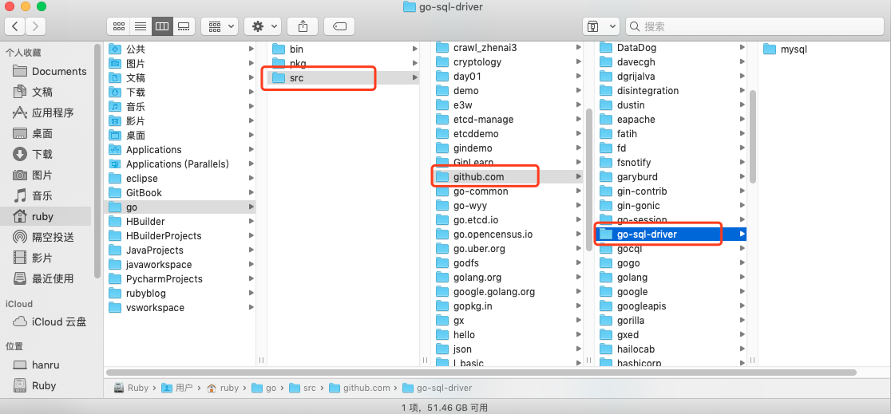


>也就是说，对于go语言来讲，其实并不关心你的代码是内部还是外部的，总之都在GOPATH里，任何import包的路径都是从GOPATH开始的；唯一的区别，就是内部依赖的包是开发者自己写的，外部依赖的包是go get下来的。


## 扩展

我们可以通过go install 来编译包文件。

我们知道一个非main包在编译后会生成一个.a文件（在临时目录下生成，除非使用go install安装到`$GOROOT`或​`$GOPATH`下，否则你看不到.a），用于后续可执行程序链接使用。

比如Go标准库中的包对应的源码部分路径在：`$GOROOT/src`，而标准库中包编译后的.a文件路径在`$GOROOT/pkg/darwin_amd64`下。


# 一、指针


## 1.1 指针的概念

指针是存储另一个变量的内存地址的变量。

我们都知道，变量是一种使用方便的占位符，用于引用计算机内存地址。

一个指针变量可以指向任何一个值的内存地址它指向那个值的内存地址。

 

在上面的图中，变量b的值为156，存储在内存地址0x1040a124。变量a持有b的地址，现在a被认为指向b。

## 1.2 获取变量的地址

Go 语言的取地址符是 &，放到一个变量前使用就会返回相应变量的内存地址。

```go
package main

import "fmt"

func main() {
   var a int = 10   

   fmt.Printf("变量的地址: %x\n", &a  )
}
```

运行结果：

```go
变量的地址: 20818a220
```

## 1.3 声明指针

声明指针，*T是指针变量的类型，它指向T类型的值。

```go
var var_name *var-type
```

var-type 为指针类型，var_name 为指针变量名，* 号用于指定变量是作为一个指针。

```go
var ip *int        /* 指向整型*/
var fp *float32    /* 指向浮点型 */
```

示例代码：

```go
package main

import "fmt"

func main() {
   var a int= 20   /* 声明实际变量 */
   var ip *int        /* 声明指针变量 */

   ip = &a  /* 指针变量的存储地址 */

   fmt.Printf("a 变量的地址是: %x\n", &a  )

   /* 指针变量的存储地址 */
   fmt.Printf("ip 变量的存储地址: %x\n", ip )

   /* 使用指针访问值 */
   fmt.Printf("*ip 变量的值: %d\n", *ip )
}
```

运行结果：

```go
a 变量的地址是: 20818a220
ip 变量的存储地址: 20818a220
*ip 变量的值: 20
```

示例代码：

```go
package main

import "fmt"

type name int8
type first struct {
	a int
	b bool
	name
}

func main() {
	a := new(first)
	a.a = 1
	a.name = 11
	fmt.Println(a.b, a.a, a.name)
}
```

运行结果：

```go
false 1 11
```

> 未初始化的变量自动赋上初始值

```go
package main

import "fmt"

type name int8
type first struct {
	a int
	b bool
	name
}

func main() {
	var a = first{1, false, 2}
	var b *first = &a
	fmt.Println(a.b, a.a, a.name, &a, b.a, &b, (*b).a)
}
```

运行结果：

```go
false 1 2 &{1 false 2} 1 0xc042068018 1
```

> 获取指针地址在指针变量前加&的方式

## 1.4 空指针

**Go 空指针**
当一个指针被定义后没有分配到任何变量时，它的值为 nil。
nil 指针也称为空指针。
nil在概念上和其它语言的null、None、nil、NULL一样，都指代零值或空值。
一个指针变量通常缩写为 ptr。

空指针判断：

```go
if(ptr != nil)     /* ptr 不是空指针 */
if(ptr == nil)    /* ptr 是空指针 */
```

## 1.5 获取指针的值

获取一个指针意味着访问指针指向的变量的值。语法是：*a

示例代码：

```go
package main  
import (  
    "fmt"
)

func main() {  
    b := 255
    a := &b
    fmt.Println("address of b is", a)
    fmt.Println("value of b is", *a)
}
```

## 1.6 操作指针改变变量的数值

示例代码：

```go
package main

import (  
    "fmt"
)

func main() {  
    b := 255
    a := &b
    fmt.Println("address of b is", a)
    fmt.Println("value of b is", *a)
    *a++
    fmt.Println("new value of b is", b)
}
```

运行结果

```
address of b is 0x1040a124  
value of b is 255  
new value of b is 256  
```


## 1.7 使用指针传递函数的参数

示例代码

```go
package main

import (  
    "fmt"
)

func change(val *int) {  
    *val = 55
}
func main() {  
    a := 58
    fmt.Println("value of a before function call is",a)
    b := &a
    change(b)
    fmt.Println("value of a after function call is", a)
}
```

运行结果

```
value of a before function call is 58  
value of a after function call is 55  
```

**不要将一个指向数组的指针传递给函数。使用切片。**

假设我们想对函数内的数组进行一些修改，并且对调用者可以看到函数内的数组所做的更改。一种方法是将一个指向数组的指针传递给函数。

```go
package main

import (  
    "fmt"
)

func modify(arr *[3]int) {  
    (*arr)[0] = 90
}

func main() {  
    a := [3]int{89, 90, 91}
    modify(&a)
    fmt.Println(a)
}
```

运行结果

```
[90 90 91]
```

示例代码：

```go
package main

import (  
    "fmt"
)

func modify(arr *[3]int) {  
    arr[0] = 90
}

func main() {  
    a := [3]int{89, 90, 91}
    modify(&a)
    fmt.Println(a)
}
```

运行结果

```
[90 90 91]
```

**虽然将指针传递给一个数组作为函数的参数并对其进行修改，但这并不是实现这一目标的惯用方法。我们有切片。**

示例代码：

```go
package main

import (  
    "fmt"
)

func modify(sls []int) {  
    sls[0] = 90
}

func main() {  
    a := [3]int{89, 90, 91}
    modify(a[:])
    fmt.Println(a)
}
```

运行结果：

```
[90 90 91]
```


>Go不支持指针算法。
>
>package main
>
>func main() {  
>    b := [...]int{109, 110, 111}
>    p := &b
>    p++
>}
>
>nvalid operation: p++ (non-numeric type *[3]int)


**指针数组**

```go
package main

import "fmt"

const MAX int = 3

func main() {

   a := []int{10,100,200}
   var i int

   for i = 0; i < MAX; i++ {
      fmt.Printf("a[%d] = %d\n", i, a[i] )
   }
}
```

`结果`

```go
a[0] = 10
a[1] = 100
a[2] = 200
```

有一种情况，我们可能需要保存数组，这样我们就需要使用到指针。

```go
package main

import "fmt"

const MAX int = 3

func main() {
   a := []int{10,100,200}
   var i int
   var ptr [MAX]*int;

   for  i = 0; i < MAX; i++ {
      ptr[i] = &a[i] /* 整数地址赋值给指针数组 */
   }

   for  i = 0; i < MAX; i++ {
      fmt.Printf("a[%d] = %d\n", i,*ptr[i] )
   }
}
```

`结果`

```go
a[0] = 10
a[1] = 100
a[2] = 200
```

## 1.8 指针的指针

**指针的指针**

如果一个指针变量存放的又是另一个指针变量的地址，则称这个指针变量为指向指针的指针变量。

```go
var ptr **int;
```

```go
package main

import "fmt"

func main() {

   var a int
   var ptr *int
   var pptr **int

   a = 3000

   /* 指针 ptr 地址 */
   ptr = &a

   /* 指向指针 ptr 地址 */
   pptr = &ptr

   /* 获取 pptr 的值 */
   fmt.Printf("变量 a = %d\n", a )
   fmt.Printf("指针变量 *ptr = %d\n", *ptr )
   fmt.Printf("指向指针的指针变量 **pptr = %d\n", **pptr)
}
```

`结果`

```go
变量 a = 3000
指针变量 *ptr = 3000
指向指针的指针变量 **pptr = 3000
```

**指针作为函数参数**

```go
package main

import "fmt"

func main() {
   /* 定义局部变量 */
   var a int = 100
   var b int= 200

   fmt.Printf("交换前 a 的值 : %d\n", a )
   fmt.Printf("交换前 b 的值 : %d\n", b )

   /* 调用函数用于交换值
   * &a 指向 a 变量的地址
   * &b 指向 b 变量的地址
   */
   swap(&a, &b);

   fmt.Printf("交换后 a 的值 : %d\n", a )
   fmt.Printf("交换后 b 的值 : %d\n", b )
}

func swap(x *int, y *int) {
   var temp int
   temp = *x    /* 保存 x 地址的值 */
   *x = *y      /* 将 y 赋值给 x */
   *y = temp    /* 将 temp 赋值给 y */
}
```

`结果`

```go
交换前 a 的值 : 100
交换前 b 的值 : 200
交换后 a 的值 : 200
交换后 b 的值 : 100
```


# 一、结构体

## 1.1 什么是结构体

Go 语言中数组可以存储同一类型的数据，但在结构体中我们可以为不同项定义不同的数据类型。
结构体是由一系列具有相同类型或不同类型的数据构成的数据集合。

## 1.2 结构体的定义和初始化

```go
type struct_variable_type struct {
   member definition;
   member definition;
   ...
   member definition;
}
```

一旦定义了结构体类型，它就能用于变量的声明

```go
variable_name := structure_variable_type {value1, value2...valuen}
```

**初始化结构体**

```go
// 1.按照顺序提供初始化值
P := person{"Tom", 25}
// 2.通过field:value的方式初始化，这样可以任意顺序
P := person{age:24, name:"Tom"}
// 3.new方式,未设置初始值的，会赋予类型的默认初始值
p := new(person)
p.age=24
```

## 1.3 结构体的访问

访问结构体成员(访问结构的各个字段)

通过点.操作符用于访问结构的各个字段。

```go
package main

import "fmt"

type Books struct {
   title string
   author string
   subject string
   book_id int
}

func main() {
   var Book1 Books        /* 声明 Book1 为 Books 类型 */
   var Book2 Books        /* 声明 Book2 为 Books 类型 */

   /* book 1 描述 */
   Book1.title = "Go 语言"
   Book1.author = "www.runoob.com"
   Book1.subject = "Go 语言教程"
   Book1.book_id = 6495407

   /* book 2 描述 */
   Book2.title = "Python 教程"
   Book2.author = "www.runoob.com"
   Book2.subject = "Python 语言教程"
   Book2.book_id = 6495700

   /* 打印 Book1 信息 */
   fmt.Printf( "Book 1 title : %s\n", Book1.title)
   fmt.Printf( "Book 1 author : %s\n", Book1.author)
   fmt.Printf( "Book 1 subject : %s\n", Book1.subject)
   fmt.Printf( "Book 1 book_id : %d\n", Book1.book_id)

   /* 打印 Book2 信息 */
   fmt.Printf( "Book 2 title : %s\n", Book2.title)
   fmt.Printf( "Book 2 author : %s\n", Book2.author)
   fmt.Printf( "Book 2 subject : %s\n", Book2.subject)
   fmt.Printf( "Book 2 book_id : %d\n", Book2.book_id)
}
```

运行结果：

```go
Book 1 title : Go 语言
Book 1 author : www.runoob.com
Book 1 subject : Go 语言教程
Book 1 book_id : 6495407
Book 2 title : Python 教程
Book 2 author : www.runoob.com
Book 2 subject : Python 语言教程
Book 2 book_id : 6495700
```

## 1.4 结构体指针

指针指向一个结构体
也可以创建指向结构的指针。

**结构体指针**

```go
var struct_pointer *Books
```

以上定义的指针变量可以存储结构体变量的地址。查看结构体变量地址，可以将 & 符号放置于结构体变量前

```go
struct_pointer = &Book1;
```

使用结构体指针访问结构体成员，使用 "." 操作符

```go
struct_pointer.title;
```

```go
package main

import "fmt"

type Books struct {
   title string
   author string
   subject string
   book_id int
}

func main() {
   var Book1 Books        /* Declare Book1 of type Book */
   var Book2 Books        /* Declare Book2 of type Book */

   /* book 1 描述 */
   Book1.title = "Go 语言"
   Book1.author = "www.runoob.com"
   Book1.subject = "Go 语言教程"
   Book1.book_id = 6495407

   /* book 2 描述 */
   Book2.title = "Python 教程"
   Book2.author = "www.runoob.com"
   Book2.subject = "Python 语言教程"
   Book2.book_id = 6495700

   /* 打印 Book1 信息 */
   printBook(&Book1)

   /* 打印 Book2 信息 */
   printBook(&Book2)
}
func printBook( book *Books ) {
   fmt.Printf( "Book title : %s\n", book.title);
   fmt.Printf( "Book author : %s\n", book.author);
   fmt.Printf( "Book subject : %s\n", book.subject);
   fmt.Printf( "Book book_id : %d\n", book.book_id);
}
```

结构体实例化也可以是这样的

```go
package main

import "fmt"

type Books struct {
}

func (s Books) String() string {
	return "data"
}
func main() {
	fmt.Printf("%v\n", Books{})
}
```


## 1.5 结构体的匿名字段

**结构体的匿名字段**

可以用字段来创建结构，这些字段只包含一个没有字段名的类型。这些字段被称为匿名字段。

在类型中，使用不写字段名的方式，使用另一个类型

```go
type Human struct {
    name string
    age int
    weight int
} 
type Student struct {
    Human // 匿名字段，那么默认Student就包含了Human的所有字段
    speciality string
} 
func main() {
    // 我们初始化一个学生
    mark := Student{Human{"Mark", 25, 120}, "Computer Science"}
    // 我们访问相应的字段
    fmt.Println("His name is ", mark.name)
    fmt.Println("His age is ", mark.age)
    fmt.Println("His weight is ", mark.weight)
    fmt.Println("His speciality is ", mark.speciality)
    // 修改对应的备注信息
    mark.speciality = "AI"
    fmt.Println("Mark changed his speciality")
    fmt.Println("His speciality is ", mark.speciality)
    // 修改他的年龄信息
    fmt.Println("Mark become old")
    mark.age = 46
    fmt.Println("His age is", mark.age)
    // 修改他的体重信息
    fmt.Println("Mark is not an athlet anymore")
    mark.weight += 60
    fmt.Println("His weight is", mark.weight)
}
```

> 可以使用"."的方式进行调用匿名字段中的属性值
>
> 实际就是字段的继承
>
> 其中可以将匿名字段理解为字段名和字段类型都是同一个
>
> 基于上面的理解，所以可以`mark.Human = Human{"Marcus", 55, 220} `和`mark.Human.age -= 1`
>
> 若存在匿名字段中的字段与非匿名字段名字相同，则最外层的优先访问，就近原则

通过匿名访问和修改字段相当的有用，但是不仅仅是struct字段哦，所有的内置类型和自定义类型都是可以作为匿名字段的。


## 1.6 结构体嵌套

嵌套的结构体
一个结构体可能包含一个字段，而这个字段反过来就是一个结构体。这些结构被称为嵌套结构。

示例代码：

```go
package main

import (  
    "fmt"
)

type Address struct {  
    city, state string
}
type Person struct {  
    name string
    age int
    address Address
}

func main() {  
    var p Person
    p.name = "Naveen"
    p.age = 50
    p.address = Address {
        city: "Chicago",
        state: "Illinois",
    }
    fmt.Println("Name:", p.name)
    fmt.Println("Age:",p.age)
    fmt.Println("City:",p.address.city)
    fmt.Println("State:",p.address.state)
}
```


## 1.7 提升字段

在结构体中属于匿名结构体的字段称为提升字段，因为它们可以被访问，就好像它们属于拥有匿名结构字段的结构一样。理解这个定义是相当复杂的。

示例代码：

```go
package main

import (  
    "fmt"
)

type Address struct {  
    city, state string
}
type Person struct {  
    name string
    age  int
    Address
}

func main() {  
    var p Person
    p.name = "Naveen"
    p.age = 50
    p.Address = Address{
        city:  "Chicago",
        state: "Illinois",
    }
    fmt.Println("Name:", p.name)
    fmt.Println("Age:", p.age)
    fmt.Println("City:", p.city) //city is promoted field
    fmt.Println("State:", p.state) //state is promoted field
}
```

运行结果

```
Name: Naveen  
Age: 50  
City: Chicago  
State: Illinois
```


## 1.8 导出结构体和字段

如果结构体类型以大写字母开头，那么它是一个导出类型，可以从其他包访问它。类似地，如果结构体的字段以大写开头，则可以从其他包访问它们。

示例代码：

1.在computer目录下，创建文件spec.go

```go
package computer

type Spec struct { //exported struct  
    Maker string //exported field
    model string //unexported field
    Price int //exported field
}
```

2.创建main.go 文件

```go
package main

import "structs/computer"  
import "fmt"

func main() {  
    var spec computer.Spec
    spec.Maker = "apple"
    spec.Price = 50000
    fmt.Println("Spec:", spec)
}
```

> 目录结构如下：
>
>     src  
>     	structs
>     		computer
>     			spec.go
>     		main.go


## 1.9 结构体比较

结构体是值类型，如果每个字段具有可比性，则是可比较的。如果它们对应的字段相等，则认为两个结构体变量是相等的。

示例代码：

```go
package main

import (  
    "fmt"
)

type name struct {  
    firstName string
    lastName string
}


func main() {  
    name1 := name{"Steve", "Jobs"}
    name2 := name{"Steve", "Jobs"}
    if name1 == name2 {
        fmt.Println("name1 and name2 are equal")
    } else {
        fmt.Println("name1 and name2 are not equal")
    }

    name3 := name{firstName:"Steve", lastName:"Jobs"}
    name4 := name{}
    name4.firstName = "Steve"
    if name3 == name4 {
        fmt.Println("name3 and name4 are equal")
    } else {
        fmt.Println("name3 and name4 are not equal")
    }
}
```

运行结果

```
name1 and name2 are equal  
name3 and name4 are not equal  
```

**如果结构变量包含的字段是不可比较的，那么结构变量是不可比较的**

示例代码：

```go
package main

import (  
    "fmt"
)

type image struct {  
    data map[int]int
}

func main() {  
    image1 := image{data: map[int]int{
        0: 155,
    }}
    image2 := image{data: map[int]int{
        0: 155,
    }}
    if image1 == image2 {
        fmt.Println("image1 and image2 are equal")
    }
}
```


## 2.0 结构体作为函数的参数

结构体作为函数参数使用

```go
ackage main

import "fmt"

type Books struct {
   title string
   author string
   subject string
   book_id int
}

func main() {
   var Book1 Books        /* 声明 Book1 为 Books 类型 */
   var Book2 Books        /* 声明 Book2 为 Books 类型 */

   /* book 1 描述 */
   Book1.title = "Go 语言"
   Book1.author = "www.runoob.com"
   Book1.subject = "Go 语言教程"
   Book1.book_id = 6495407

   /* book 2 描述 */
   Book2.title = "Python 教程"
   Book2.author = "www.runoob.com"
   Book2.subject = "Python 语言教程"
   Book2.book_id = 6495700

   /* 打印 Book1 信息 */
   printBook(Book1)

   /* 打印 Book2 信息 */
   printBook(Book2)
}

func printBook( book Books ) {
   fmt.Printf( "Book title : %s\n", book.title);
   fmt.Printf( "Book author : %s\n", book.author);
   fmt.Printf( "Book subject : %s\n", book.subject);
   fmt.Printf( "Book book_id : %d\n", book.book_id);
}
```

**make、new操作**

make用于内建类型（map、slice 和channel）的内存分配。new用于各种类型的内存分配
内建函数new本质上说跟其它语言中的同名函数功能一样：new(T)分配了零值填充的T类型的内存空间，并且返回其地址，即一个*T类型的值。用Go的术语说，它返回了一个指针，指向新分配的类型T的零值。有一点非常重要：new返回指针

内建函数make(T, args)与new(T)有着不同的功能，make只能创建slice、map和channel，并且返回一个有初始值(非零)的T类型，而不是*T。本质来讲，导致这三个类型有所不同的原因是指向数据结构的引用在使用前必须被初始化。例如，一个slice，是一个包含指向数据（内部array）的指针、长度和容量的三项描述符；在这些项目被初始化之前，slice为nil。对于slice、map和channel来说，make初始化了内部的数据结构，填充适当的值。

make返回初始化后的（非零）值。


# 方法


## 1.1 什么是方法

Go 语言中同时有函数和方法。一个方法就是一个包含了接受者的函数，接受者可以是命名类型或者结构体类型的一个值或者是一个指针。所有给定类型的方法属于该类型的方法集

方法只是一个函数，它带有一个特殊的接收器类型，它是在func关键字和方法名之间编写的。接收器可以是struct类型或非struct类型。接收方可以在方法内部访问。


方法能给用户自定义的类型添加新的行为。它和函数的区别在于方法有一个接收者，给一个函数添加一个接收者，那么它就变成了方法。接收者可以是值接收者，也可以是指针接收者。

在调用方法的时候，值类型既可以调用值接收者的方法，也可以调用指针接收者的方法；指针类型既可以调用指针接收者的方法，也可以调用值接收者的方法。

也就是说，不管方法的接收者是什么类型，该类型的值和指针都可以调用，不必严格符合接收者的类型。


## 1.2 方法的语法

定义方法的语法

```go
func (t Type) methodName(parameter list)(return list) {
  
}
func funcName(parameter list)(return list){
    
}
```

实例代码：

```go
package main

import (  
    "fmt"
)

type Employee struct {  
    name     string
    salary   int
    currency string
}

/*
 displaySalary() method has Employee as the receiver type
*/
func (e Employee) displaySalary() {  
    fmt.Printf("Salary of %s is %s%d", e.name, e.currency, e.salary)
}

func main() {  
    emp1 := Employee {
        name:     "Sam Adolf",
        salary:   5000,
        currency: "$",
    }
    emp1.displaySalary() //Calling displaySalary() method of Employee type
}
```

**可以定义相同的方法名**

示例代码：

```go
package main

import (
	"fmt"
	"math"
)

type Rectangle struct {
	width, height float64
}
type Circle struct {
	radius float64
}


func (r Rectangle) area() float64 {
	return r.width * r.height
}
//该 method 属于 Circle 类型对象中的方法
func (c Circle) area() float64 {
	return c.radius * c.radius * math.Pi
}
func main() {
	r1 := Rectangle{12, 2}
	r2 := Rectangle{9, 4}
	c1 := Circle{10}
	c2 := Circle{25}
	fmt.Println("Area of r1 is: ", r1.area())
	fmt.Println("Area of r2 is: ", r2.area())
	fmt.Println("Area of c1 is: ", c1.area())
	fmt.Println("Area of c2 is: ", c2.area())
}
```

运行结果

```
Area of r1 is:  24
Area of r2 is:  36
Area of c1 is:  314.1592653589793
Area of c2 is:  1963.4954084936207
```

- 虽然method的名字一模一样，但是如果接收者不一样，那么method就不一样
- method里面可以访问接收者的字段
- 调用method通过.访问，就像struct里面访问字段一样 

## 1.3 方法和函数

既然我们已经有了函数，为什么还要使用方法？

示例代码：

```go
package main

import (  
    "fmt"
)

type Employee struct {  
    name     string
    salary   int
    currency string
}

/*
 displaySalary() method converted to function with Employee as parameter
*/
func displaySalary(e Employee) {  
    fmt.Printf("Salary of %s is %s%d", e.name, e.currency, e.salary)
}

func main() {  
    emp1 := Employee{
        name:     "Sam Adolf",
        salary:   5000,
        currency: "$",
    }
    displaySalary(emp1)
}
```

>在上面的程序中，displaySalary方法被转换为一个函数，而Employee struct作为参数传递给它。这个程序也产生了相同的输出：Salary of Sam Adolf is $5000.。

为什么我们可以用函数来写相同的程序呢?有以下几个原因

1. Go不是一种纯粹面向对象的编程语言，它不支持类。因此，类型的方法是一种实现类似于类的行为的方法。
2. 相同名称的方法可以在不同的类型上定义，而具有相同名称的函数是不允许的。假设我们有一个正方形和圆形的结构。可以在正方形和圆形上定义一个名为Area的方法。这是在下面的程序中完成的。

## 1.4 变量作用域 

作用域为已声明标识符所表示的常量、类型、变量、函数或包在源代码中的作用范围。

Go 语言中变量可以在三个地方声明：

- 函数内定义的变量称为局部变量
- 函数外定义的变量称为全局变量
- 函数定义中的变量称为形式参数

**局部变量**

在函数体内声明的变量称之为局部变量，它们的作用域只在函数体内，参数和返回值变量也是局部变量。

**全局变量**

在函数体外声明的变量称之为全局变量，首字母大写全局变量可以在整个包甚至外部包（被导出后）使用。

```go
package main

import "fmt"

/* 声明全局变量 */
var g int

func main() {

   /* 声明局部变量 */
   var a, b int

   /* 初始化参数 */
   a = 10
   b = 20
   g = a + b

   fmt.Printf("结果： a = %d, b = %d and g = %d\n", a, b, g)
}
```

`结果`

```go
结果： a = 10, b = 20 and g = 30
```

**形式参数**

形式参数会作为函数的局部变量来使用

**指针作为接收者**

若不是以指针作为接收者，实际只是获取了一个copy，而不能真正改变接收者的中的数据

```go
func (b *Box) SetColor(c Color) {
	b.color = c
}
```

示例代码

```go
package main

import (
	"fmt"
)

type Rectangle struct {
	width, height int
}

func (r *Rectangle) setVal() {
	r.height = 20
}

func main() {
	p := Rectangle{1, 2}
	s := p
	p.setVal()
	fmt.Println(p.height, s.height)
}
```

结果

```go
20 2
```

如果没有那个*，则值就是`2 2`

## 1.5 method继承

method是可以继承的，如果匿名字段实现了一个method，那么包含这个匿名字段的struct也能调用该method

```go
package main

import "fmt"

type Human struct {
	name  string
	age   int
	phone string
}
type Student struct {
	Human  //匿名字段
	school string
}
type Employee struct {
	Human   //匿名字段
	company string
}

func (h *Human) SayHi() {
	fmt.Printf("Hi, I am %s you can call me on %s\n", h.name, h.phone)
}
func main() {
	mark := Student{Human{"Mark", 25, "222-222-YYYY"}, "MIT"}
	sam := Employee{Human{"Sam", 45, "111-888-XXXX"}, "Golang Inc"}
	mark.SayHi()
	sam.SayHi()
}
```

运行结果：

```go
Hi, I am Mark you can call me on 222-222-YYYY
Hi, I am Sam you can call me on 111-888-XXXX
```

## 1.6 method重写

```go
package main

import "fmt"

type Human struct {
	name  string
	age   int
	phone string
}
type Student struct {
	Human  //匿名字段
	school string
}
type Employee struct {
	Human   //匿名字段
	company string
}

//Human定义method
func (h *Human) SayHi() {
	fmt.Printf("Hi, I am %s you can call me on %s\n", h.name, h.phone)
}

//Employee的method重写Human的method
func (e *Employee) SayHi() {
	fmt.Printf("Hi, I am %s, I work at %s. Call me on %s\n", e.name,
		e.company, e.phone) //Yes you can split into 2 lines here.
}
func main() {
	mark := Student{Human{"Mark", 25, "222-222-YYYY"}, "MIT"}
	sam := Employee{Human{"Sam", 45, "111-888-XXXX"}, "Golang Inc"}
	mark.SayHi()
	sam.SayHi()
}
```

运行结果：

```go
Hi, I am Mark you can call me on 222-222-YYYY
Hi, I am Sam, I work at Golang Inc. Call me on 111-888-XXXX
```

- 方法是可以继承和重写的
- 存在继承关系时，按照就近原则，进行调用


# 接口

## 1.1 什么是接口?

面向对象世界中的接口的一般定义是“接口定义对象的行为”。它表示让指定对象应该做什么。实现这种行为的方法(实现细节)是针对对象的。

在Go中，接口是一组方法签名。当类型为接口中的所有方法提供定义时，它被称为实现接口。它与OOP非常相似。接口指定了类型应该具有的方法，类型决定了如何实现这些方法。

>  它把所有的具有共性的方法定义在一起，任何其他类型只要实现了这些方法就是实现了这个接口
>
>  接口定义了一组方法，如果某个对象实现了某个接口的所有方法，则此对象就实现了该接口。


## 1.2 接口的定义语法

定义接口

```go
/* 定义接口 */
type interface_name interface {
   method_name1 [return_type]
   method_name2 [return_type]
   method_name3 [return_type]
   ...
   method_namen [return_type]
}

/* 定义结构体 */
type struct_name struct {
   /* variables */
}

/* 实现接口方法 */
func (struct_name_variable struct_name) method_name1() [return_type] {
   /* 方法实现 */
}
...
func (struct_name_variable struct_name) method_namen() [return_type] {
   /* 方法实现*/
}
```

示例代码：

```go
package main

import (
    "fmt"
)

type Phone interface {
    call()
}

type NokiaPhone struct {
}

func (nokiaPhone NokiaPhone) call() {
    fmt.Println("I am Nokia, I can call you!")
}

type IPhone struct {
}

func (iPhone IPhone) call() {
    fmt.Println("I am iPhone, I can call you!")
}

func main() {
    var phone Phone

    phone = new(NokiaPhone)
    phone.call()

    phone = new(IPhone)
    phone.call()

}
```

运行结果：

```go
I am Nokia, I can call you!
I am iPhone, I can call you!
```

- interface可以被任意的对象实现
- 一个对象可以实现任意多个interface
- 任意的类型都实现了空interface(我们这样定义：interface{})，也就是包含0个method的interface

## 1.3 interface值


```go
package main

import "fmt"

type Human struct {
	name  string
	age   int
	phone string
}
type Student struct {
	Human  //匿名字段
	school string
	loan   float32
}
type Employee struct {
	Human   //匿名字段
	company string
	money   float32
} //Human实现Sayhi方法
func (h Human) SayHi() {
	fmt.Printf("Hi, I am %s you can call me on %s\n", h.name, h.phone)
} //Human实现Sing方法
func (h Human) Sing(lyrics string) {
	fmt.Println("La la la la...", lyrics)
} //Employee重写Human的SayHi方法
func (e Employee) SayHi() {
	fmt.Printf("Hi, I am %s, I work at %s. Call me on %s\n", e.name,
		e.company, e.phone) //Yes you can split into 2 lines here.
}

// Interface Men被Human,Student和Employee实现
// 因为这三个类型都实现了这两个方法
type Men interface {
	SayHi()
	Sing(lyrics string)
}

func main() {
	mike := Student{Human{"Mike", 25, "222-222-XXX"}, "MIT", 0.00}
	paul := Student{Human{"Paul", 26, "111-222-XXX"}, "Harvard", 100}
	sam := Employee{Human{"Sam", 36, "444-222-XXX"}, "Golang Inc.", 1000}
	Tom := Employee{Human{"Sam", 36, "444-222-XXX"}, "Things Ltd.", 5000}
	//定义Men类型的变量i
	var i Men
	//i能存储Student
	i = mike
	fmt.Println("This is Mike, a Student:")
	i.SayHi()
	i.Sing("November rain")
	//i也能存储Employee
	i = Tom
	fmt.Println("This is Tom, an Employee:")
	i.SayHi()
	i.Sing("Born to be wild")
	//定义了slice Men
	fmt.Println("Let's use a slice of Men and see what happens")
	x := make([]Men, 3)
	//T这三个都是不同类型的元素，但是他们实现了interface同一个接口
	x[0], x[1], x[2] = paul, sam, mike
	for _, value := range x {
		value.SayHi()
	}
}
```

运行结果：

```go
	This is Mike, a Student:
	Hi, I am Mike you can call me on 222-222-XXX
	La la la la... November rain
	This is Tom, an Employee:
	Hi, I am Sam, I work at Things Ltd.. Call me on 444-222-XXX
	La la la la... Born to be wild
	Let's use a slice of Men and see what happens
	Hi, I am Paul you can call me on 111-222-XXX
	Hi, I am Sam, I work at Golang Inc.. Call me on 444-222-XXX
	Hi, I am Mike you can call me on 222-222-XXX
```

那么interface里面到底能存什么值呢？如果我们定义了一个interface的变量，那么这个变量里面可以存实现这个interface的任意类型的对象。例如上面例子中，我们定义了一个Men interface类型的变量m，那么m里面可以存Human、Student或者Employee值

> 当然，使用指针的方式，也是可以的
>
> 但是，接口对象不能调用实现对象的属性

**interface函数参数**

interface的变量可以持有任意实现该interface类型的对象，这给我们编写函数(包括method)提供了一些额外的思考，我们是不是可以通过定义interface参数，让函数接受各种类型的参数

**嵌入interface**

```go
package main

import "fmt"

type Human interface {
	Len()
}
type Student interface {
	Human
}

type Test struct {
}

func (h *Test) Len() {
	fmt.Println("成功")
}
func main() {
	var s Student
	s = new(Test)
	s.Len()
}
```


示例代码：

```go
package test

import (
	"fmt"
)

type Controller struct {
	M int32
}

type Something interface {
	Get()
	Post()
}

func (c *Controller) Get() {
	fmt.Print("GET")
}

func (c *Controller) Post() {
	fmt.Print("POST")
}
```

```go
package main

import (
	"fmt"
	"test"
)

type T struct {
	test.Controller
}

func (t *T) Get() {
	//new(test.Controller).Get()
	fmt.Print("T")
}
func (t *T) Post() {
	fmt.Print("T")
}
func main() {
	var something test.Something
	something = new(T)
	var t T
	t.M = 1
	//	t.Controller.M = 1
	something.Get()
}
```


Controller实现了所有的Something接口方法，当结构体T中调用Controller结构体的时候，T就相当于Java中的继承，T继承了Controller，因此，T可以不用重写所有的Something接口中的方法，因为父构造器已经实现了接口。

如果Controller没有实现Something接口方法，则T要调用Something中方法，就要实现其所有方法。

如果`something = new(test.Controller)`则调用的是Controller中的Get方法。

T可以使用Controller结构体中定义的变量


## 1.4 接口的类型

**接口与鸭子类型：**

先直接来看维基百科里的定义：

> If it looks like a duck, swims like a duck, and quacks like a duck, then it probably is a duck.

翻译过来就是：如果某个东西长得像鸭子，像鸭子一样游泳，像鸭子一样嘎嘎叫，那它就可以被看成是一只鸭子。

Duck Typing，鸭子类型，是动态编程语言的一种对象推断策略，它更关注对象能如何被使用，而不是对象的类型本身。Go 语言作为一门静态语言，它通过通过接口的方式完美支持鸭子类型。

而在静态语言如 Java, C++ 中，必须要显示地声明实现了某个接口，之后，才能用在任何需要这个接口的地方。如果你在程序中调用某个数，却传入了一个根本就没有实现另一个的类型，那在编译阶段就不会通过。这也是静态语言比动态语言更安全的原因。

动态语言和静态语言的差别在此就有所体现。静态语言在编译期间就能发现类型不匹配的错误，不像动态语言，必须要运行到那一行代码才会报错。当然，静态语言要求程序员在编码阶段就要按照规定来编写程序，为每个变量规定数据类型，这在某种程度上，加大了工作量，也加长了代码量。动态语言则没有这些要求，可以让人更专注在业务上，代码也更短，写起来更快，这一点，写 python 的同学比较清楚。

Go 语言作为一门现代静态语言，是有后发优势的。它引入了动态语言的便利，同时又会进行静态语言的类型检查，写起来是非常 Happy 的。Go 采用了折中的做法：不要求类型显示地声明实现了某个接口，只要实现了相关的方法即可，编译器就能检测到。

总结一下，鸭子类型是一种动态语言的风格，在这种风格中，一个对象有效的语义，不是由继承自特定的类或实现特定的接口，而是由它"当前方法和属性的集合"决定。Go 作为一种静态语言，通过接口实现了鸭子类型，实际上是 Go 的编译器在其中作了隐匿的转换工作。

**Go语言的多态性：**

Go中的多态性是在接口的帮助下实现的。正如我们已经讨论过的，接口可以在Go中隐式地实现。如果类型为接口中声明的所有方法提供了定义，则实现一个接口。让我们看看在接口的帮助下如何实现多态。

任何定义接口所有方法的类型都被称为隐式地实现该接口。

类型接口的变量可以保存实现接口的任何值。接口的这个属性用于实现Go中的多态性。


## 1.5 接口断言

前面说过，因为空接口 interface{}没有定义任何函数，因此 Go 中所有类型都实现了空接口。当一个函数的形参是interface{}，那么在函数中，需要对形参进行断言，从而得到它的真实类型。

语法格式：

```go
// 安全类型断言

<目标类型的值>，<布尔参数> := <表达式>.( 目标类型 )

//非安全类型断言

<目标类型的值> := <表达式>.( 目标类型 )

```

示例代码：

```go
package main

import "fmt"

func main() {

   var i1 interface{} = new (Student)
   s := i1.(Student) //不安全，如果断言失败，会直接panic

   fmt.Println(s)


	var i2 interface{} = new(Student)
	s, ok := i2.(Student) //安全，断言失败，也不会panic，只是ok的值为false
	if ok {
		fmt.Println(s)
	}
}

type Student struct {

}

```

断言其实还有另一种形式，就是用在利用 switch语句判断接口的类型。每一个case会被顺序地考虑。当命中一个case 时，就会执行 case 中的语句，因此 case 语句的顺序是很重要的，因为很有可能会有多个 case匹配的情况。

示例代码：

```go
switch ins:=s.(type) {
	case Triangle:
		fmt.Println("三角形。。。",ins.a,ins.b,ins.c)
	case Circle:
		fmt.Println("圆形。。。。",ins.radius)
	case int:
		fmt.Println("整型数据。。")
	}
```


#### 总结

接口对象不能调用接口实现对象的属性


# 面向对象(OOP)


go并不是一个纯面向对象的编程语言。在go中的面向对象，结构体替换了类。

Go并没有提供类class，但是它提供了结构体struct，方法method，可以在结构体上添加。提供了捆绑数据和方法的行为，这些数据和方法与类类似。

## 1.1 定义结构体和方法

通过以下代码来更好的理解，首先在src目录下创建一个package命名为oop，在oop目录下，再创建一个子目录命名为employee，在该目录下创建一个go文件命名为employee.go。

目录结构：oop -> employee -> employee.go

在employee.go文件中保存以下代码：

```go
package employee

import (  
    "fmt"
)

type Employee struct {  
    FirstName   string
    LastName    string
    TotalLeaves int
    LeavesTaken int
}

func (e Employee) LeavesRemaining() {  
    fmt.Printf("%s %s has %d leaves remaining", e.FirstName, e.LastName, (e.TotalLeaves - e.LeavesTaken))
}
```

然后在oop目录下，创建文件并命名为main.go，并保存以下内容

```go
package main

import "oop/employee"

func main() {  
    e := employee.Employee {
        FirstName: "Sam",
        LastName: "Adolf",
        TotalLeaves: 30,
        LeavesTaken: 20,
    }
    e.LeavesRemaining()
}
```

运行结果：

```
Sam Adolf has 10 leaves remaining 
```

## 1.2 New()函数替代了构造函数

我们上面写的程序看起来不错，但是里面有一个微妙的问题。让我们看看当我们用0值定义employee struct时会发生什么。更改main的内容。转到下面的代码，

```go
package main

import "oop/employee"

func main() {  
    var e employee.Employee
    e.LeavesRemaining()
}
```

运行结果：

```
has 0 leaves remaining
```

通过运行结果可以知道，使用Employee的零值创建的变量是不可用的。它没有有效的名、姓，也没有有效的保留细节。在其他的OOP语言中，比如java，这个问题可以通过使用构造函数来解决。使用参数化构造函数可以创建一个有效的对象。


go不支持构造函数。如果某个类型的零值不可用，则程序员的任务是不导出该类型以防止其他包的访问，并提供一个名为NewT(parameters)的函数，该函数初始化类型T和所需的值。在go中，它是一个命名一个函数的约定，它创建了一个T类型的值给NewT(parameters)。这就像一个构造函数。如果包只定义了一个类型，那么它的一个约定就是将这个函数命名为New(parameters)而不是NewT(parameters)。


更改employee.go的代码：

首先修改employee结构体为非导出，并创建一个函数New()，它将创建一个新Employee。代码如下：

```go
package employee

import (  
    "fmt"
)

type employee struct {  
    firstName   string
    lastName    string
    totalLeaves int
    leavesTaken int
}

func New(firstName string, lastName string, totalLeave int, leavesTaken int) employee {  
    e := employee {firstName, lastName, totalLeave, leavesTaken}
    return e
}

func (e employee) LeavesRemaining() {  
    fmt.Printf("%s %s has %d leaves remaining", e.firstName, e.lastName, (e.totalLeaves - e.leavesTaken))
}
```

我们在这里做了一些重要的改变。我们已经将Employee struct的起始字母e设置为小写，即我们已经将类型Employee struct更改为type Employee struct。通过这样做，我们成功地导出了employee结构并阻止了其他包的访问。将未导出的结构的所有字段都导出为未导出的方法是很好的做法，除非有特定的需要导出它们。由于我们不需要在包之外的任何地方使用employee struct的字段，所以我们也没有导出所有字段。

由于employee是未导出的，所以不可能从其他包中创建类型employee的值。因此，我们提供了一个输出的新函数。将所需的参数作为输入并返回新创建的employee。

这个程序还需要做一些修改，让它能够工作，但是让我们运行这个程序来了解到目前为止变化的效果。如果这个程序运行，它将会失败，有以下编译错误，

```
go/src/constructor/main.go:6: undefined: employee.Employee  
```

这是因为我们有未导出的Employee，因此编译器抛出错误，该类型在main中没有定义。完美的。正是我们想要的。现在没有其他的包能够创建一个零值的员工。我们成功地防止了一个无法使用的员工结构价值被创建。现在创建员工的唯一方法是使用新功能。

修改main.go代码

```go
package main  

import "oop/employee"

func main() {  
    e := employee.New("Sam", "Adolf", 30, 20)
    e.LeavesRemaining()
}
```

运行结果：

```
Sam Adolf has 10 leaves remaining 
```

因此，我们可以明白，虽然Go不支持类，但是结构体可以有效地使用，在使用构造函数的位置，使用New(parameters)的方法即可。

## 1.3组成(Composition )替代了继承(Inheritance)

Go不支持继承，但它支持组合。组合的一般定义是“放在一起”。构图的一个例子就是汽车。汽车是由轮子、发动机和其他各种部件组成的。

博客文章就是一个完美的组合例子。每个博客都有标题、内容和作者信息。这可以用组合完美地表示出来。

### 1.3.1 通过嵌入结构体实现组成

可以通过将一个struct类型嵌入到另一个结构中实现。

示例代码：

```go
package main

import (  
    "fmt"
)

/*
我们创建了一个author struct，它包含字段名、lastName和bio。我们还添加了一个方法fullName()，将作者作为接收者类型，这将返回作者的全名。
*/
type author struct {  
    firstName string
    lastName  string
    bio       string
}

func (a author) fullName() string {  
    return fmt.Sprintf("%s %s", a.firstName, a.lastName)
}
/*
post struct有字段标题、内容。它还有一个嵌入式匿名字段作者。这个字段表示post struct是由author组成的。现在post struct可以访问作者结构的所有字段和方法。我们还在post struct中添加了details()方法，它打印出作者的标题、内容、全名和bio。
*/
type post struct {  
    title     string
    content   string
    author
}

func (p post) details() {  
    fmt.Println("Title: ", p.title)
    fmt.Println("Content: ", p.content)
    fmt.Println("Author: ", p.author.fullName())
    fmt.Println("Bio: ", p.author.bio)
}

func main() {  
    author1 := author{
        "Naveen",
        "Ramanathan",
        "Golang Enthusiast",
    }
    post1 := post{
        "Inheritance in Go",
        "Go supports composition instead of inheritance",
        author1,
    }
    post1.details()
}

```

运行结果：

```
Title:  Inheritance in Go  
Content:  Go supports composition instead of inheritance  
Author:  Naveen Ramanathan  
Bio:  Golang Enthusiast  
```

**嵌入结构体的切片**

在以上程序的main函数下增加以下代码，并运行

```go
type website struct {  
        []post
}
func (w website) contents() {  
    fmt.Println("Contents of Website\n")
    for _, v := range w.posts {
        v.details()
        fmt.Println()
    }
}
```

运行报错：

```
main.go:31:9: syntax error: unexpected [, expecting field name or embedded type 
```

这个错误指向structs []post的嵌入部分。原因是不可能匿名嵌入一片。需要一个字段名。我们来修正这个错误，让编译器通过。

```go
type website struct {  
        posts []post
}
```

现在让我们修改的main函数,为我们的新的website创建几个posts。修改完完整代码如下：

```go
package main

import (  
    "fmt"
)

type author struct {  
    firstName string
    lastName  string
    bio       string
}

func (a author) fullName() string {  
    return fmt.Sprintf("%s %s", a.firstName, a.lastName)
}

type post struct {  
    title   string
    content string
    author
}
func (p post) details() {  
    fmt.Println("Title: ", p.title)
    fmt.Println("Content: ", p.content)
    fmt.Println("Author: ", p.fullName())
    fmt.Println("Bio: ", p.bio)
}

type website struct {  
 posts []post
}
func (w website) contents() {  
    fmt.Println("Contents of Website\n")
    for _, v := range w.posts {
        v.details()
        fmt.Println()
    }
}
func main() {  
    author1 := author{
        "Naveen",
        "Ramanathan",
        "Golang Enthusiast",
    }
    post1 := post{
        "Inheritance in Go",
        "Go supports composition instead of inheritance",
        author1,
    }
    post2 := post{
        "Struct instead of Classes in Go",
        "Go does not support classes but methods can be added to structs",
        author1,
    }
    post3 := post{
        "Concurrency",
        "Go is a concurrent language and not a parallel one",
        author1,
    }
    w := website{
        posts: []post{post1, post2, post3},
    }
    w.contents()
}   
```

运行结果：

```
Contents of Website

Title:  Inheritance in Go  
Content:  Go supports composition instead of inheritance  
Author:  Naveen Ramanathan  
Bio:  Golang Enthusiast

Title:  Struct instead of Classes in Go  
Content:  Go does not support classes but methods can be added to structs  
Author:  Naveen Ramanathan  
Bio:  Golang Enthusiast

Title:  Concurrency  
Content:  Go is a concurrent language and not a parallel one  
Author:  Naveen Ramanathan  
Bio:  Golang Enthusiast  
```

## 1.4 多态性(Polymorphism)

Go中的多态性是在接口的帮助下实现的。正如我们已经讨论过的，接口可以在Go中隐式地实现。如果类型为接口中声明的所有方法提供了定义，则实现一个接口。让我们看看在接口的帮助下如何实现多态。

任何定义接口所有方法的类型都被称为隐式地实现该接口。

类型接口的变量可以保存实现接口的任何值。接口的这个属性用于实现Go中的多态性。

举个例子，一个虚构的组织有两种项目的收入:固定的账单和时间和材料。组织的净收入是由这些项目的收入之和计算出来的。为了保持本教程的简单，我们假设货币是美元，我们不会处理美分。它将使用整数来表示。

首先我们定义一个接口：Income

```go
type Income interface {  
    calculate() int
    source() string
}
```

接下来，定义两个结构体：FixedBilling和TimeAndMaterial

```go
type FixedBilling struct {  
    projectName string
    biddedAmount int
}
```

```go
type TimeAndMaterial struct {  
    projectName string
    noOfHours  int
    hourlyRate int
}
```

下一步是定义这些结构体类型的方法，计算并返回实际收入和收入来源。

```go
func (fb FixedBilling) calculate() int {  
    return fb.biddedAmount
}

func (fb FixedBilling) source() string {  
    return fb.projectName
}

func (tm TimeAndMaterial) calculate() int {  
    return tm.noOfHours * tm.hourlyRate
}

func (tm TimeAndMaterial) source() string {  
    return tm.projectName
}
```

接下来，我们来声明一下计算和打印总收入的calculateNetIncome函数。

```go
func calculateNetIncome(ic []Income) {  
    var netincome int = 0
    for _, income := range ic {
        fmt.Printf("Income From %s = $%d\n", income.source(), income.calculate())
        netincome += income.calculate()
    }
    fmt.Printf("Net income of organisation = $%d", netincome)
}
```

上面的calculateNetIncome函数接受一部分Income接口作为参数。它通过遍历切片和调用calculate()方法来计算总收入。它还通过调用source()方法来显示收入来源。根据收入接口的具体类型，将调用不同的calculate()和source()方法。因此，我们在calculateNetIncome函数中实现了多态。

在未来，如果组织增加了一种新的收入来源，这个函数仍然可以正确地计算总收入，而没有一行代码更改。

最后我们写以下主函数：

```go
func main() {  
    project1 := FixedBilling{projectName: "Project 1", biddedAmount: 5000}
    project2 := FixedBilling{projectName: "Project 2", biddedAmount: 10000}
    project3 := TimeAndMaterial{projectName: "Project 3", noOfHours: 160, hourlyRate: 25}
    incomeStreams := []Income{project1, project2, project3}
    calculateNetIncome(incomeStreams)
}
```

运行结果：

```
Income From Project 1 = $5000  
Income From Project 2 = $10000  
Income From Project 3 = $4000  
Net income of organisation = $19000  
```


假设该组织通过广告找到了新的收入来源。让我们看看如何简单地添加新的收入方式和计算总收入，而不用对calculateNetIncome函数做任何更改。由于多态性，这样是可行的。

首先让我们定义Advertisement类型和calculate()和source()方法。

```go
type Advertisement struct {  
    adName     string
    CPC        int
    noOfClicks int
}

func (a Advertisement) calculate() int {  
    return a.CPC * a.noOfClicks
}

func (a Advertisement) source() string {  
    return a.adName
}
```

广告类型有三个字段adName, CPC(cost per click)和noof点击数(cost per click)。广告的总收入是CPC和noOfClicks的产品。


修改主函数：

```go
func main() {  
    project1 := FixedBilling{projectName: "Project 1", biddedAmount: 5000}
    project2 := FixedBilling{projectName: "Project 2", biddedAmount: 10000}
    project3 := TimeAndMaterial{projectName: "Project 3", noOfHours: 160, hourlyRate: 25}
    bannerAd := Advertisement{adName: "Banner Ad", CPC: 2, noOfClicks: 500}
    popupAd := Advertisement{adName: "Popup Ad", CPC: 5, noOfClicks: 750}
    incomeStreams := []Income{project1, project2, project3, bannerAd, popupAd}
    calculateNetIncome(incomeStreams)
}
```

运行结果：

```
Income From Project 1 = $5000  
Income From Project 2 = $10000  
Income From Project 3 = $4000  
Income From Banner Ad = $1000  
Income From Popup Ad = $3750  
Net income of organisation = $23750 
```

综上，我们没有对calculateNetIncome函数做任何更改，尽管我们添加了新的收入方式。它只是因为多态性而起作用。由于新的Advertisement类型也实现了Income接口，我们可以将它添加到incomeStreams切片中。calculateNetIncome函数也在没有任何更改的情况下工作，因为它可以调用Advertisement类型的calculate()和source()方法。


# type关键字


type是go语法里的重要而且常用的关键字，type绝不只是对应于C/C++中的typedef。搞清楚type的使用，就容易理解go语言中的核心概念struct、interface、函数等的使用。


## 一、类型定义

### 1.1 定义结构体

使用type 可以定义结构体类型：

```go
//1、定义结构体
//结构体定义
type person struct {
   name string //注意后面不能有逗号
   age  int
}
```


### 1.2 定义接口

使用type 可以定义接口类型：

```go
type USB interface {
	start()
	end()
}
```


### 1.3 定义其他的新类型

使用type，还可以定义新类型。

语法：

```go
type 类型名 Type
```


示例代码：

```go
package main

import "fmt"

type myint int
type mystr string

func main() {

	 var i1 myint
	 var i2 = 100
	 i1 = 100
	 fmt.Println(i1)
	 //i1 = i2 //cannot use i2 (type int) as type myint in assignment
	 fmt.Println(i1,i2)
	 
	 var name mystr
	 name = "王二狗"
	 var s1 string
	 s1 = "李小花"
	 fmt.Println(name)
	 fmt.Println(s1)
	 name = s1 //cannot use s1 (type string) as type mystr in assignment
}

```

### 1.4 定义函数的类型

Go语言支持函数式编程，可以使用高阶编程语法。一个函数可以作为另一个函数的参数，也可以作为另一个函数的返回值，那么在定义这个高阶函数的时候，如果函数的类型比较复杂，我们可以使用type来定义这个函数的类型：

```go
package main

import (
	"fmt"
	"strconv"
)

func main() {

	 res1 := fun1()
	 fmt.Println(res1(10,20))
}


type my_fun  func (int,int)(string)

//fun1()函数的返回值是my_func类型
func fun1 () my_fun{
	fun := func(a,b int) string {
		s := strconv.Itoa(a) + strconv.Itoa(b)
		return s
	}
	return fun
}

```


## 二、类型别名

类型别名的写法为：

```go
type 别名 = Type
```

类型别名规定：TypeAlias 只是 Type 的别名，本质上 TypeAlias 与 Type 是同一个类型。就像一个孩子小时候有小名、乳名，上学后用学名，英语老师又会给他起英文名，但这些名字都指的是他本人。


类型别名是 Go 1.9 版本添加的新功能。主要用于代码升级、迁移中类型的兼容性问题。在 C/C++语言中，代码重构升级可以使用宏快速定义新的一段代码。Go 语言中没有选择加入宏，而是将解决重构中最麻烦的类型名变更问题。

在 Go 1.9 版本之前的内建类型定义的代码是这样写的：

```go
type byte uint8
type rune int32
```

而在 Go 1.9 版本之后变为：

```go

type byte = uint8
type rune = int32
```

这个修改就是配合类型别名而进行的修改。

示例代码：

```go
package main

import (
	"fmt"
)

func main() {

	var i1 myint
	var i2 = 100
	i1 = 100
	fmt.Println(i1)
	//i1 = i2 //cannot use i2 (type int) as type myint in assignment
	fmt.Println(i1,i2)
	var i3 myint2
	i3 = i2
	fmt.Println(i1,i2,i3)

}

type myint int
type myint2 = int //不是重新定义类型，只是给int起别名


```


## 三、非本地类型不能定义方法

能够随意地为各种类型起名字，是否意味着可以在自己包里为这些类型任意添加方法？

```go
package main
import (
    "time"
)
// 定义time.Duration的别名为MyDuration
type MyDuration = time.Duration
// 为MyDuration添加一个函数
func (m MyDuration) EasySet(a string) { //cannot define new methods on non-local type time.Duration
}
func main() {
}
```

以上代码报错。报错信息：cannot define new methods on non-local type time.Duration

编译器提示：不能在一个非本地的类型 time.Duration 上定义新方法。非本地方法指的就是使用 time.Duration 的代码所在的包，也就是 main 包。因为 time.Duration 是在 time 包中定义的，在 main 包中使用。time.Duration 包与 main 包不在同一个包中，因此不能为不在一个包中的类型定义方法。

解决这个问题有下面两种方法：

- 将类型别名改为类型定义： type MyDuration time.Duration，也就是将 MyDuration 从别名改为类型。
- 将 MyDuration 的别名定义放在 time 包中。

## 四、在结构体成员嵌入时使用别名

当类型别名作为结构体嵌入的成员时会发生什么情况？

```go
package main

import (
	"fmt"
)

type Person struct {
	name string
}

func (p Person) Show() {
	fmt.Println("Person-->",p.name)
}

//类型别名
type People = Person

type Student struct {
	// 嵌入两个结构
	Person
	People
}

func (p People) Show2(){
	fmt.Println("People------>",p.name)
}

func main() {
	//
	var s Student

	//s.name = "王二狗" //ambiguous selector s.name
	s.People.name = "李小花"
	s.Person.name = "王二狗"
	//s.Show() //ambiguous selector s.Show
	s.Person.Show()
	s.People.Show2()
	fmt.Printf("%T,%T\n",s.Person,s.People) //main.Person,main.Person

}

```

在通过s直接访问name的时候，或者s直接调用Show()方法，因为两个类型都有 name字段和Show() 方法，会发生歧义，证明People 的本质确实是Person 类型。


部分内容引自：http://c.biancheng.net/view/25.html


# 错误处理


在实际工程项目中，我们希望通过程序的错误信息快速定位问题，但是又不喜欢错误处理代码写的冗余而又啰嗦。`Go`语言没有提供像`Java`、`C#`语言中的`try...catch`异常处理方式，而是通过函数返回值逐层往上抛。这种设计，鼓励工程师在代码中显式的检查错误，而非忽略错误，好处就是避免漏掉本应处理的错误。但是带来一个弊端，让代码啰嗦。

## 1.1 什么是错误

错误是什么?

错误指的是可能出现问题的地方出现了问题。比如打开一个文件时失败，这种情况在人们的意料之中 。

而异常指的是不应该出现问题的地方出现了问题。比如引用了空指针，这种情况在人们的意料之外。可见，错误是业务过程的一部分，而异常不是 。


Go中的错误也是一种类型。错误用内置的`error` 类型表示。就像其他类型的，如int，float64，。错误值可以存储在变量中，从函数中返回，等等。

## 1.2 演示错误

让我们从一个示例程序开始，这个程序尝试打开一个不存在的文件。

示例代码：

```go
package main

import (  
    "fmt"
    "os"
)

func main() {  
    f, err := os.Open("/test.txt")
    if err != nil {
        fmt.Println(err)
        return
    }
  //根据f进行文件的读或写
    fmt.Println(f.Name(), "opened successfully")
}
```

> 在os包中有打开文件的功能函数：
>
> ​	func Open(name string) (file \*File, err error)
>
> 如果文件已经成功打开，那么Open函数将返回文件处理。如果在打开文件时出现错误，将返回一个非nil错误。

​	

如果一个函数或方法返回一个错误，那么按照惯例，它必须是函数返回的最后一个值。因此，`Open` 函数返回的值是最后一个值。

处理错误的惯用方法是将返回的错误与nil进行比较。nil值表示没有发生错误，而非nil值表示出现错误。在我们的例子中，我们检查错误是否为nil。如果它不是nil，我们只需打印错误并从主函数返回。

运行结果：

```
open /test.txt: No such file or directory
```

我们得到一个错误，说明该文件不存在。

## 1.3 错误类型表示

Go 语言通过内置的错误接口提供了非常简单的错误处理机制。

让我们再深入一点，看看如何定义错误类型的构建。错误是一个带有以下定义的接口类型，

```go
type error interface {
    Error() string
}
```

它包含一个带有Error（）字符串的方法。任何实现这个接口的类型都可以作为一个错误使用。这个方法提供了对错误的描述。

当打印错误时，fmt.Println函数在内部调用Error() 方法来获取错误的描述。这就是错误描述是如何在一行中打印出来的。

**从错误中提取更多信息的不同方法**

既然我们知道错误是一种接口类型，那么让我们看看如何提取更多关于错误的信息。

在上面的例子中，我们仅仅是打印了错误的描述。如果我们想要的是导致错误的文件的实际路径。一种可能的方法是解析错误字符串。这是我们程序的输出，

```
open /test.txt: No such file or directory  
```

我们可以解析这个错误消息并从中获取文件路径"/test.txt"。但这是一个糟糕的方法。在新版本的语言中，错误描述可以随时更改，我们的代码将会中断。

是否有办法可靠地获取文件名？答案是肯定的，它可以做到，标准Go库使用不同的方式提供更多关于错误的信息。让我们一看一看。

 1.断言底层结构类型并从结构字段获取更多信息

如果仔细阅读打开函数的文档，可以看到它返回的是PathError类型的错误。PathError是一个struct类型，它在标准库中的实现如下，

```go
type PathError struct {  
    Op   string
    Path string
    Err  error
}

func (e *PathError) Error() string { return e.Op + " " + e.Path + ": " + e.Err.Error() }  
```

从上面的代码中，您可以理解PathError通过声明`Error()string`方法实现了错误接口。该方法连接操作、路径和实际错误并返回它。这样我们就得到了错误信息，

```
open /test.txt: No such file or directory 
```

PathError结构的路径字段包含导致错误的文件的路径。让我们修改上面写的程序，并打印出路径。

修改代码：

```go
package main

import (  
    "fmt"
    "os"
)

func main() {  
    f, err := os.Open("/test.txt")
    if err, ok := err.(*os.PathError); ok {
        fmt.Println("File at path", err.Path, "failed to open")
        return
    }
    fmt.Println(f.Name(), "opened successfully")
}
```

在上面的程序中，我们使用类型断言获得错误接口的基本值。然后我们用错误来打印路径.这个程序输出,

```
File at path /test.txt failed to open  
```

2. 断言底层结构类型，并使用方法获取更多信息

获得更多信息的第二种方法是断言底层类型，并通过调用struct类型的方法获取更多信息。

示例代码：

```go
type DNSError struct {  
    ...
}

func (e *DNSError) Error() string {  
    ...
}
func (e *DNSError) Timeout() bool {  
    ... 
}
func (e *DNSError) Temporary() bool {  
    ... 
}
```

从上面的代码中可以看到，DNSError struct有两个方法Timeout() bool和Temporary() bool，它们返回一个布尔值，表示错误是由于超时还是临时的。

让我们编写一个断言*DNSError类型的程序，并调用这些方法来确定错误是临时的还是超时的。

```go
package main

import (  
    "fmt"
    "net"
)

func main() {  
    addr, err := net.LookupHost("golangbot123.com")
    if err, ok := err.(*net.DNSError); ok {
        if err.Timeout() {
            fmt.Println("operation timed out")
        } else if err.Temporary() {
            fmt.Println("temporary error")
        } else {
            fmt.Println("generic error: ", err)
        }
        return
    }
    fmt.Println(addr)
}
```

在上面的程序中，我们正在尝试获取一个无效域名的ip地址，这是一个无效的域名。golangbot123.com。我们通过声明它来输入*net.DNSError来获得错误的潜在价值。

在我们的例子中，错误既不是暂时的，也不是由于超时，因此程序会打印出来，

```
generic error:  lookup golangbot123.com: no such host  
```

如果错误是临时的或超时的，那么相应的If语句就会执行，我们可以适当地处理它。

3.直接比较

获得更多关于错误的详细信息的第三种方法是直接与类型错误的变量进行比较。让我们通过一个例子来理解这个问题。

filepath包的Glob函数用于返回与模式匹配的所有文件的名称。当模式出现错误时，该函数将返回一个错误ErrBadPattern。

在filepath包中定义了ErrBadPattern，如下所述：

```go
var ErrBadPattern = errors.New("syntax error in pattern")  
```

errors.New()用于创建新的错误。

当模式出现错误时，由Glob函数返回ErrBadPattern。

让我们写一个小程序来检查这个错误：

```go
package main

import (  
    "fmt"
    "path/filepath"
)

func main() {  
    files, error := filepath.Glob("[")
    if error != nil && error == filepath.ErrBadPattern {
        fmt.Println(error)
        return
    }
    fmt.Println("matched files", files)
}
```

运行结果：

```
syntax error in pattern  
```

**不要忽略错误**

永远不要忽略一个错误。忽视错误会招致麻烦。让我重新编写一个示例，该示例列出了与模式匹配的所有文件的名称，而忽略了错误处理代码。

```go
package main

import (  
    "fmt"
    "path/filepath"
)

func main() {  
    files, _ := filepath.Glob("[")
    fmt.Println("matched files", files)
}
```

我们从前面的例子中已经知道模式是无效的。我忽略了Glob函数返回的错误，方法是使用行号中的空白标识符。

```
matched files []  
```

由于我们忽略了这个错误，输出看起来好像没有文件匹配这个模式，但是实际上这个模式本身是畸形的。所以不要忽略错误。


## 1.4 自定义错误

创建自定义错误可以使用errors包下的New()函数，以及fmt包下的：Errorf()函数。

```go
//errors包：
func New(text string) error {}

//fmt包：
func Errorf(format string, a ...interface{}) error {}
```

在使用New()函数创建自定义错误之前，让我们了解它是如何实现的。下面提供了错误包中的新功能的实现。

```go
// Package errors implements functions to manipulate errors.
  package errors

  // New returns an error that formats as the given text.
  func New(text string) error {
      return &errorString{text}
  }

  // errorString is a trivial implementation of error.
  type errorString struct {
      s string
  }

  func (e *errorString) Error() string {
      return e.s
  }
```

既然我们知道了New()函数是如何工作的，那么就让我们在自己的程序中使用它来创建一个自定义错误。

我们将创建一个简单的程序，计算一个圆的面积，如果半径为负，将返回一个错误。

```go
package main

import (  
    "errors"
    "fmt"
    "math"
)

func circleArea(radius float64) (float64, error) {  
    if radius < 0 {
        return 0, errors.New("Area calculation failed, radius is less than zero")
    }
    return math.Pi * radius * radius, nil
}

func main() {  
    radius := -20.0
    area, err := circleArea(radius)
    if err != nil {
        fmt.Println(err)
        return
    }
    fmt.Printf("Area of circle %0.2f", area)
}
```

运行结果：

```
Area calculation failed, radius is less than zero 
```

使用Errorf向错误添加更多信息

上面的程序运行得很好，但是如果我们打印出导致错误的实际半径，那就不好了。这就是fmt包的Errorf函数的用武之地。这个函数根据一个格式说明器格式化错误，并返回一个字符串作为值来满足错误。

使用Errorf函数，修改程序。

```go
package main

import (  
    "fmt"
    "math"
)

func circleArea(radius float64) (float64, error) {  
    if radius < 0 {
        return 0, fmt.Errorf("Area calculation failed, radius %0.2f is less than zero", radius)
    }
    return math.Pi * radius * radius, nil
}

func main() {  
    radius := -20.0
    area, err := circleArea(radius)
    if err != nil {
        fmt.Println(err)
        return
    }
    fmt.Printf("Area of circle %0.2f", area)
}
```

运行结果：

```
Area calculation failed, radius -20.00 is less than zero  
```

使用struct类型和字段提供关于错误的更多信息

还可以使用将错误接口实现为错误的struct类型。这给我们提供了更多的错误处理的灵活性。在我们的示例中，如果我们想要访问导致错误的半径，那么现在唯一的方法是解析错误描述区域计算失败，半径-20.00小于零。这不是一种正确的方法，因为如果描述发生了变化，我们的代码就会中断。

我们将使用在前面的教程中解释的标准库的策略，在“断言底层结构类型并从struct字段获取更多信息”，并使用struct字段来提供对导致错误的半径的访问。我们将创建一个实现错误接口的struct类型，并使用它的字段来提供关于错误的更多信息。

第一步是创建一个struct类型来表示错误。错误类型的命名约定是，名称应该以文本Error结束。让我们把struct类型命名为areaError

```go
type areaError struct {  
    err    string
    radius float64
}
```

上面的struct类型有一个字段半径，它存储了为错误负责的半径的值，并且错误字段存储了实际的错误消息。

下一步，是实现error 接口

```go
func (e *areaError) Error() string {  
    return fmt.Sprintf("radius %0.2f: %s", e.radius, e.err)
}
```

在上面的代码片段中，我们使用一个指针接收器区域错误来实现错误接口的Error() string方法。这个方法打印出半径和错误描述。

```go
package main

import (  
    "fmt"
    "math"
)

type areaError struct {  
    err    string
    radius float64
}

func (e *areaError) Error() string {  
    return fmt.Sprintf("radius %0.2f: %s", e.radius, e.err)
}

func circleArea(radius float64) (float64, error) {  
    if radius < 0 {
        return 0, &areaError{"radius is negative", radius}
    }
    return math.Pi * radius * radius, nil
}

func main() {  
    radius := -20.0
    area, err := circleArea(radius)
    if err != nil {
        if err, ok := err.(*areaError); ok {
            fmt.Printf("Radius %0.2f is less than zero", err.radius)
            return
        }
        fmt.Println(err)
        return
    }
    fmt.Printf("Area of circle %0.2f", area)
}
```

程序输出：

```
Radius -20.00 is less than zero
```

使用结构类型的方法提供关于错误的更多信息

在本节中，我们将编写一个程序来计算矩形的面积。如果长度或宽度小于0，这个程序将输出一个错误。

第一步是创建一个结构来表示错误。

```go
type areaError struct {  
    err    string //error description
    length float64 //length which caused the error
    width  float64 //width which caused the error
}
```

上面的错误结构类型包含一个错误描述字段，以及导致错误的长度和宽度。

现在我们有了错误类型，让我们实现错误接口，并在错误类型上添加一些方法来提供关于错误的更多信息。

```go
func (e *areaError) Error() string {  
    return e.err
}

func (e *areaError) lengthNegative() bool {  
    return e.length < 0
}

func (e *areaError) widthNegative() bool {  
    return e.width < 0
}
```

在上面的代码片段中，我们返回`Error() string` 方法的错误描述。当长度小于0时，lengthNegative() bool方法返回true;当宽度小于0时，widthNegative() bool方法返回true。这两种方法提供了更多关于误差的信息，在这种情况下，他们说面积计算是否失败，因为长度是负的，还是宽度为负的。因此，我们使用了struct错误类型的方法来提供更多关于错误的信息。

下一步是写出面积计算函数。

```go
func rectArea(length, width float64) (float64, error) {  
    err := ""
    if length < 0 {
        err += "length is less than zero"
    }
    if width < 0 {
        if err == "" {
            err = "width is less than zero"
        } else {
            err += ", width is less than zero"
        }
    }
    if err != "" {
        return 0, &areaError{err, length, width}
    }
    return length * width, nil
}
```

上面的rectArea函数检查长度或宽度是否小于0，如果它返回一个错误消息，则返回矩形的面积为nil。

主函数：

```go
func main() {  
    length, width := -5.0, -9.0
    area, err := rectArea(length, width)
    if err != nil {
        if err, ok := err.(*areaError); ok {
            if err.lengthNegative() {
                fmt.Printf("error: length %0.2f is less than zero\n", err.length)

            }
            if err.widthNegative() {
                fmt.Printf("error: width %0.2f is less than zero\n", err.width)

            }
        }
        fmt.Println(err)
        return
    }
    fmt.Println("area of rect", area)
}
```

运行结果：

```
error: length -5.00 is less than zero  
error: width -9.00 is less than zero 
```


## 1.5 panic()和recover()

Golang中引入两个内置函数panic和recover来触发和终止异常处理流程，同时引入关键字defer来延迟执行defer后面的函数。
一直等到包含defer语句的函数执行完毕时，延迟函数（defer后的函数）才会被执行，而不管包含defer语句的函数是通过return的正常结束，还是由于panic导致的异常结束。你可以在一个函数中执行多条defer语句，它们的执行顺序与声明顺序相反。
当程序运行时，如果遇到引用空指针、下标越界或显式调用panic函数等情况，则先触发panic函数的执行，然后调用延迟函数。调用者继续传递panic，因此该过程一直在调用栈中重复发生：函数停止执行，调用延迟执行函数等。如果一路在延迟函数中没有recover函数的调用，则会到达该协程的起点，该协程结束，然后终止其他所有协程，包括主协程（类似于C语言中的主线程，该协程ID为1）。

panic：
 1、内建函数
 2、假如函数F中书写了panic语句，会终止其后要执行的代码，在panic所在函数F内如果存在要执行的defer函数列表，按照defer的逆序执行
 3、返回函数F的调用者G，在G中，调用函数F语句之后的代码不会执行，假如函数G中存在要执行的defer函数列表，按照defer的逆序执行，这里的defer 有点类似 try-catch-finally 中的 finally
 4、直到goroutine整个退出，并报告错误

recover：
 1、内建函数
 2、用来控制一个goroutine的panicking行为，捕获panic，从而影响应用的行为
 3、一般的调用建议
 a). 在defer函数中，通过recever来终止一个gojroutine的panicking过程，从而恢复正常代码的执行
 b). 可以获取通过panic传递的error

简单来讲：go中可以抛出一个panic的异常，然后在defer中通过recover捕获这个异常，然后正常处理。


错误和异常从Golang机制上讲，就是error和panic的区别。很多其他语言也一样，比如C++/Java，没有error但有errno，没有panic但有throw。

Golang错误和异常是可以互相转换的：

1. 错误转异常，比如程序逻辑上尝试请求某个URL，最多尝试三次，尝试三次的过程中请求失败是错误，尝试完第三次还不成功的话，失败就被提升为异常了。
2. 异常转错误，比如panic触发的异常被recover恢复后，将返回值中error类型的变量进行赋值，以便上层函数继续走错误处理流程。

 

**什么情况下用错误表达，什么情况下用异常表达，就得有一套规则，否则很容易出现一切皆错误或一切皆异常的情况。** 

以下给出异常处理的作用域（场景）：

1. 空指针引用
2. 下标越界
3. 除数为0
4. 不应该出现的分支，比如default
5. 输入不应该引起函数错误


其他场景我们使用错误处理，这使得我们的函数接口很精炼。对于异常，我们可以选择在一个合适的上游去recover，并打印堆栈信息，使得部署后的程序不会终止。

 

**说明： Golang错误处理方式一直是很多人诟病的地方，有些人吐槽说一半的代码都是"if err != nil { / 打印 && 错误处理 / }"，严重影响正常的处理逻辑。当我们区分错误和异常，根据规则设计函数，就会大大提高可读性和可维护性。**

 

## 1.6 错误处理的正确姿势

**姿势一：失败的原因只有一个时，不使用error**

我们看一个案例：

```go
func (self *AgentContext) CheckHostType(host_type string) error {
    switch host_type {
    case "virtual_machine":
        return nil
    case "bare_metal":
        return nil
    }
    return errors.New("CheckHostType ERROR:" + host_type)
}
```

 

我们可以看出，该函数失败的原因只有一个，所以返回值的类型应该为bool，而不是error，重构一下代码： 

```go
func (self *AgentContext) IsValidHostType(hostType string) bool {
    return hostType == "virtual_machine" || hostType == "bare_metal"
}
```

 

说明：大多数情况，导致失败的原因不止一种，尤其是对I/O操作而言，用户需要了解更多的错误信息，这时的返回值类型不再是简单的bool，而是error。

 

**姿势二：没有失败时，不使用error**

error在Golang中是如此的流行，以至于很多人设计函数时不管三七二十一都使用error，即使没有一个失败原因。
我们看一下示例代码：


```go
func (self *CniParam) setTenantId() error {
    self.TenantId = self.PodNs
    return nil
}
```

 

对于上面的函数设计，就会有下面的调用代码：

```go
err := self.setTenantId()
if err != nil {
    // log
    // free resource
    return errors.New(...)
}
```

 

根据我们的正确姿势，重构一下代码：

```go
func (self *CniParam) setTenantId() {
    self.TenantId = self.PodNs
}
```

 

于是调用代码变为：

```go
self.setTenantId()
```

 

**姿势三：error应放在返回值类型列表的最后**

对于返回值类型error，用来传递错误信息，在Golang中通常放在最后一个。

```go
resp, err := http.Get(url)
if err != nil {
    return nill, err
}
```

 

bool作为返回值类型时也一样。

```go
value, ok := cache.Lookup(key) 
if !ok {
    // ...cache[key] does not exist… 
}
```

 

**姿势四：错误值统一定义，而不是跟着感觉走**

很多人写代码时，到处return errors.New(value)，而错误value在表达同一个含义时也可能形式不同，比如“记录不存在”的错误value可能为：

1. "record is not existed."
2. "record is not exist!"
3. "###record is not existed！！！"
4. ...

这使得相同的错误value撒在一大片代码里，当上层函数要对特定错误value进行统一处理时，需要漫游所有下层代码，以保证错误value统一，不幸的是有时会有漏网之鱼，而且这种方式严重阻碍了错误value的重构。

于是，我们可以参考C/C++的错误码定义文件，在Golang的每个包中增加一个错误对象定义文件，如下所示：

```go
var ERR_EOF = errors.New("EOF")
var ERR_CLOSED_PIPE = errors.New("io: read/write on closed pipe")
var ERR_NO_PROGRESS = errors.New("multiple Read calls return no data or error")
var ERR_SHORT_BUFFER = errors.New("short buffer")
var ERR_SHORT_WRITE = errors.New("short write")
var ERR_UNEXPECTED_EOF = errors.New("unexpected EOF")
```

  

**姿势五：错误逐层传递时，层层都加日志**

层层都加日志非常方便故障定位。

说明：至于通过测试来发现故障，而不是日志，目前很多团队还很难做到。如果你或你的团队能做到，那么请忽略这个姿势。


**姿势六：错误处理使用defer**

我们一般通过判断error的值来处理错误，如果当前操作失败，需要将本函数中已经create的资源destroy掉，示例代码如下：

```go
func deferDemo() error {
    err := createResource1()
    if err != nil {
        return ERR_CREATE_RESOURCE1_FAILED
    }
    err = createResource2()
    if err != nil {
        destroyResource1()
        return ERR_CREATE_RESOURCE2_FAILED
    }

    err = createResource3()
    if err != nil {
        destroyResource1()
        destroyResource2()
        return ERR_CREATE_RESOURCE3_FAILED
    }

    err = createResource4()
    if err != nil {
        destroyResource1()
        destroyResource2()
        destroyResource3()
        return ERR_CREATE_RESOURCE4_FAILED
    } 
    return nil
}
```

当Golang的代码执行时，如果遇到defer的闭包调用，则压入堆栈。当函数返回时，会按照后进先出的顺序调用闭包。
**对于闭包的参数是值传递，而对于外部变量却是引用传递，所以闭包中的外部变量err的值就变成外部函数返回时最新的err值。**
根据这个结论，我们重构上面的示例代码：

```go
func deferDemo() error {
    err := createResource1()
    if err != nil {
        return ERR_CREATE_RESOURCE1_FAILED
    }
    defer func() {
        if err != nil {
            destroyResource1()
        }
    }()
    err = createResource2()
    if err != nil {
        return ERR_CREATE_RESOURCE2_FAILED
    }
    defer func() {
        if err != nil {
            destroyResource2()
                   }
    }()

    err = createResource3()
    if err != nil {
        return ERR_CREATE_RESOURCE3_FAILED
    }
    defer func() {
        if err != nil {
            destroyResource3()
        }
    }()

    err = createResource4()
    if err != nil {
        return ERR_CREATE_RESOURCE4_FAILED
    }
    return nil
}
```

**姿势七：当尝试几次可以避免失败时，不要立即返回错误**

如果错误的发生是偶然性的，或由不可预知的问题导致。一个明智的选择是重新尝试失败的操作，有时第二次或第三次尝试时会成功。在重试时，我们需要限制重试的时间间隔或重试的次数，防止无限制的重试。

两个案例：

1. 我们平时上网时，尝试请求某个URL，有时第一次没有响应，当我们再次刷新时，就有了惊喜。
2. 团队的一个QA曾经建议当Neutron的attach操作失败时，最好尝试三次，这在当时的环境下验证果然是有效的。

 

**姿势八：当上层函数不关心错误时，建议不返回error**

对于一些资源清理相关的函数（destroy/delete/clear），如果子函数出错，打印日志即可，而无需将错误进一步反馈到上层函数，因为一般情况下，上层函数是不关心执行结果的，或者即使关心也无能为力，于是我们建议将相关函数设计为不返回error。

 

**姿势九：当发生错误时，不忽略有用的返回值**

通常，当函数返回non-nil的error时，其他的返回值是未定义的(undefined)，这些未定义的返回值应该被忽略。然而，有少部分函数在发生错误时，仍然会返回一些有用的返回值。比如，当读取文件发生错误时，Read函数会返回可以读取的字节数以及错误信息。对于这种情况，应该将读取到的字符串和错误信息一起打印出来。

**说明：对函数的返回值要有清晰的说明，以便于其他人使用。** 

 

## 1.7 异常处理的正确姿势

**姿势一：在程序开发阶段，坚持速错**

速错，简单来讲就是“让它挂”，只有挂了你才会第一时间知道错误。在早期开发以及任何发布阶段之前，最简单的同时也可能是最好的方法是调用panic函数来中断程序的执行以强制发生错误，使得该错误不会被忽略，因而能够被尽快修复。

 

**姿势二：在程序部署后，应恢复异常避免程序终止**

在Golang中，某个Goroutine如果panic了，并且没有recover，那么整个Golang进程就会异常退出。所以，一旦Golang程序部署后，在任何情况下发生的异常都不应该导致程序异常退出，我们在上层函数中加一个延迟执行的recover调用来达到这个目的，并且是否进行recover需要根据环境变量或配置文件来定，默认需要recover。
这个姿势类似于C语言中的断言，但还是有区别：一般在Release版本中，断言被定义为空而失效，但需要有if校验存在进行异常保护，尽管契约式设计中不建议这样做。在Golang中，recover完全可以终止异常展开过程，省时省力。

我们在调用recover的延迟函数中以最合理的方式响应该异常：

1. 打印堆栈的异常调用信息和关键的业务信息，以便这些问题保留可见；
2. 将异常转换为错误，以便调用者让程序恢复到健康状态并继续安全运行。

我们看一个简单的例子：

```go
func funcA() error {
    defer func() {
        if p := recover(); p != nil {
            fmt.Printf("panic recover! p: %v", p)
            debug.PrintStack()
        }
    }()
    return funcB()
}

func funcB() error {
    // simulation
    panic("foo")
    return errors.New("success")
}

func test() {
    err := funcA()
    if err == nil {
        fmt.Printf("err is nil\\n")
    } else {
        fmt.Printf("err is %v\\n", err)
    }
}
```

 

我们期望test函数的输出是：

```
err is foo
```

实际上test函数的输出是：

```
err is nil
```

 

原因是panic异常处理机制不会自动将错误信息传递给error，所以要在funcA函数中进行显式的传递，代码如下所示：

 

```go
func funcA() (err error) {
    defer func() {
        if p := recover(); p != nil {
            fmt.Println("panic recover! p:", p)
            str, ok := p.(string)
            if ok {
                err = errors.New(str)
            } else {
                err = errors.New("panic")
            }
            debug.PrintStack()
        }
    }()
    return funcB()
}
```

 

**姿势三：对于不应该出现的分支，使用异常处理**

 当某些不应该发生的场景发生时，我们就应该调用panic函数来触发异常。比如，当程序到达了某条逻辑上不可能到达的路径：

```go
switch s := suit(drawCard()); s {
    case "Spades":
    // ...
    case "Hearts":
    // ...
    case "Diamonds":
    // ... 
    case "Clubs":
    // ...
    default:
        panic(fmt.Sprintf("invalid suit %v", s))
}
```

 

**姿势四：针对入参不应该有问题的函数，使用panic设计**

入参不应该有问题一般指的是硬编码，我们先看这两个函数（Compile和MustCompile），其中MustCompile函数是对Compile函数的包装：

```go
func MustCompile(str string) *Regexp {
    regexp, error := Compile(str)
    if error != nil {
        panic(`regexp: Compile(` + quote(str) + `): ` + error.Error())
    }
    return regexp
}
```

所以，对于同时支持用户输入场景和硬编码场景的情况，一般支持硬编码场景的函数是对支持用户输入场景函数的包装。
对于只支持硬编码单一场景的情况，函数设计时直接使用panic，即返回值类型列表中不会有error，这使得函数的调用处理非常方便（没有了乏味的"if err != nil {/ 打印 && 错误处理 /}"代码块）。


本文部分内容引自https://www.jianshu.com/p/f30da01eea97


# 一、File文件操作


首先，file类是在os包中的，封装了底层的文件描述符和相关信息，同时封装了Read和Write的实现。

## 1、FileInfo接口

FileInfo接口中定义了File信息相关的方法。

```go
type FileInfo interface {
	Name() string       // base name of the file 文件名.扩展名 aa.txt
	Size() int64        // 文件大小，字节数 12540
	Mode() FileMode     // 文件权限 -rw-rw-rw-
	ModTime() time.Time // 修改时间 2018-04-13 16:30:53 +0800 CST
	IsDir() bool        // 是否文件夹
	Sys() interface{}   // 基础数据源接口(can return nil)
}
```


## 2、权限

至于操作权限perm，除非创建文件时才需要指定，不需要创建新文件时可以将其设定为０。虽然go语言给perm权限设定了很多的常量，但是习惯上也可以直接使用数字，如0666(具体含义和Unix系统的一致)。

权限控制：

```go
linux 下有2种文件权限表示方式，即“符号表示”和“八进制表示”。

（1）符号表示方式:
-      ---         ---        ---
type   owner       group      others
文件的权限是这样子分配的 读 写 可执行 分别对应的是 r w x 如果没有那一个权限，用 - 代替
(-文件 d目录 |连接符号)
例如：-rwxr-xr-x


（2）八进制表示方式：	
r ——> 004
w ——> 002
x ——> 001
- ——> 000

0755
0777
0555
0444
0666
```


## 3、打开模式

文件打开模式：

```go
const (
    O_RDONLY int = syscall.O_RDONLY // 只读模式打开文件
    O_WRONLY int = syscall.O_WRONLY // 只写模式打开文件
    O_RDWR   int = syscall.O_RDWR   // 读写模式打开文件
    O_APPEND int = syscall.O_APPEND // 写操作时将数据附加到文件尾部
    O_CREATE int = syscall.O_CREAT  // 如果不存在将创建一个新文件
    O_EXCL   int = syscall.O_EXCL   // 和O_CREATE配合使用，文件必须不存在
    O_SYNC   int = syscall.O_SYNC   // 打开文件用于同步I/O
    O_TRUNC  int = syscall.O_TRUNC  // 如果可能，打开时清空文件
)
```


## 4、File操作

```go
type File
//File代表一个打开的文件对象。

func Create(name string) (file *File, err error)
//Create采用模式0666（任何人都可读写，不可执行）创建一个名为name的文件，如果文件已存在会截断它（为空文件）。如果成功，返回的文件对象可用于I/O；对应的文件描述符具有O_RDWR模式。如果出错，错误底层类型是*PathError。

func Open(name string) (file *File, err error)
//Open打开一个文件用于读取。如果操作成功，返回的文件对象的方法可用于读取数据；对应的文件描述符具有O_RDONLY模式。如果出错，错误底层类型是*PathError。

func OpenFile(name string, flag int, perm FileMode) (file *File, err error)
//OpenFile是一个更一般性的文件打开函数，大多数调用者都应用Open或Create代替本函数。它会使用指定的选项（如O_RDONLY等）、指定的模式（如0666等）打开指定名称的文件。如果操作成功，返回的文件对象可用于I/O。如果出错，错误底层类型是*PathError。

func NewFile(fd uintptr, name string) *File
//NewFile使用给出的Unix文件描述符和名称创建一个文件。

func Pipe() (r *File, w *File, err error)
//Pipe返回一对关联的文件对象。从r的读取将返回写入w的数据。本函数会返回两个文件对象和可能的错误。

func (f *File) Name() string
//Name方法返回（提供给Open/Create等方法的）文件名称。

func (f *File) Stat() (fi FileInfo, err error)
//Stat返回描述文件f的FileInfo类型值。如果出错，错误底层类型是*PathError。

func (f *File) Fd() uintptr
//Fd返回与文件f对应的整数类型的Unix文件描述符。

func (f *File) Chdir() error
//Chdir将当前工作目录修改为f，f必须是一个目录。如果出错，错误底层类型是*PathError。

func (f *File) Chmod(mode FileMode) error
//Chmod修改文件的模式。如果出错，错误底层类型是*PathError。

func (f *File) Chown(uid, gid int) error
//Chown修改文件的用户ID和组ID。如果出错，错误底层类型是*PathError。

func (f *File) Close() error
//Close关闭文件f，使文件不能用于读写。它返回可能出现的错误。


func (f *File) Readdir(n int) (fi []FileInfo, err error)
//Readdir读取目录f的内容，返回一个有n个成员的[]FileInfo，这些FileInfo是被Lstat返回的，采用目录顺序。对本函数的下一次调用会返回上一次调用剩余未读取的内容的信息。如果n>0，Readdir函数会返回一个最多n个成员的切片。这时，如果Readdir返回一个空切片，它会返回一个非nil的错误说明原因。如果到达了目录f的结尾，返回值err会是io.EOF。如果n<=0，Readdir函数返回目录中剩余所有文件对象的FileInfo构成的切片。此时，如果Readdir调用成功（读取所有内容直到结尾），它会返回该切片和nil的错误值。如果在到达结尾前遇到错误，会返回之前成功读取的FileInfo构成的切片和该错误。

func (f *File) Readdirnames(n int) (names []string, err error)
//Readdir读取目录f的内容，返回一个有n个成员的[]string，切片成员为目录中文件对象的名字，采用目录顺序。对本函数的下一次调用会返回上一次调用剩余未读取的内容的信息。如果n>0，Readdir函数会返回一个最多n个成员的切片。这时，如果Readdir返回一个空切片，它会返回一个非nil的错误说明原因。如果到达了目录f的结尾，返回值err会是io.EOF。如果n<=0，Readdir函数返回目录中剩余所有文件对象的名字构成的切片。此时，如果Readdir调用成功（读取所有内容直到结尾），它会返回该切片和nil的错误值。如果在到达结尾前遇到错误，会返回之前成功读取的名字构成的切片和该错误。

func (f *File) Truncate(size int64) error
//Truncate改变文件的大小，它不会改变I/O的当前位置。 如果截断文件，多出的部分就会被丢弃。如果出错，错误底层类型是*PathError。


```


## 5、示例代码

文件信息：FileInfo

```go
package main

import (
	"os"
	"fmt"
)

func main() {
	/*
	FileInfo：文件信息
		interface
			Name()，文件名
			Size()，文件大小，字节为单位
			IsDir()，是否是目录
			ModTime()，修改时间
			Mode()，权限

	 */
	fileInfo,err :=  os.Stat("/Users/ruby/Documents/pro/a/aa.txt")
	if err != nil{
		fmt.Println("err :",err)
		return
	}
	fmt.Printf("%T\n",fileInfo)
	//文件名
	fmt.Println(fileInfo.Name())
	//文件大小
	fmt.Println(fileInfo.Size())
	//是否是目录
	fmt.Println(fileInfo.IsDir()) //IsDirectory
	//修改时间
	fmt.Println(fileInfo.ModTime())
	//权限
	fmt.Println(fileInfo.Mode()) //-rw-r--r--
}

```


运行结果：


文件操作实例：

```go
package main

import (
	"fmt"
	"path/filepath"
	"path"
	"os"
)

func main() {
	/*
	文件操作：
	1.路径：
		相对路径：relative
			ab.txt
			相对于当前工程
		绝对路径：absolute
			/Users/ruby/Documents/pro/a/aa.txt

		.当前目录
		..上一层
	2.创建文件夹，如果文件夹存在，创建失败
		os.MkDir()，创建一层
		os.MkDirAll()，可以创建多层

	3.创建文件，Create采用模式0666（任何人都可读写，不可执行）创建一个名为name的文件，如果文件已存在会截断它（为空文件）
		os.Create()，创建文件

	4.打开文件：让当前的程序，和指定的文件之间建立一个连接
		os.Open(filename)
		os.OpenFile(filename,mode,perm)

	5.关闭文件：程序和文件之间的链接断开。
		file.Close()

	5.删除文件或目录：慎用，慎用，再慎用
		os.Remove()，删除文件和空目录
		os.RemoveAll()，删除所有
	 */
	 //1.路径
	 fileName1:="/Users/ruby/Documents/pro/a/aa.txt"
	 fileName2:="bb.txt"
	 fmt.Println(filepath.IsAbs(fileName1)) //true
	 fmt.Println(filepath.IsAbs(fileName2)) //false
	 fmt.Println(filepath.Abs(fileName1))
	 fmt.Println(filepath.Abs(fileName2)) // /Users/ruby/go/src/l_file/bb.txt

	 fmt.Println("获取父目录：",path.Join(fileName1,".."))

	 //2.创建目录
	 //err := os.Mkdir("/Users/ruby/Documents/pro/a/bb",os.ModePerm)
	 //if err != nil{
	 //	fmt.Println("err:",err)
	 //	return
	 //}
	 //fmt.Println("文件夹创建成功。。")
	 //err :=os.MkdirAll("/Users/ruby/Documents/pro/a/cc/dd/ee",os.ModePerm)
	 //if err != nil{
	 //	fmt.Println("err:",err)
	 //	return
	 //}
	 //fmt.Println("多层文件夹创建成功")

	 //3.创建文件:Create采用模式0666（任何人都可读写，不可执行）创建一个名为name的文件，如果文件已存在会截断它（为空文件）
	 //file1,err :=os.Create("/Users/ruby/Documents/pro/a/ab.txt")
	 //if err != nil{
	 //	fmt.Println("err：",err)
	 //	return
	 //}
	 //fmt.Println(file1)

	 //file2,err := os.Create(fileName2)//创建相对路径的文件，是以当前工程为参照的
	 //if err != nil{
	 //	fmt.Println("err :",err)
	 //	return
	 //}
	 //fmt.Println(file2)

	 //4.打开文件：
	 //file3 ,err := os.Open(fileName1) //只读的
	 //if err != nil{
	 //	fmt.Println("err:",err)
	 //	return
	 //}
	 //fmt.Println(file3)
	/*
	第一个参数：文件名称
	第二个参数：文件的打开方式
		const (
	// Exactly one of O_RDONLY, O_WRONLY, or O_RDWR must be specified.
		O_RDONLY int = syscall.O_RDONLY // open the file read-only.
		O_WRONLY int = syscall.O_WRONLY // open the file write-only.
		O_RDWR   int = syscall.O_RDWR   // open the file read-write.
		// The remaining values may be or'ed in to control behavior.
		O_APPEND int = syscall.O_APPEND // append data to the file when writing.
		O_CREATE int = syscall.O_CREAT  // create a new file if none exists.
		O_EXCL   int = syscall.O_EXCL   // used with O_CREATE, file must not exist.
		O_SYNC   int = syscall.O_SYNC   // open for synchronous I/O.
		O_TRUNC  int = syscall.O_TRUNC  // truncate regular writable file when opened.
	)
	第三个参数：文件的权限：文件不存在创建文件，需要指定权限
	 */
	 //file4,err := os.OpenFile(fileName1,os.O_RDONLY|os.O_WRONLY,os.ModePerm)
	 //if err != nil{
	 //	fmt.Println("err:",err)
	 //	return
	 //}
	 //fmt.Println(file4)

	 //5关闭文件，
	 //file4.Close()

	 //6.删除文件或文件夹：
	 //删除文件
	//err :=  os.Remove("/Users/ruby/Documents/pro/a/aa.txt")
	//if err != nil{
	//	fmt.Println("err:",err)
	//	return
	//}
	//fmt.Println("删除文件成功。。")
	//删除目录
	err :=  os.RemoveAll("/Users/ruby/Documents/pro/a/cc")
	if err != nil{
		fmt.Println("err:",err)
		return
	}
	fmt.Println("删除目录成功。。")
}

```


# 二、I/O操作

I/O操作也叫输入输出操作。其中I是指Input，O是指Output，用于读或者写数据的，有些语言中也叫流操作，是指数据通信的通道。

Golang 标准库对 IO 的抽象非常精巧，各个组件可以随意组合，可以作为接口设计的典范。

## 1、io包

io包中提供I/O原始操作的一系列接口。它主要包装了一些已有的实现，如 os 包中的那些，并将这些抽象成为实用性的功能和一些其他相关的接口。

由于这些接口和原始的操作以不同的实现包装了低级操作，客户不应假定它们对于并行执行是安全的。

在io包中最重要的是两个接口：Reader和Writer接口，首先来介绍这两个接口．

Reader接口的定义，Read()方法用于读取数据。

```go
type Reader interface {
        Read(p []byte) (n int, err error)
}
```

```
Read 将 len(p) 个字节读取到 p 中。它返回读取的字节数 n（0 <= n <= len(p)）以及任何遇到的错误。即使 Read 返回的 n < len(p)，它也会在调用过程中使用 p的全部作为暂存空间。若一些数据可用但不到 len(p) 个字节，Read 会照例返回可用的东西，而不是等待更多。

当 Read 在成功读取 n > 0 个字节后遇到一个错误或 EOF 情况，它就会返回读取的字节数。它会从相同的调用中返回（非nil的）错误或从随后的调用中返回错误（和 n == 0）。这种一般情况的一个例子就是 Reader 在输入流结束时会返回一个非零的字节数，可能的返回不是 err == EOF 就是 err == nil。无论如何，下一个 Read 都应当返回 0, EOF。

调用者应当总在考虑到错误 err 前处理 n > 0 的字节。这样做可以在读取一些字节，以及允许的 EOF 行为后正确地处理I/O错误。

Read 的实现会阻止返回零字节的计数和一个 nil 错误，调用者应将这种情况视作空操作。
```


Writer接口的定义，Write()方法用于写出数据。

```go
type Writer interface {
        Write(p []byte) (n int, err error)
}
```

```
Write 将 len(p) 个字节从 p 中写入到基本数据流中。它返回从 p 中被写入的字节数n（0 <= n <= len(p)）以及任何遇到的引起写入提前停止的错误。若 Write 返回的n < len(p)，它就必须返回一个非nil的错误。Write 不能修改此切片的数据，即便它是临时的。
```


Seeker接口的定义，封装了基本的 Seek 方法。

```go
type Seeker interface {
        Seek(offset int64, whence int) (int64, error)
}
```

```
Seeker 用来移动数据的读写指针
Seek 设置下一次读写操作的指针位置，每次的读写操作都是从指针位置开始的
whence 的含义：
	如果 whence 为 0：表示从数据的开头开始移动指针
	如果 whence 为 1：表示从数据的当前指针位置开始移动指针
	如果 whence 为 2：表示从数据的尾部开始移动指针
offset 是指针移动的偏移量
	返回移动后的指针位置和移动过程中遇到的任何错误
```


 ReaderFrom接口的定义，封装了基本的 ReadFrom 方法。

```go
type ReaderFrom interface {
        ReadFrom(r Reader) (n int64, err error)
}
```

```
ReadFrom 从 r 中读取数据到对象的数据流中
	直到 r 返回 EOF 或 r 出现读取错误为止
	返回值 n 是读取的字节数
	返回值 err 就是 r 的返回值 err
```


WriterTo接口的定义，封装了基本的 WriteTo 方法。

```go
type WriterTo interface {
        WriteTo(w Writer) (n int64, err error)
}
```

```
WriterTo 将对象的数据流写入到 w 中
	直到对象的数据流全部写入完毕或遇到写入错误为止
	返回值 n 是写入的字节数
	返回值 err 就是 w 的返回值 err
```


定义ReaderAt接口，ReaderAt 接口封装了基本的 ReadAt 方法

```go
type ReaderAt interface {
        ReadAt(p []byte, off int64) (n int, err error)
}
```

```
ReadAt 从对象数据流的 off 处读出数据到 p 中
	忽略数据的读写指针，从数据的起始位置偏移 off 处开始读取
	如果对象的数据流只有部分可用，不足以填满 p
	则 ReadAt 将等待所有数据可用之后，继续向 p 中写入
	直到将 p 填满后再返回
	在这点上 ReadAt 要比 Read 更严格
	返回读取的字节数 n 和读取时遇到的错误
	如果 n < len(p)，则需要返回一个 err 值来说明
	为什么没有将 p 填满（比如 EOF）
	如果 n = len(p)，而且对象的数据没有全部读完，则
	err 将返回 nil
	如果 n = len(p)，而且对象的数据刚好全部读完，则
	err 将返回 EOF 或者 nil（不确定）
```


定义WriterAt接口，WriterAt 接口封装了基本的 WriteAt 方法

```go
type WriterAt interface {
        WriteAt(p []byte, off int64) (n int, err error)
}
```

```
WriteAt 将 p 中的数据写入到对象数据流的 off 处
	忽略数据的读写指针，从数据的起始位置偏移 off 处开始写入
	返回写入的字节数和写入时遇到的错误
	如果 n < len(p)，则必须返回一个 err 值来说明
	为什么没有将 p 完全写入
```


其他。。。


## 2、文件读写

file类是在os包中的，封装了底层的文件描述符和相关信息，同时封装了Read和Write的实现。

```go

func (f *File) Read(b []byte) (n int, err error)
//Read方法从f中读取最多len(b)字节数据并写入b。它返回读取的字节数和可能遇到的任何错误。文件终止标志是读取0个字节且返回值err为io.EOF。

func (f *File) ReadAt(b []byte, off int64) (n int, err error)
//ReadAt从指定的位置（相对于文件开始位置）读取len(b)字节数据并写入b。它返回读取的字节数和可能遇到的任何错误。当n<len(b)时，本方法总是会返回错误；如果是因为到达文件结尾，返回值err会是io.EOF。

func (f *File) Write(b []byte) (n int, err error)
//Write向文件中写入len(b)字节数据。它返回写入的字节数和可能遇到的任何错误。如果返回值n!=len(b)，本方法会返回一个非nil的错误。

func (f *File) WriteString(s string) (ret int, err error)
//WriteString类似Write，但接受一个字符串参数。

func (f *File) WriteAt(b []byte, off int64) (n int, err error)
//WriteAt在指定的位置（相对于文件开始位置）写入len(b)字节数据。它返回写入的字节数和可能遇到的任何错误。如果返回值n!=len(b)，本方法会返回一个非nil的错误。

func (f *File) Seek(offset int64, whence int) (ret int64, err error)
//Seek设置下一次读/写的位置。offset为相对偏移量，而whence决定相对位置：0为相对文件开头，1为相对当前位置，2为相对文件结尾。它返回新的偏移量（相对开头）和可能的错误。

func (f *File) Sync() (err error)
//Sync递交文件的当前内容进行稳定的存储。一般来说，这表示将文件系统的最近写入的数据在内存中的拷贝刷新到硬盘中稳定保存。


```


## 3、实例代码

读取文件中的数据：

```go
package main

import (
	"os"
	"fmt"
	"io"
)

func main() {
	/*
	读取数据：
		Reader接口：
			Read(p []byte)(n int, error)
	 */
	 //读取本地aa.txt文件中的数据
	 //step1：打开文件
	 fileName := "/Users/ruby/Documents/pro/a/aa.txt"
	 file,err := os.Open(fileName)
	 if err != nil{
	 	fmt.Println("err:",err)
	 	return
	 }
	 //step3：关闭文件
	 defer file.Close()

	 //step2：读取数据
	 bs := make([]byte,4,4)
	 /*
	 //第一次读取
	 n,err :=file.Read(bs)
	 fmt.Println(err) //<nil>
	 fmt.Println(n) //4
	 fmt.Println(bs) //[97 98 99 100]
	fmt.Println(string(bs)) //abcd

	//第二次读取
	n,err = file.Read(bs)
	fmt.Println(err)//<nil>
	fmt.Println(n)//4
	fmt.Println(bs) //[101 102 103 104]
	fmt.Println(string(bs)) //efgh

	//第三次读取
	n,err = file.Read(bs)
	fmt.Println(err) //<nil>
	fmt.Println(n) //2
	fmt.Println(bs) //[105 106 103 104]
	fmt.Println(string(bs)) //ijgh

	//第四次读取
	n,err = file.Read(bs)
	fmt.Println(err) //EOF
	fmt.Println(n) //0
	 */
	 n := -1
	 for{
	 	n,err = file.Read(bs)
	 	if n == 0 || err == io.EOF{
	 		fmt.Println("读取到了文件的末尾，结束读取操作。。")
	 		break
		}
	 	fmt.Println(string(bs[:n]))
	 }
}

```


写出数据到本地文件：

```go
package main

import (
	"os"
	"fmt"
	"log"
)

func main() {
	/*
	写出数据：
	 */

	 fileName := "/Users/ruby/Documents/pro/a/ab.txt"
	//step1：打开文件
	//step2：写出数据
	//step3：关闭文件
	//file,err := os.Open(fileName)
	file,err := os.OpenFile(fileName,os.O_CREATE|os.O_WRONLY|os.O_APPEND,os.ModePerm)
	if err != nil{
		fmt.Println(err)
		return
	}
	defer file.Close()

	//写出数据
	//bs :=[]byte{65,66,67,68,69,70}//A,B,C,D,E,F
	bs :=[] byte{97,98,99,100} //a,b,c,d
	//n,err := file.Write(bs)
	n,err := file.Write(bs[:2])
	fmt.Println(n)
	HandleErr(err)
	file.WriteString("\n")

	//直接写出字符串
	n,err = file.WriteString("HelloWorld")
	fmt.Println(n)
	HandleErr(err)

	file.WriteString("\n")
	n,err =file.Write([]byte("today"))
	fmt.Println(n)
	HandleErr(err)

}

func HandleErr(err error){
	if err != nil{
		log.Fatal(err)
	}
}

```


# 三、文件复制

在io包中主要是操作流的一些方法，今天主要学习一下copy。就是把一个文件复制到另一个目录下。

它的原理就是通过程序，从源文件读取文件中的数据，在写出到目标文件里。


## 1、方法一：io包下的Read()和Write()方法实现

我们可以通过io包下的Read()和Write()方法，边读边写，就能够实现文件的复制。这个方法是按块读取文件，块的大小也会影响到程序的性能。

```go
}
/*
该函数的功能：实现文件的拷贝，返回值是拷贝的总数量(字节),错误
 */
func copyFile1(srcFile,destFile string)(int,error){
	file1,err:=os.Open(srcFile)
	if err != nil{
		return 0,err
	}
	file2,err:=os.OpenFile(destFile,os.O_WRONLY|os.O_CREATE,os.ModePerm)
	if err !=nil{
		return 0,err
	}
	defer file1.Close()
	defer file2.Close()
	//拷贝数据
	bs := make([]byte,1024,1024)
	n :=-1//读取的数据量
	total := 0
	for {
		n,err = file1.Read(bs)
		if err == io.EOF || n == 0{
			fmt.Println("拷贝完毕。。")
			break
		}else if err !=nil{
			fmt.Println("报错了。。。")
			return total,err
		}
		total += n
		file2.Write(bs[:n])
	}
	return total,nil

}

```


## 2、方法二：io包下的Copy()方法实现

我们也可以直接使用io包下的Copy()方法。

示例代码如下：

```go
func copyFile2(srcFile, destFile string)(int64,error){
	file1,err:=os.Open(srcFile)
	if err != nil{
		return 0,err
	}
	file2,err:=os.OpenFile(destFile,os.O_WRONLY|os.O_CREATE,os.ModePerm)
	if err !=nil{
		return 0,err
	}
	defer file1.Close()
	defer file2.Close()

	return io.Copy(file2,file1)
}
```


### 扩展内容：

在io包（golang 版本 1.12）中，不止提供了Copy()方法，还有另外2个公开的copy方法：CopyN()，CopyBuffer()。

```go
Copy（dst,src） 为复制src 全部到 dst 中。

CopyN(dst,src,n) 为复制src 中 n 个字节到 dst。

CopyBuffer（dst,src,buf）为指定一个buf缓存区，以这个大小完全复制。

```


他们的关系如下：


(图片来自网络)

从图可以看出，无论是哪个copy方法最终都是由copyBuffer（）这个私有方法实现的。

```go
func copyBuffer(dst Writer, src Reader, buf []byte) (written int64, err error) {
	// If the reader has a WriteTo method, use it to do the copy.
	// Avoids an allocation and a copy.
	if wt, ok := src.(WriterTo); ok {
		return wt.WriteTo(dst)
	}
	// Similarly, if the writer has a ReadFrom method, use it to do the copy.
	if rt, ok := dst.(ReaderFrom); ok {
		return rt.ReadFrom(src)
	}
	if buf == nil {
		size := 32 * 1024
		if l, ok := src.(*LimitedReader); ok && int64(size) > l.N {
			if l.N < 1 {
				size = 1
			} else {
				size = int(l.N)
			}
		}
		buf = make([]byte, size)
	}
	for {
		nr, er := src.Read(buf)
		if nr > 0 {
			nw, ew := dst.Write(buf[0:nr])
			if nw > 0 {
				written += int64(nw)
			}
			if ew != nil {
				err = ew
				break
			}
			if nr != nw {
				err = ErrShortWrite
				break
			}
		}
		if er != nil {
			if er != EOF {
				err = er
			}
			break
		}
	}
	return written, err
}
```


从这部分代码可以看出，复制主要分为3种。

 1.如果被复制的Reader（src）会尝试能否断言成writerTo，如果可以则直接调用下面的writerTo方法

 2.如果 Writer（dst） 会尝试能否断言成ReadFrom ，如果可以则直接调用下面的readfrom方法

 3.如果都木有实现，则调用底层read实现复制。


其中，有这么一段代码：

```go
if buf == nil {
		size := 32 * 1024
		if l, ok := src.(*LimitedReader); ok && int64(size) > l.N {
			if l.N < 1 {
				size = 1
			} else {
				size = int(l.N)
			}
		}
		buf = make([]byte, size)
	}
```


这部分主要是实现了对Copy和CopyN的处理。通过上面的调用关系图，我们看出CopyN在调用后，会把Reader转成LimiteReader。

区别是如果Copy，直接建立一个缓存区默认大小为 32* 1024 的buf，如果是CopyN 会先判断 要复制的字节数，如果小于默认大小，会创建一个等于要复制字节数的buf。


## 3、方法三：ioutil包

第三种方法是使用ioutil包中的 `ioutil.WriteFile()`和 `ioutil.ReadFile()`，但由于使用一次性读取文件，再一次性写入文件的方式，所以该方法不适用于大文件，容易内存溢出。

示例代码：

```go

func copyFile3(srcFile, destFile string)(int,error){
	input, err := ioutil.ReadFile(srcFile)
	if err != nil {
		fmt.Println(err)
		return 0,err
	}

	err = ioutil.WriteFile(destFile, input, 0644)
	if err != nil {
		fmt.Println("操作失败：", destFile)
		fmt.Println(err)
		return 0,err
	}

	return len(input),nil
}

```


## 4、总结

最后，我们来测试一下这3种拷贝需要花费时间，拷贝的文件都是一样的一个mp4文件(400M)，


代码：

```go
func main() {
	/*
	复制文件：
	 */
	//srcFile := "/home/ruby/文档/pro/aa.txt"
	//destFile := "/home/ruby/文档/aa.txt"

	srcFile :="/Users/ruby/Documents/pro/a/001_小程序入门.mp4"
	destFile:="001_小程序入门.mp4"
	total,err:=copyFile1(srcFile,destFile)
	fmt.Println(err)
	fmt.Println(total)

}
```


第一种：io包下Read()和Write()直接读写：我们自己创建读取数据的切片的大小，直接影响性能。

```go
localhost:l_file ruby$ time go run demo05_copy.go 
拷贝完毕。。
<nil>
401386819

real    0m7.911s
user    0m2.900s
sys     0m7.661s


```


第二种：io包下Copy()方法：

```go
localhost:l_file ruby$ time go run demo05_copy.go 
<nil>
401386819

real    0m1.594s
user    0m0.533s
sys     0m1.136s


```


第三种：ioutil包

```go
localhost:l_file ruby$ time go run demo05_copy.go 
<nil>
401386819

real    0m1.515s
user    0m0.339s
sys     0m0.625s

```

运行结果：


这3种方式，在性能上，不管是还是io.Copy()还是ioutil包，性能都是还不错的。


# 四、断点续传

## 1、Seeker接口

Seeker是包装基本Seek方法的接口。

```go
type Seeker interface {
        Seek(offset int64, whence int) (int64, error)
}
```


seek(offset,whence),设置指针光标的位置，随机读写文件：

	第一个参数：偏移量
	第二个参数：如何设置			
	
				0：seekStart表示相对于文件开始，
				1：seekCurrent表示相对于当前偏移量，
				2：seek end表示相对于结束。


```go
const (
	SeekStart   = 0 // seek relative to the origin of the file
	SeekCurrent = 1 // seek relative to the current offset
	SeekEnd     = 2 // seek relative to the end
)
```


示例代码：

我们要读取本地/Users/ruby/Documents/pro/a 目录下的aa.txt文件，文件中的内容是：abcdefghij这几个字符。


示例代码：

```go
package main

import (
	"os"
	"fmt"
	"io"
)

func main() {
	/*
	seek(offset,whence),设置指针光标的位置
	第一个参数：偏移量
	第二个参数：如何设置
		0：seekStart表示相对于文件开始，
		1：seekCurrent表示相对于当前偏移量，
		2：seek end表示相对于结束。


	const (
	SeekStart   = 0 // seek relative to the origin of the file
	SeekCurrent = 1 // seek relative to the current offset
	SeekEnd     = 2 // seek relative to the end
)

	随机读取文件：
		可以设置指针光标的位置
	 */

	file,_:=os.OpenFile("/Users/ruby/Documents/pro/a/aa.txt",os.O_RDWR,0)
	defer file.Close()
	bs :=[]byte{0}

	file.Read(bs)
	fmt.Println(string(bs))

	file.Seek(4,io.SeekStart)
	file.Read(bs)
	fmt.Println(string(bs))
	file.Seek(2,0) //也是SeekStart
	file.Read(bs)
	fmt.Println(string(bs))

	file.Seek(3,io.SeekCurrent)
	file.Read(bs)
	fmt.Println(string(bs))

	file.Seek(0,io.SeekEnd)
	file.WriteString("ABC")
}

```

运行结果：

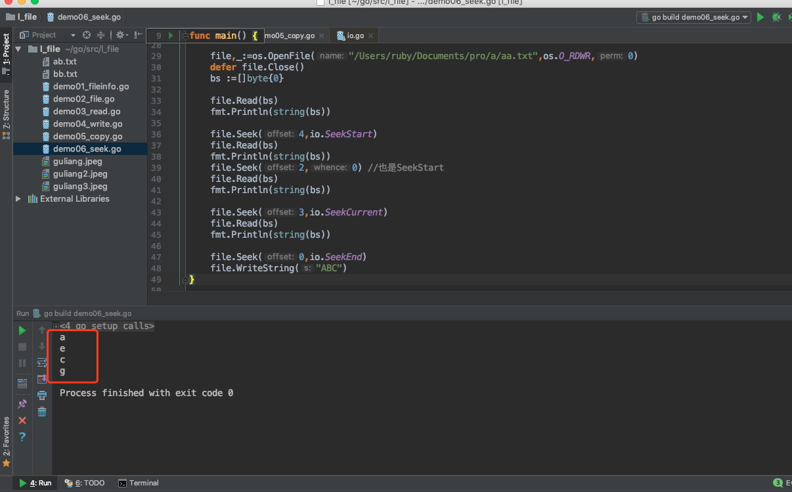


本地文件：


## 2、断点续传

首先思考几个问题
Q1：如果你要传的文件，比较大，那么是否有方法可以缩短耗时？
Q2：如果在文件传递过程中，程序因各种原因被迫中断了，那么下次再重启时，文件是否还需要重头开始？
Q3：传递文件的时候，支持暂停和恢复么？即使这两个操作分布在程序进程被杀前后。


通过断点续传可以实现，不同的语言有不同的实现方式。我们看看Go语言中，通过Seek()方法如何实现：

先说一下思路：想实现断点续传，主要就是记住上一次已经传递了多少数据，那我们可以创建一个临时文件，记录已经传递的数据量，当恢复传递的时候，先从临时文件中读取上次已经传递的数据量，然后通过Seek()方法，设置到该读和该写的位置，再继续传递数据。

示例代码：

```go
package main

import (
	"fmt"
	"os"
	"strconv"
	"io"
)

func main() {
	/*
	断点续传：
		文件传递：文件复制
			/Users/ruby/Documents/pro/a/guliang.jpeg

		复制到
			guliang4.jpeg

	思路：
		边复制，边记录复制的总量
	 */

	srcFile:="/Users/ruby/Documents/pro/a/guliang.jpeg"
	destFile:="guliang4.jpeg"
	tempFile:=destFile+"temp.txt"
	//fmt.Println(tempFile)
	file1,_:=os.Open(srcFile)
	file2,_:=os.OpenFile(destFile,os.O_CREATE|os.O_WRONLY,os.ModePerm)
	file3,_:=os.OpenFile(tempFile,os.O_CREATE|os.O_RDWR,os.ModePerm)


	defer file1.Close()
	defer file2.Close()
	//1.读取临时文件中的数据，根据seek
	file3.Seek(0,io.SeekStart)
	bs:=make([]byte,100,100)
	n1,err:=file3.Read(bs)
	fmt.Println(n1)
	countStr:=string(bs[:n1])
	fmt.Println(countStr)
	//count,_:=strconv.Atoi(countStr)
	count,_:=strconv.ParseInt(countStr,10,64)
	fmt.Println(count)

	//2. 设置读，写的偏移量
	file1.Seek(count,0)
	file2.Seek(count,0)
	data:=make([]byte,1024,1024)
	n2:=-1// 读取的数据量
	n3:=-1//写出的数据量
	total :=int(count)//读取的总量

	for{
		//3.读取数据
		n2,err=file1.Read(data)
		if err ==io.EOF{
			fmt.Println("文件复制完毕。。")
			file3.Close()
			os.Remove(tempFile)
			break
		}
		//将数据写入到目标文件
		n3,_=file2.Write(data[:n2])
		total += n3
		//将复制总量，存储到临时文件中
		file3.Seek(0,io.SeekStart)
		file3.WriteString(strconv.Itoa(total))


		//假装断电
		//if total>8000{
		//	panic("假装断电了。。。，假装的。。。")
		//}
	}

}

```


# 五、bufio包


生命不止，继续Go go go。。

Go语言在io操作中，还提供了一个bufio的包，使用这个包可以大幅提高文件读写的效率。


## 1、bufio包原理

bufio 是通过缓冲来提高效率。

io操作本身的效率并不低，低的是频繁的访问本地磁盘的文件。所以bufio就提供了缓冲区(分配一块内存)，读和写都先在缓冲区中，最后再读写文件，来降低访问本地磁盘的次数，从而提高效率。

简单的说就是，把文件读取进缓冲（内存）之后再读取的时候就可以避免文件系统的io 从而提高速度。同理，在进行写操作时，先把文件写入缓冲（内存），然后由缓冲写入文件系统。看完以上解释有人可能会表示困惑了，直接把 内容->文件 和 内容->缓冲->文件相比， 缓冲区好像没有起到作用嘛。其实缓冲区的设计是为了存储多次的写入，最后一口气把缓冲区内容写入文件。


bufio 封装了io.Reader或io.Writer接口对象，并创建另一个也实现了该接口的对象。

io.Reader或io.Writer 接口实现read() 和 write() 方法，对于实现这个接口的对象都是可以使用这两个方法的。


Reader对象

bufio.Reader 是bufio中对io.Reader 的封装

```go
// Reader implements buffering for an io.Reader object.
type Reader struct {
	buf          []byte
	rd           io.Reader // reader provided by the client
	r, w         int       // buf read and write positions
	err          error
	lastByte     int // last byte read for UnreadByte; -1 means invalid
	lastRuneSize int // size of last rune read for UnreadRune; -1 means invalid
}
```

bufio.Read(p []byte) 相当于读取大小len(p)的内容，思路如下：

1. 当缓存区有内容的时，将缓存区内容全部填入p并清空缓存区
2. 当缓存区没有内容的时候且len(p)>len(buf),即要读取的内容比缓存区还要大，直接去文件读取即可
3. 当缓存区没有内容的时候且len(p)<len(buf),即要读取的内容比缓存区小，缓存区从文件读取内容充满缓存区，并将p填满（此时缓存区有剩余内容）
4. 以后再次读取时缓存区有内容，将缓存区内容全部填入p并清空缓存区（此时和情况1一样）

源码：

```go
// Read reads data into p.
// It returns the number of bytes read into p.
// The bytes are taken from at most one Read on the underlying Reader,
// hence n may be less than len(p).
// To read exactly len(p) bytes, use io.ReadFull(b, p).
// At EOF, the count will be zero and err will be io.EOF.
func (b *Reader) Read(p []byte) (n int, err error) {
	n = len(p)
	if n == 0 {
		return 0, b.readErr()
	}
	if b.r == b.w {
		if b.err != nil {
			return 0, b.readErr()
		}
		if len(p) >= len(b.buf) {
			// Large read, empty buffer.
			// Read directly into p to avoid copy.
			n, b.err = b.rd.Read(p)
			if n < 0 {
				panic(errNegativeRead)
			}
			if n > 0 {
				b.lastByte = int(p[n-1])
				b.lastRuneSize = -1
			}
			return n, b.readErr()
		}
		// One read.
		// Do not use b.fill, which will loop.
		b.r = 0
		b.w = 0
		n, b.err = b.rd.Read(b.buf)
		if n < 0 {
			panic(errNegativeRead)
		}
		if n == 0 {
			return 0, b.readErr()
		}
		b.w += n
	}

	// copy as much as we can
	n = copy(p, b.buf[b.r:b.w])
	b.r += n
	b.lastByte = int(b.buf[b.r-1])
	b.lastRuneSize = -1
	return n, nil
}

```

说明：

reader内部通过维护一个r, w 即读入和写入的位置索引来判断是否缓存区内容被全部读出。

Writer对象

bufio.Writer 是bufio中对io.Writer 的封装

```go
// Writer implements buffering for an io.Writer object.
// If an error occurs writing to a Writer, no more data will be
// accepted and all subsequent writes, and Flush, will return the error.
// After all data has been written, the client should call the
// Flush method to guarantee all data has been forwarded to
// the underlying io.Writer.
type Writer struct {
	err error
	buf []byte
	n   int
	wr  io.Writer
}
```

bufio.Write(p []byte) 的思路如下

1. 判断buf中可用容量是否可以放下 p
2. 如果能放下，直接把p拼接到buf后面，即把内容放到缓冲区
3. 如果缓冲区的可用容量不足以放下，且此时缓冲区是空的，直接把p写入文件即可
4. 如果缓冲区的可用容量不足以放下，且此时缓冲区有内容，则用p把缓冲区填满，把缓冲区所有内容写入文件，并清空缓冲区
5. 判断p的剩余内容大小能否放到缓冲区，如果能放下（此时和步骤1情况一样）则把内容放到缓冲区
6. 如果p的剩余内容依旧大于缓冲区，（注意此时缓冲区是空的，情况和步骤3一样）则把p的剩余内容直接写入文件

以下是源码

```go

// Write writes the contents of p into the buffer.
// It returns the number of bytes written.
// If nn < len(p), it also returns an error explaining
// why the write is short.
func (b *Writer) Write(p []byte) (nn int, err error) {
	for len(p) > b.Available() && b.err == nil {
		var n int
		if b.Buffered() == 0 {
			// Large write, empty buffer.
			// Write directly from p to avoid copy.
			n, b.err = b.wr.Write(p)
		} else {
			n = copy(b.buf[b.n:], p)
			b.n += n
			b.Flush()
		}
		nn += n
		p = p[n:]
	}
	if b.err != nil {
		return nn, b.err
	}
	n := copy(b.buf[b.n:], p)
	b.n += n
	nn += n
	return nn, nil
}

```

说明：

b.wr 存储的是一个io.writer对象，实现了Write()的接口，所以可以使用b.wr.Write(p) 将p的内容写入文件。

b.flush() 会将缓存区内容写入文件，当所有写入完成后，因为缓存区会存储内容，所以需要手动flush()到文件。

b.Available() 为buf可用容量，等于len(buf) - n。

下图解释的是其中一种情况，即缓存区有内容，剩余p大于缓存区


## 2、bufio包

bufio包实现了有缓冲的I/O。它包装一个io.Reader或io.Writer接口对象，创建另一个也实现了该接口，且同时还提供了缓冲和一些文本I/O的帮助函数的对象。

bufio.Reader：

bufio.Reader 实现了如下接口：
	io.Reader
	io.WriterTo
	io.ByteScanner
	io.RuneScanner

```go
// NewReaderSize 将 rd 封装成一个带缓存的 bufio.Reader 对象，
// 缓存大小由 size 指定（如果小于 16 则会被设置为 16）。
// 如果 rd 的基类型就是有足够缓存的 bufio.Reader 类型，则直接将
// rd 转换为基类型返回。
func NewReaderSize(rd io.Reader, size int) *Reader

// NewReader 相当于 NewReaderSize(rd, 4096)
func NewReader(rd io.Reader) *Reader

// Peek 返回缓存的一个切片，该切片引用缓存中前 n 个字节的数据，
// 该操作不会将数据读出，只是引用，引用的数据在下一次读取操作之
// 前是有效的。如果切片长度小于 n，则返回一个错误信息说明原因。
// 如果 n 大于缓存的总大小，则返回 ErrBufferFull。
func (b *Reader) Peek(n int) ([]byte, error)

// Read 从 b 中读出数据到 p 中，返回读出的字节数和遇到的错误。
// 如果缓存不为空，则只能读出缓存中的数据，不会从底层 io.Reader
// 中提取数据，如果缓存为空，则：
// 1、len(p) >= 缓存大小，则跳过缓存，直接从底层 io.Reader 中读
// 出到 p 中。
// 2、len(p) < 缓存大小，则先将数据从底层 io.Reader 中读取到缓存
// 中，再从缓存读取到 p 中。
func (b *Reader) Read(p []byte) (n int, err error)

// Buffered 返回缓存中未读取的数据的长度。
func (b *Reader) Buffered() int

// ReadBytes 功能同 ReadSlice，只不过返回的是缓存的拷贝。
func (b *Reader) ReadBytes(delim byte) (line []byte, err error)

// ReadString 功能同 ReadBytes，只不过返回的是字符串。
func (b *Reader) ReadString(delim byte) (line string, err error)

...
```


bufio.Writer：

bufio.Writer 实现了如下接口：
	io.Writer
	io.ReaderFrom
	io.ByteWriter


```go
// NewWriterSize 将 wr 封装成一个带缓存的 bufio.Writer 对象，
// 缓存大小由 size 指定（如果小于 4096 则会被设置为 4096）。
// 如果 wr 的基类型就是有足够缓存的 bufio.Writer 类型，则直接将
// wr 转换为基类型返回。
func NewWriterSize(wr io.Writer, size int) *Writer

// NewWriter 相当于 NewWriterSize(wr, 4096)
func NewWriter(wr io.Writer) *Writer

// WriteString 功能同 Write，只不过写入的是字符串
func (b *Writer) WriteString(s string) (int, error)

// WriteRune 向 b 写入 r 的 UTF-8 编码，返回 r 的编码长度。
func (b *Writer) WriteRune(r rune) (size int, err error)

// Flush 将缓存中的数据提交到底层的 io.Writer 中
func (b *Writer) Flush() error

// Available 返回缓存中未使用的空间的长度
func (b *Writer) Available() int

// Buffered 返回缓存中未提交的数据的长度
func (b *Writer) Buffered() int

// Reset 将 b 的底层 Writer 重新指定为 w，同时丢弃缓存中的所有数据，复位
// 所有标记和错误信息。相当于创建了一个新的 bufio.Writer。
func (b *Writer) Reset(w io.Writer)

...
```


## 3、实例代码

读取数据：

```go
package main

import (
	"os"
	"fmt"
	"bufio"
)

func main() {
	/*
	bufio:高效io读写
		buffer缓存
		io：input/output

	将io包下的Reader，Write对象进行包装，带缓存的包装，提高读写的效率

		ReadBytes()
		ReadString()
		ReadLine()

	 */

	 fileName:="/Users/ruby/Documents/pro/a/english.txt"
	 file,err := os.Open(fileName)
	 if err != nil{
	 	fmt.Println(err)
	 	return
	 }
	 defer file.Close()

	 //创建Reader对象
	 //b1 := bufio.NewReader(file)
	 //1.Read()，高效读取
	 //p := make([]byte,1024)
	 //n1,err := b1.Read(p)
	 //fmt.Println(n1)
	 //fmt.Println(string(p[:n1]))

	 //2.ReadLine()
	 //data,flag,err := b1.ReadLine()
	 //fmt.Println(flag)
	 //fmt.Println(err)
	 //fmt.Println(data)
	 //fmt.Println(string(data))

	 //3.ReadString()
	// s1,err :=b1.ReadString('\n')
	// fmt.Println(err)
	// fmt.Println(s1)
	//
	// s1,err = b1.ReadString('\n')
	// fmt.Println(err)
	// fmt.Println(s1)
	//
	//s1,err = b1.ReadString('\n')
	//fmt.Println(err)
	//fmt.Println(s1)
	//
	//for{
	//	s1,err := b1.ReadString('\n')
	//	if err == io.EOF{
	//		fmt.Println("读取完毕。。")
	//		break
	//	}
	//	fmt.Println(s1)
	//}

	//4.ReadBytes()
	//data,err :=b1.ReadBytes('\n')
	//fmt.Println(err)
	//fmt.Println(string(data))


	//Scanner
	//s2 := ""
	//fmt.Scanln(&s2)
	//fmt.Println(s2)

	b2 := bufio.NewReader(os.Stdin)
	s2, _ := b2.ReadString('\n')
	fmt.Println(s2)

}

```

本地文件：english.txt文件内容：


写数据示例代码：

```go
package main

import (
	"os"
	"fmt"
	"bufio"
)

func main() {
	/*
	bufio:高效io读写
		buffer缓存
		io：input/output

	将io包下的Reader，Write对象进行包装，带缓存的包装，提高读写的效率

		func (b *Writer) Write(p []byte) (nn int, err error)
		func (b *Writer) WriteByte(c byte) error
		func (b *Writer) WriteRune(r rune) (size int, err error)
		func (b *Writer) WriteString(s string) (int, error)

	 */

	 fileName := "/Users/ruby/Documents/pro/a/cc.txt"
	 file,err := os.OpenFile(fileName,os.O_CREATE|os.O_WRONLY,os.ModePerm)
	 if err != nil{
	 	fmt.Println(err)
	 	return
	 }
	 defer file.Close()

	 w1 := bufio.NewWriter(file)
	 //n,err := w1.WriteString("helloworld")
	 //fmt.Println(err)
	 //fmt.Println(n)
	 //w1.Flush() //刷新缓冲区

	 for i:=1;i<=1000;i++{
	 	w1.WriteString(fmt.Sprintf("%d:hello",i))
	 }
	 w1.Flush()
}

```


# 六、ioutil包

除了io包可以读写数据，Go语言中还提供了一个辅助的工具包就是ioutil，里面的方法虽然不多，但是都还蛮好用的。

```go
import "io/ioutil"
```

该包的介绍只有一句话：Package ioutil implements some I/O utility functions。

## 1、ioutil包的方法

下面我们来看一下里面的方法：

```go
// Discard 是一个 io.Writer 接口，调用它的 Write 方法将不做任何事情
// 并且始终成功返回。
var Discard io.Writer = devNull(0)

// ReadAll 读取 r 中的所有数据，返回读取的数据和遇到的错误。
// 如果读取成功，则 err 返回 nil，而不是 EOF，因为 ReadAll 定义为读取
// 所有数据，所以不会把 EOF 当做错误处理。
func ReadAll(r io.Reader) ([]byte, error)

// ReadFile 读取文件中的所有数据，返回读取的数据和遇到的错误。
// 如果读取成功，则 err 返回 nil，而不是 EOF
func ReadFile(filename string) ([]byte, error)

// WriteFile 向文件中写入数据，写入前会清空文件。
// 如果文件不存在，则会以指定的权限创建该文件。
// 返回遇到的错误。
func WriteFile(filename string, data []byte, perm os.FileMode) error

// ReadDir 读取指定目录中的所有目录和文件（不包括子目录）。
// 返回读取到的文件信息列表和遇到的错误，列表是经过排序的。
func ReadDir(dirname string) ([]os.FileInfo, error)

// NopCloser 将 r 包装为一个 ReadCloser 类型，但 Close 方法不做任何事情。
func NopCloser(r io.Reader) io.ReadCloser

// TempFile 在 dir 目录中创建一个以 prefix 为前缀的临时文件，并将其以读
// 写模式打开。返回创建的文件对象和遇到的错误。
// 如果 dir 为空，则在默认的临时目录中创建文件（参见 os.TempDir），多次
// 调用会创建不同的临时文件，调用者可以通过 f.Name() 获取文件的完整路径。
// 调用本函数所创建的临时文件，应该由调用者自己删除。
func TempFile(dir, prefix string) (f *os.File, err error)

// TempDir 功能同 TempFile，只不过创建的是目录，返回目录的完整路径。
func TempDir(dir, prefix string) (name string, err error)
```


## 2、示例代码：

```go
package main

import (
	"io/ioutil"
	"fmt"
	"os"
)

func main() {
	/*
	ioutil包：
		ReadFile()
		WriteFile()
		ReadDir()
		..
	 */

	//1.读取文件中的所有的数据
	//fileName1 := "/Users/ruby/Documents/pro/a/aa.txt"
	//data, err := ioutil.ReadFile(fileName1)
	//fmt.Println(err)
	//fmt.Println(string(data))

	//2.写出数据
	//fileName2:="/Users/ruby/Documents/pro/a/bbb.txt"
	//s1:="helloworld面朝大海春暖花开"
	//err:=ioutil.WriteFile(fileName2,[]byte(s1),0777)
	//fmt.Println(err)

	//3.
	//s2:="qwertyuiopsdfghjklzxcvbnm"
	//r1:=strings.NewReader(s2)
	//data,_:=ioutil.ReadAll(r1)
	//fmt.Println(data)

	//4.ReadDir(),读取一个目录下的子内容：子文件和子目录，但是仅有一层
	//dirName:="/Users/ruby/Documents/pro/a"
	//fileInfos,_:=ioutil.ReadDir(dirName)
	//fmt.Println(len(fileInfos))
	//for i:=0;i<len(fileInfos);i++{
	//	//fmt.Printf("%T\n",fileInfos[i])
	//	fmt.Println(i,fileInfos[i].Name(),fileInfos[i].IsDir())
	//
	//}


	// 5.创建临时目录
	dir, err := ioutil.TempDir("/Users/ruby/Documents/pro/a", "Test")
	if err != nil {
		fmt.Println(err)
	}
	defer os.Remove(dir) // 用完删除
	fmt.Printf("%s\n", dir)

	// 创建临时文件
	f, err := ioutil.TempFile(dir, "Test")
	if err != nil {
		fmt.Println(err)
	}
	defer os.Remove(f.Name()) // 用完删除
	fmt.Printf("%s\n", f.Name())

}

```


# 七、遍历文件夹


学习io之后，尤其是文件操作，我们就可以遍历给定的目录文件夹了。可以使用ioutil包下的readDir()方法，这个方法可以获取指定目录下的内容，返回文件和子目录。

因为文件夹下还有子文件夹，而ioutil包的ReadDir()只能获取一层目录，所以我们需要自己去设计算法来实现，最容易实现的思路就是使用递归。

示例代码：

```go
package main

import (
	"io/ioutil"
	"fmt"
	"log"
)

func main() {
	/**
	遍历文件夹：
	 */

	dirname := "/Users/ruby/Documents/pro"
	listFiles(dirname, 0)

}

func listFiles(dirname string, level int) {
	// level用来记录当前递归的层次
	// 生成有层次感的空格
	s := "|--"
	for i := 0; i < level; i++ {
		s = "|   " + s
	}

	fileInfos, err := ioutil.ReadDir(dirname)
	if err != nil{
		log.Fatal(err)
	}
	for _, fi := range fileInfos {
		filename := dirname + "/" + fi.Name()
		fmt.Printf("%s%s\n", s, filename)
		if fi.IsDir() {
			//继续遍历fi这个目录
			listFiles(filename, level+1)
		}
	}
}


```


运行结果：


# 一、并发性Concurrency


## 1.1 多任务

怎么来理解多任务呢？其实就是指我们的操作系统可以同时执行多个任务。举个例子，你一边听音乐，一边刷微博，一边聊QQ，一边用Markdown写作业，这就是多任务，至少同时有4个任务正在运行。还有很多任务悄悄地在后台同时运行着，只是界面上没有显示而已。


CPU的速度太快啦。。。


## 1.2 什么是并发

Go是并发语言，而不是并行语言。在讨论如何在Go中进行并发处理之前，我们首先必须了解什么是并发，以及它与并行性有什么不同。(Go is a concurrent language and not a parallel one. )

**并发性Concurrency是同时处理许多事情的能力。**

举个例子，假设一个人在晨跑。在晨跑时，他的鞋带松了。现在这个人停止跑步，系鞋带，然后又开始跑步。这是一个典型的并发性示例。这个人能够同时处理跑步和系鞋带，这是一个人能够同时处理很多事情。

什么是并行性parallelism，它与并发concurrency有什么不同?
并行就是同时做很多事情。这听起来可能与并发类似，但实际上是不同的。

让我们用同样的慢跑例子更好地理解它。在这种情况下，我们假设这个人正在慢跑，并且使用它的手机听音乐。在这种情况下，一个人一边慢跑一边听音乐，那就是他同时在做很多事情。这就是所谓的并行性(parallelism)。

并发性和并行性——一种技术上的观点。
假设我们正在编写一个web浏览器。web浏览器有各种组件。其中两个是web页面呈现区域和下载文件从internet下载的下载器。假设我们以这样的方式构建了浏览器的代码，这样每个组件都可以独立地执行。当这个浏览器运行在单个核处理器中时，处理器将在浏览器的两个组件之间进行上下文切换。它可能会下载一个文件一段时间，然后它可能会切换到呈现用户请求的网页的html。这就是所谓的并发性。并发进程从不同的时间点开始，它们的执行周期重叠。在这种情况下，下载和呈现从不同的时间点开始，它们的执行重叠。

假设同一浏览器运行在多核处理器上。在这种情况下，文件下载组件和HTML呈现组件可能同时在不同的内核中运行。这就是所谓的并行性。


并行性Parallelism不会总是导致更快的执行时间。这是因为并行运行的组件可能需要相互通信。例如，在我们的浏览器中，当文件下载完成时，应该将其传递给用户，比如使用弹出窗口。这种通信发生在负责下载的组件和负责呈现用户界面的组件之间。这种通信开销在并发concurrent 系统中很低。当组件在多个内核中并行concurrent 运行时，这种通信开销很高。因此，并行程序并不总是导致更快的执行时间!


## 1.3 进程、线程、协程

**进程(Process)，线程(Thread)，协程(Coroutine，也叫轻量级线程)**

进程
进程是一个程序在一个数据集中的一次动态执行过程，可以简单理解为“正在执行的程序”，它是CPU资源分配和调度的独立单位。 
进程一般由程序、数据集、进程控制块三部分组成。我们编写的程序用来描述进程要完成哪些功能以及如何完成；数据集则是程序在执行过程中所需要使用的资源；进程控制块用来记录进程的外部特征，描述进程的执行变化过程，系统可以利用它来控制和管理进程，它是系统感知进程存在的唯一标志。 **进程的局限是创建、撤销和切换的开销比较大。**


线程
线程是在进程之后发展出来的概念。 线程也叫轻量级进程，它是一个基本的CPU执行单元，也是程序执行过程中的最小单元，由线程ID、程序计数器、寄存器集合和堆栈共同组成。一个进程可以包含多个线程。 
线程的优点是减小了程序并发执行时的开销，提高了操作系统的并发性能，缺点是线程没有自己的系统资源，只拥有在运行时必不可少的资源，但同一进程的各线程可以共享进程所拥有的系统资源，如果把进程比作一个车间，那么线程就好比是车间里面的工人。不过对于某些独占性资源存在锁机制，处理不当可能会产生“死锁”。


协程
协程是一种用户态的轻量级线程，又称微线程，英文名Coroutine，协程的调度完全由用户控制。人们通常将协程和子程序（函数）比较着理解。 
子程序调用总是一个入口，一次返回，一旦退出即完成了子程序的执行。 

**与传统的系统级线程和进程相比，协程的最大优势在于其"轻量级"，可以轻松创建上百万个而不会导致系统资源衰竭，而线程和进程通常最多也不能超过1万的。这也是协程也叫轻量级线程的原因。**

> 协程与多线程相比，其优势体现在：协程的执行效率极高。因为子程序切换不是线程切换，而是由程序自身控制，因此，没有线程切换的开销，和多线程比，线程数量越多，协程的性能优势就越明显。


**Go语言对于并发的实现是靠协程，Goroutine**


# 二、Go语言的并发模型

Go 语言相比Java等一个很大的优势就是可以方便地编写并发程序。Go 语言内置了 goroutine 机制，使用goroutine可以快速地开发并发程序， 更好的利用多核处理器资源。接下来我们来了解一下Go语言的并发原理。

## 2.1 线程模型

在现代操作系统中，线程是处理器调度和分配的基本单位，进程则作为资源拥有的基本单位。每个进程是由私有的虚拟地址空间、代码、数据和其它各种系统资源组成。线程是进程内部的一个执行单元。 每一个进程至少有一个主执行线程，它无需由用户去主动创建，是由系统自动创建的。 用户根据需要在应用程序中创建其它线程，多个线程并发地运行于同一个进程中。

我们先从线程讲起，无论语言层面何种并发模型，到了操作系统层面，一定是以线程的形态存在的。而操作系统根据资源访问权限的不同，体系架构可分为用户空间和内核空间；内核空间主要操作访问CPU资源、I/O资源、内存资源等硬件资源，为上层应用程序提供最基本的基础资源，用户空间呢就是上层应用程序的固定活动空间，用户空间不可以直接访问资源，必须通过“系统调用”、“库函数”或“Shell脚本”来调用内核空间提供的资源。

我们现在的计算机语言，可以狭义的认为是一种“软件”，它们中所谓的“线程”，往往是用户态的线程，和操作系统本身内核态的线程（简称KSE），还是有区别的。

Go并发编程模型在底层是由操作系统所提供的线程库支撑的，因此还是得从线程实现模型说起。

线程可以视为进程中的控制流。一个进程至少会包含一个线程，因为其中至少会有一个控制流持续运行。因而，一个进程的第一个线程会随着这个进程的启动而创建，这个线程称为该进程的主线程。当然，一个进程也可以包含多个线程。这些线程都是由当前进程中已存在的线程创建出来的，创建的方法就是调用系统调用，更确切地说是调用
pthread create函数。拥有多个线程的进程可以并发执行多个任务，并且即使某个或某些任务被阻塞，也不会影响其他任务正常执行，这可以大大改善程序的响应时间和吞吐量。另一方面，线程不可能独立于进程存在。它的生命周期不可能逾越其所属进程的生命周期。

线程的实现模型主要有3个，分别是:用户级线程模型、内核级线程模型和两级线程模型。它们之间最大的差异就在于线程与内核调度实体( Kernel Scheduling Entity,简称KSE)之间的对应关系上。顾名思义，内核调度实体就是可以被内核的调度器调度的对象。在很多文献和书中，它也称为内核级线程，是操作系统内核的最小调度单元。

#### 2.1.1 内核级线程模型

用户线程与KSE是1对1关系(1:1)。大部分编程语言的线程库(如linux的pthread，Java的java.lang.Thread，C++11的std::thread等等)都是对操作系统的线程（内核级线程）的一层封装，创建出来的每个线程与一个不同的KSE静态关联，因此其调度完全由OS调度器来做。这种方式实现简单，直接借助OS提供的线程能力，并且不同用户线程之间一般也不会相互影响。但其创建，销毁以及多个线程之间的上下文切换等操作都是直接由OS层面亲自来做，在需要使用大量线程的场景下对OS的性能影响会很大。


每个线程由内核调度器独立的调度，所以如果一个线程阻塞则不影响其他的线程。

优点：在多核处理器的硬件的支持下，内核空间线程模型支持了真正的并行，当一个线程被阻塞后，允许另一个线程继续执行，所以并发能力较强。

缺点：每创建一个用户级线程都需要创建一个内核级线程与其对应，这样创建线程的开销比较大，会影响到应用程序的性能。

#### 2.1.2 用户级线程模型

用户线程与KSE是多对1关系(M:1)，这种线程的创建，销毁以及多个线程之间的协调等操作都是由用户自己实现的线程库来负责，对OS内核透明，一个进程中所有创建的线程都与同一个KSE在运行时动态关联。现在有许多语言实现的 **协程** 基本上都属于这种方式。这种实现方式相比内核级线程可以做的很轻量级，对系统资源的消耗会小很多，因此可以创建的数量与上下文切换所花费的代价也会小得多。但该模型有个致命的缺点，如果我们在某个用户线程上调用阻塞式系统调用(如用阻塞方式read网络IO)，那么一旦KSE因阻塞被内核调度出CPU的话，剩下的所有对应的用户线程全都会变为阻塞状态（整个进程挂起）。 
所以这些语言的**协程库**会把自己一些阻塞的操作重新封装为完全的非阻塞形式，然后在以前要阻塞的点上，主动让出自己，并通过某种方式通知或唤醒其他待执行的用户线程在该KSE上运行，从而避免了内核调度器由于KSE阻塞而做上下文切换，这样整个进程也不会被阻塞了。

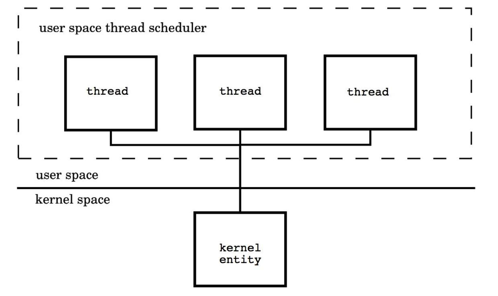

优点： 这种模型的好处是线程上下文切换都发生在用户空间，避免的模态切换（mode switch），从而对于性能有积极的影响。

缺点：所有的线程基于一个内核调度实体即内核线程，这意味着只有一个处理器可以被利用，在多处理器环境下这是不能够被接受的，本质上，用户线程只解决了并发问题，但是没有解决并行问题。如果线程因为 I/O 操作陷入了内核态，内核态线程阻塞等待 I/O 数据，则所有的线程都将会被阻塞，用户空间也可以使用非阻塞而 I/O，但是不能避免性能及复杂度问题。

#### 2.1.3 两级线程模型

用户线程与KSE是多对多关系(M:N)，这种实现综合了前两种模型的优点，为一个进程中创建多个KSE，并且线程可以与不同的KSE在运行时进行动态关联，当某个KSE由于其上工作的线程的阻塞操作被内核调度出CPU时，当前与其关联的其余用户线程可以重新与其他KSE建立关联关系。当然这种动态关联机制的实现很复杂，也需要用户自己去实现，这算是它的一个缺点吧。Go语言中的并发就是使用的这种实现方式，Go为了实现该模型自己实现了一个运行时调度器来负责Go中的"线程"与KSE的动态关联。此模型有时也被称为 **混合型线程模型**，**即用户调度器实现用户线程到KSE的“调度”，内核调度器实现KSE到CPU上的调度**。

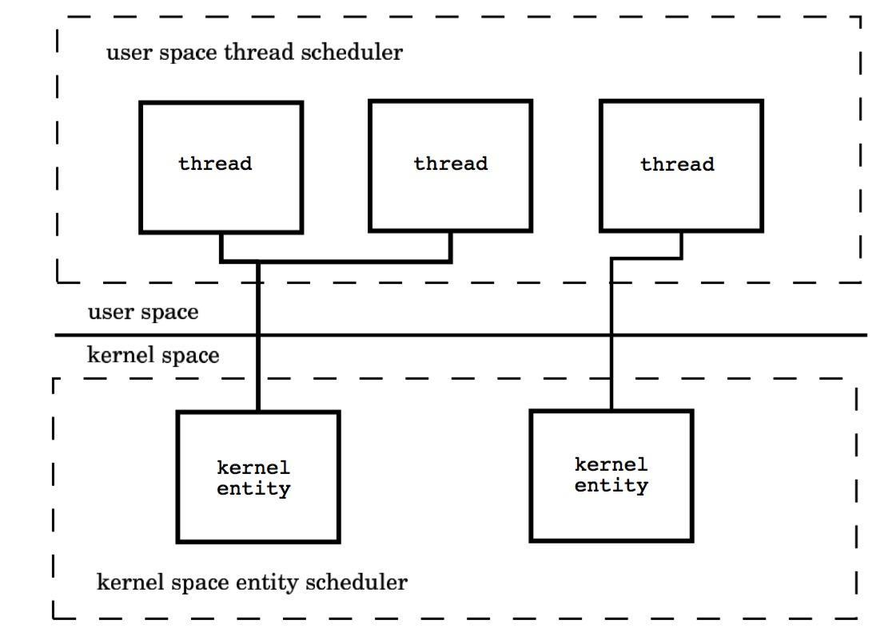


## 2.2 Go并发调度: G-P-M模型

在操作系统提供的内核线程之上，Go搭建了一个特有的两级线程模型。goroutine机制实现了M : N的线程模型，goroutine机制是协程（coroutine）的一种实现，golang内置的调度器，可以让多核CPU中每个CPU执行一个协程。

#### 2.2.1 调度器是如何工作的

有了上面的认识，我们可以开始真正的介绍Go的并发机制了，先用一段代码展示一下在Go语言中新建一个“线程”(Go语言中称为Goroutine)的样子：

```go
// 用go关键字加上一个函数（这里用了匿名函数）
// 调用就做到了在一个新的“线程”并发执行任务
go func() { 
    // do something in one new goroutine
}()
```

功能上等价于Java8的代码:

```java
new java.lang.Thread(() -> { 
    // do something in one new thread
}).start();
```

理解goroutine机制的原理，关键是理解Go语言scheduler的实现。

Go语言中支撑整个scheduler实现的主要有4个重要结构，分别是M、G、P、Sched， 前三个定义在runtime.h中，Sched定义在proc.c中。

- Sched结构就是调度器，它维护有存储M和G的队列以及调度器的一些状态信息等。
- M结构是Machine，系统线程，它由操作系统管理的，goroutine就是跑在M之上的；M是一个很大的结构，里面维护小对象内存cache（mcache）、当前执行的goroutine、随机数发生器等等非常多的信息。
- P结构是Processor，处理器，它的主要用途就是用来执行goroutine的，它维护了一个goroutine队列，即runqueue。Processor是让我们从N:1调度到M:N调度的重要部分。
- G是goroutine实现的核心结构，它包含了栈，指令指针，以及其他对调度goroutine很重要的信息，例如其阻塞的channel。

> Processor的数量是在启动时被设置为环境变量GOMAXPROCS的值，或者通过运行时调用函数GOMAXPROCS()进行设置。Processor数量固定意味着任意时刻只有GOMAXPROCS个线程在运行go代码。

我们分别用三角形，矩形和圆形表示Machine Processor和Goroutine。


在单核处理器的场景下，所有goroutine运行在同一个M系统线程中，每一个M系统线程维护一个Processor，任何时刻，一个Processor中只有一个goroutine，其他goroutine在runqueue中等待。一个goroutine运行完自己的时间片后，让出上下文，回到runqueue中。 多核处理器的场景下，为了运行goroutines，每个M系统线程会持有一个Processor。


在正常情况下，scheduler会按照上面的流程进行调度，但是线程会发生阻塞等情况，看一下goroutine对线程阻塞等的处理。


#### 2.2.2 线程阻塞

当正在运行的goroutine阻塞的时候，例如进行系统调用，会再创建一个系统线程（M1），当前的M线程放弃了它的Processor，P转到新的线程中去运行。


#### 2.2.3 runqueue执行完成

当其中一个Processor的runqueue为空，没有goroutine可以调度。它会从另外一个上下文偷取一半的goroutine。


> 其图中的G，P和M都是Go语言运行时系统（其中包括内存分配器，并发调度器，垃圾收集器等组件，可以想象为Java中的JVM）抽象出来概念和数据结构对象：
> G：Goroutine的简称，上面用go关键字加函数调用的代码就是创建了一个G对象，是对一个要并发执行的任务的封装，也可以称作用户态线程。属于用户级资源，对OS透明，具备轻量级，可以大量创建，上下文切换成本低等特点。
> M：Machine的简称，在linux平台上是用clone系统调用创建的，其与用linux pthread库创建出来的线程本质上是一样的，都是利用系统调用创建出来的OS线程实体。M的作用就是执行G中包装的并发任务。**Go运行时系统中的调度器的主要职责就是将G公平合理的安排到多个M上去执行**。其属于OS资源，可创建的数量上也受限了OS，通常情况下G的数量都多于活跃的M的。
> P：Processor的简称，逻辑处理器，主要作用是管理G对象（每个P都有一个G队列），并为G在M上的运行提供本地化资源。

从两级线程模型来看，似乎并不需要P的参与，有G和M就可以了，那为什么要加入P这个东东呢？
其实Go语言运行时系统早期(Go1.0)的实现中并没有P的概念，Go中的调度器直接将G分配到合适的M上运行。但这样带来了很多问题，例如，不同的G在不同的M上并发运行时可能都需向系统申请资源（如堆内存），由于资源是全局的，将会由于资源竞争造成很多系统性能损耗，为了解决类似的问题，后面的Go（Go1.1）运行时系统加入了P，让P去管理G对象，M要想运行G必须先与一个P绑定，然后才能运行该P管理的G。这样带来的好处是，我们可以在P对象中预先申请一些系统资源（本地资源），G需要的时候先向自己的本地P申请（无需锁保护），如果不够用或没有再向全局申请，而且从全局拿的时候会多拿一部分，以供后面高效的使用。就像现在我们去政府办事情一样，先去本地政府看能搞定不，如果搞不定再去中央，从而提供办事效率。
而且由于P解耦了G和M对象，这样即使M由于被其上正在运行的G阻塞住，其余与该M关联的G也可以随着P一起迁移到别的活跃的M上继续运行，从而让G总能及时找到M并运行自己，从而提高系统的并发能力。
Go运行时系统通过构造G-P-M对象模型实现了一套用户态的并发调度系统，可以自己管理和调度自己的并发任务，所以可以说Go语言**原生支持并发**。**自己实现的调度器负责将并发任务分配到不同的内核线程上运行，然后内核调度器接管内核线程在CPU上的执行与调度。**

可以看到Go的并发用起来非常简单，用了一个语法糖将内部复杂的实现结结实实的包装了起来。其内部可以用下面这张图来概述：


写在最后，Go运行时完整的调度系统是很复杂，很难用一篇文章描述的清楚，这里只能从宏观上介绍一下，让大家有个整体的认识。

```go
// Goroutine1
func task1() {
    go task2()
    go task3()
}
```

假如我们有一个G(Goroutine1)已经通过P被安排到了一个M上正在执行，在Goroutine1执行的过程中我们又创建两个G，这两个G会被马上放入与Goroutine1相同的P的本地G任务队列中，排队等待与该P绑定的M的执行，这是最基本的结构，很好理解。 关键问题是:
**a.如何在一个多核心系统上尽量合理分配G到多个M上运行，充分利用多核，提高并发能力呢？**
如果我们在一个Goroutine中通过**go**关键字创建了大量G，这些G虽然暂时会被放在同一个队列, 但如果这时还有空闲P（系统内P的数量默认等于系统cpu核心数），Go运行时系统始终能保证至少有一个（通常也只有一个）活跃的M与空闲P绑定去各种G队列去寻找可运行的G任务，该种M称为**自旋的M**。一般寻找顺序为：自己绑定的P的队列，全局队列，然后其他P队列。如果自己P队列找到就拿出来开始运行，否则去全局队列看看，由于全局队列需要锁保护，如果里面有很多任务，会转移一批到本地P队列中，避免每次都去竞争锁。如果全局队列还是没有，就要开始玩狠的了，直接从其他P队列偷任务了（偷一半任务回来）。这样就保证了在还有可运行的G任务的情况下，总有与CPU核心数相等的M+P组合 在执行G任务或在执行G的路上(寻找G任务)。
**b. 如果某个M在执行G的过程中被G中的系统调用阻塞了，怎么办？**
在这种情况下，这个M将会被内核调度器调度出CPU并处于阻塞状态，与该M关联的其他G就没有办法继续执行了，但Go运行时系统的一个监控线程(sysmon线程)能探测到这样的M，并把与该M绑定的P剥离，寻找其他空闲或新建M接管该P，然后继续运行其中的G，大致过程如下图所示。然后等到该M从阻塞状态恢复，需要重新找一个空闲P来继续执行原来的G，如果这时系统正好没有空闲的P，就把原来的G放到全局队列当中，等待其他M+P组合发掘并执行。


**c. 如果某一个G在M运行时间过长，有没有办法做抢占式调度，让该M上的其他G获得一定的运行时间，以保证调度系统的公平性?**
我们知道linux的内核调度器主要是基于时间片和优先级做调度的。对于相同优先级的线程，内核调度器会尽量保证每个线程都能获得一定的执行时间。为了防止有些线程"饿死"的情况，内核调度器会发起抢占式调度将长期运行的线程中断并让出CPU资源，让其他线程获得执行机会。当然在Go的运行时调度器中也有类似的抢占机制，但并不能保证抢占能成功，因为Go运行时系统并没有内核调度器的中断能力，它只能通过向运行时间过长的G中设置抢占flag的方法温柔的让运行的G自己主动让出M的执行权。 
说到这里就不得不提一下Goroutine在运行过程中可以动态扩展自己线程栈的能力，可以从初始的2KB大小扩展到最大1G（64bit系统上），因此在每次调用函数之前需要先计算该函数调用需要的栈空间大小，然后按需扩展（超过最大值将导致运行时异常）。Go抢占式调度的机制就是利用在判断要不要扩栈的时候顺便查看以下自己的抢占flag，决定是否继续执行，还是让出自己。
运行时系统的监控线程会计时并设置抢占flag到运行时间过长的G，然后G在有函数调用的时候会检查该抢占flag，如果已设置就将自己放入全局队列，这样该M上关联的其他G就有机会执行了。但如果正在执行的G是个很耗时的操作且没有任何函数调用(如只是for循环中的计算操作)，即使抢占flag已经被设置，该G还是将一直霸占着当前M直到执行完自己的任务。


# 三、runtime包

官网文档对runtime包的介绍：

```
Package runtime contains operations that interact with Go's runtime system, such as functions to control goroutines. It also includes the low-level type information used by the reflect package; see reflect's documentation for the programmable interface to the run-time type system.
```


尽管 Go 编译器产生的是本地可执行代码，这些代码仍旧运行在 Go 的 runtime（这部分的代码可以在 runtime 包中找到）当中。这个 runtime 类似 Java 和 .NET 语言所用到的虚拟机，它负责管理包括内存分配、垃圾回收（第 10.8 节）、栈处理、goroutine、channel、切片（slice）、map 和反射（reflection）等等。

## 3.1 常用函数

**`runtime` 调度器是个非常有用的东西，关于 `runtime` 包几个方法:**

- **NumCPU**：返回当前系统的 `CPU` 核数量

- **GOMAXPROCS**：设置最大的可同时使用的 `CPU` 核数

  通过runtime.GOMAXPROCS函数，应用程序何以在运行期间设置运行时系统中得P最大数量。但这会引起“Stop the World”。所以，应在应用程序最早的调用。并且最好是在运行Go程序之前设置好操作程序的环境变量GOMAXPROCS，而不是在程序中调用runtime.GOMAXPROCS函数。

  无论我们传递给函数的整数值是什么值，运行时系统的P最大值总会在1~256之间。

> go1.8后，默认让程序运行在多个核上,可以不用设置了
> go1.8前，还是要设置一下，可以更高效的利益cpu


- **Gosched**：让当前线程让出 `cpu` 以让其它线程运行,它不会挂起当前线程，因此当前线程未来会继续执行

  这个函数的作用是让当前 `goroutine` 让出 `CPU`，当一个 `goroutine` 发生阻塞，`Go` 会自动地把与该 `goroutine` 处于同一系统线程的其他 `goroutine` 转移到另一个系统线程上去，以使这些 `goroutine` 不阻塞。

- **Goexit**：退出当前 `goroutine`(但是`defer`语句会照常执行)

- **NumGoroutine**：返回正在执行和排队的任务总数

  runtime.NumGoroutine函数在被调用后，会返回系统中的处于特定状态的Goroutine的数量。这里的特指是指Grunnable\Gruning\Gsyscall\Gwaition。处于这些状态的Groutine即被看做是活跃的或者说正在被调度。

  注意：垃圾回收所在Groutine的状态也处于这个范围内的话，也会被纳入该计数器。

- **GOOS**：目标操作系统

- **runtime.GC**:会让运行时系统进行一次强制性的垃圾收集

  1. 强制的垃圾回收：不管怎样，都要进行的垃圾回收。
  2. 非强制的垃圾回收：只会在一定条件下进行的垃圾回收（即运行时，系统自上次垃圾回收之后新申请的堆内存的单元（也成为单元增量）达到指定的数值）。

- **GOROOT** :获取goroot目录

- **GOOS** : 查看目标操作系统 
  很多时候，我们会根据平台的不同实现不同的操作，就而已用GOOS了：

- 。。。


## 3.2 示例代码：

1. 获取goroot和os：

 ```go
   //获取goroot目录：
   	fmt.Println("GOROOT-->",runtime.GOROOT())
   
   	//获取操作系统
   	fmt.Println("os/platform-->",runtime.GOOS) // GOOS--> darwin，mac系统
   
 ```

   

2. 获取CPU数量，和设置CPU数量：

```go
func init(){
	//1.获取逻辑cpu的数量
	fmt.Println("逻辑CPU的核数：",runtime.NumCPU())
	//2.设置go程序执行的最大的：[1,256]
	n := runtime.GOMAXPROCS(runtime.NumCPU())
	fmt.Println(n)
}
```


3. Gosched()：

```go
func main() {
	go func() {
		for i := 0; i < 5; i++ {
			fmt.Println("goroutine。。。")
		}

	}()

	for i := 0; i < 4; i++ {
		//让出时间片，先让别的协议执行，它执行完，再回来执行此协程
		runtime.Gosched()
		fmt.Println("main。。")
	}
}

```


4. Goexit的使用（终止协程）

```go

func main() {
	//创建新建的协程
	go func() {
		fmt.Println("goroutine开始。。。")

		//调用了别的函数
		fun()

		fmt.Println("goroutine结束。。")
	}() //别忘了()

	//睡一会儿，不让主协程结束
	time.Sleep(3*time.Second)
}


func fun() {
	defer fmt.Println("defer。。。")

	//return           //终止此函数
	runtime.Goexit() //终止所在的协程

	fmt.Println("fun函数。。。")
}
```

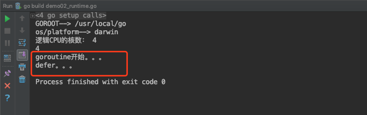


# 四、临界资源安全问题

## 4.1 临界资源

**临界资源:** 指并发环境中多个进程/线程/协程共享的资源。

但是在并发编程中对临界资源的处理不当， 往往会导致数据不一致的问题。

示例代码：

```go
package main

import (
	"fmt"
	"time"
)

func main()  {
	a := 1
	go func() {
		a = 2
		fmt.Println("子goroutine。。",a)
	}()
	a = 3
	time.Sleep(1)
	fmt.Println("main goroutine。。",a)
}
```

我们通过终端命令来执行：


能够发现一处被多个goroutine共享的数据。


## 4.2 临界资源安全问题


并发本身并不复杂，但是因为有了资源竞争的问题，就使得我们开发出好的并发程序变得复杂起来，因为会引起很多莫名其妙的问题。

如果多个goroutine在访问同一个数据资源的时候，其中一个线程修改了数据，那么这个数值就被修改了，对于其他的goroutine来讲，这个数值可能是不对的。

举个例子，我们通过并发来实现火车站售票这个程序。一共有100张票，4个售票口同时出售。

我们先来看一下示例代码：

```go
package main

import (
	"fmt"
	"math/rand"
	"time"
)

//全局变量
var ticket = 10 // 100张票

func main() {
	/*
	4个goroutine，模拟4个售票口，4个子程序操作同一个共享数据。
	 */
	go saleTickets("售票口1") // g1,100
	go saleTickets("售票口2") // g2,100
	go saleTickets("售票口3") //g3,100
	go saleTickets("售票口4") //g4,100

	time.Sleep(5*time.Second)
}

func saleTickets(name string) {
	rand.Seed(time.Now().UnixNano())
	//for i:=1;i<=100;i++{
	//	fmt.Println(name,"售出：",i)
	//}
	for { //ticket=1
		if ticket > 0 { //g1,g3,g2,g4
			//睡眠
			time.Sleep(time.Duration(rand.Intn(1000)) * time.Millisecond)
			// g1 ,g3, g2,g4
			fmt.Println(name, "售出：", ticket)  // 1 , 0, -1 , -2
			ticket--   //0 , -1 ,-2 , -3
		} else {
			fmt.Println(name,"售罄，没有票了。。")
			break
		}
	}
}

```


我们为了更好的观察临界资源问题，每个goroutine先睡眠一个随机数，然后再售票，我们发现程序的运行结果，还可以卖出编号为负数的票。


**分析：**

我们的卖票逻辑是先判断票数的编号是否为负数，如果大于0，然后我们就进行卖票，只不过在卖票钱先睡眠，然后再卖，假如说此时已经卖票到只剩最后1张了，某一个goroutine持有了CPU的时间片，那么它再片段是否有票的时候，条件是成立的，所以它可以卖票编号为1的最后一张票。但是因为它在卖之前，先睡眠了，那么其他的goroutine就会持有CPU的时间片，而此时这张票还没有被卖出，那么第二个goroutine再判断是否有票的时候，条件也是成立的，那么它可以卖出这张票，然而它也进入了睡眠。。其他的第三个第四个goroutine都是这样的逻辑，当某个goroutine醒来的时候，不会再判断是否有票，而是直接售出，这样就卖出最后一张票了，然而其他的goroutine醒来的时候，就会陆续卖出了第0张，-1张，-2张。

这就是临界资源的不安全问题。某一个goroutine在访问某个数据资源的时候，按照数值，已经判断好了条件，然后又被其他的goroutine抢占了资源，并修改了数值，等这个goroutine再继续访问这个数据的时候，数值已经不对了。

## 4.3 临界资源安全问题的解决

要想解决临界资源安全的问题，很多编程语言的解决方案都是同步。通过上锁的方式，某一时间段，只能允许一个goroutine来访问这个共享数据，当前goroutine访问完毕，解锁后，其他的goroutine才能来访问。

我们可以借助于sync包下的锁操作。

示例代码：

```go
package main

import (
	"fmt"
	"math/rand"
	"time"
	"sync"
)

//全局变量
var ticket = 10 // 100张票

var wg sync.WaitGroup
var matex sync.Mutex // 创建锁头

func main() {
	/*
	4个goroutine，模拟4个售票口，4个子程序操作同一个共享数据。
	 */
	wg.Add(4)
	go saleTickets("售票口1") // g1,100
	go saleTickets("售票口2") // g2,100
	go saleTickets("售票口3") //g3,100
	go saleTickets("售票口4") //g4,100
	wg.Wait()              // main要等待。。。

	//time.Sleep(5*time.Second)
}

func saleTickets(name string) {
	rand.Seed(time.Now().UnixNano())
	defer wg.Done()
	//for i:=1;i<=100;i++{
	//	fmt.Println(name,"售出：",i)
	//}
	for { //ticket=1
		matex.Lock()
		if ticket > 0 { //g1,g3,g2,g4
			//睡眠
			time.Sleep(time.Duration(rand.Intn(1000)) * time.Millisecond)
			// g1 ,g3, g2,g4
			fmt.Println(name, "售出：", ticket) // 1 , 0, -1 , -2
			ticket--                         //0 , -1 ,-2 , -3
		} else {
			matex.Unlock() //解锁
			fmt.Println(name, "售罄，没有票了。。")
			break
		}
		matex.Unlock() //解锁
	}
}

```


运行结果：


在Go的并发编程中有一句很经典的话：**不要以共享内存的方式去通信，而要以通信的方式去共享内存。**

在Go语言中并不鼓励用锁保护共享状态的方式在不同的Goroutine中分享信息(以共享内存的方式去通信)。而是鼓励通过**channel**将共享状态或共享状态的变化在各个Goroutine之间传递（以通信的方式去共享内存），这样同样能像用锁一样保证在同一的时间只有一个Goroutine访问共享状态。

当然，在主流的编程语言中为了保证多线程之间共享数据安全性和一致性，都会提供一套基本的同步工具集，如锁，条件变量，原子操作等等。Go语言标准库也毫不意外的提供了这些同步机制，使用方式也和其他语言也差不多。


# 五、sync包

官网文档对sync包的介绍：

```
Package sync provides basic synchronization primitives such as mutual exclusion locks. Other than the Once and WaitGroup types, most are intended for use by low-level library routines. Higher-level synchronization is better done via channels and communication.
```


sync是synchronization同步这个词的缩写，所以也会叫做同步包。这里提供了基本同步的操作，比如互斥锁等等。这里除了Once和WaitGroup类型之外，大多数类型都是供低级库例程使用的。更高级别的同步最好通过channel通道和communication通信来完成


## 5.1 WaitGroup

WaitGroup，同步等待组。

在类型上，它是一个结构体。一个WaitGroup的用途是等待一个goroutine的集合执行完成。主goroutine调用了Add()方法来设置要等待的goroutine的数量。然后，每个goroutine都会执行并且执行完成后调用Done()这个方法。与此同时，可以使用Wait()方法来阻塞，直到所有的goroutine都执行完成。


### 5.1.1 Add()方法：

Add这个方法，用来设置到WaitGroup的计数器的值。我们可以理解为每个waitgroup中都有一个计数器
用来表示这个同步等待组中要执行的goroutin的数量。

如果计数器的数值变为0，那么就表示等待时被阻塞的goroutine都被释放，如果计数器的数值为负数，那么就会引发恐慌，程序就报错了。


### 5.1.2 Done()方法

Done()方法，就是当WaitGroup同步等待组中的某个goroutine执行完毕后，设置这个WaitGroup的counter数值减1。


其实Done()的底层代码就是调用了Add()方法：

```go
// Done decrements the WaitGroup counter by one.
func (wg *WaitGroup) Done() {
	wg.Add(-1)
}
```


### 5.1.3 Wait()方法

Wait()方法，表示让当前的goroutine等待，进入阻塞状态。一直到WaitGroup的计数器为零。才能解除阻塞，
这个goroutine才能继续执行。


### 5.1.4 示例代码：

我们创建并启动两个goroutine，来打印数字和字母，并在main goroutine中，将这两个子goroutine加入到一个WaitGroup中，同时让main goroutine进入Wait()，让两个子goroutine先执行。当每个子goroutine执行完毕后，调用Done()方法，设置WaitGroup的counter减1。当两条子goroutine都执行完毕后，WaitGroup中的counter的数值为零，解除main goroutine的阻塞。

示例代码：

```go
package main

import (
	"fmt"
	"sync"
)
var wg sync.WaitGroup // 创建同步等待组对象
func main()  {
	/*
	WaitGroup：同步等待组
		可以使用Add(),设置等待组中要 执行的子goroutine的数量，
		
		在main 函数中，使用wait(),让主程序处于等待状态。直到等待组中子程序执行完毕。解除阻塞

		子gorotuine对应的函数中。wg.Done()，用于让等待组中的子程序的数量减1
	 */
	//设置等待组中，要执行的goroutine的数量
	wg.Add(2)
	go fun1()
	go fun2()
	fmt.Println("main进入阻塞状态。。。等待wg中的子goroutine结束。。")
	wg.Wait() //表示main goroutine进入等待，意味着阻塞
	fmt.Println("main，解除阻塞。。")

}
func fun1()  {
	for i:=1;i<=10;i++{
		fmt.Println("fun1.。。i:",i)
	}
	wg.Done() //给wg等待中的执行的goroutine数量减1.同Add(-1)
}
func fun2()  {
	defer wg.Done()
	for j:=1;j<=10;j++{
		fmt.Println("\tfun2..j,",j)
	}
}


```

运行结果：

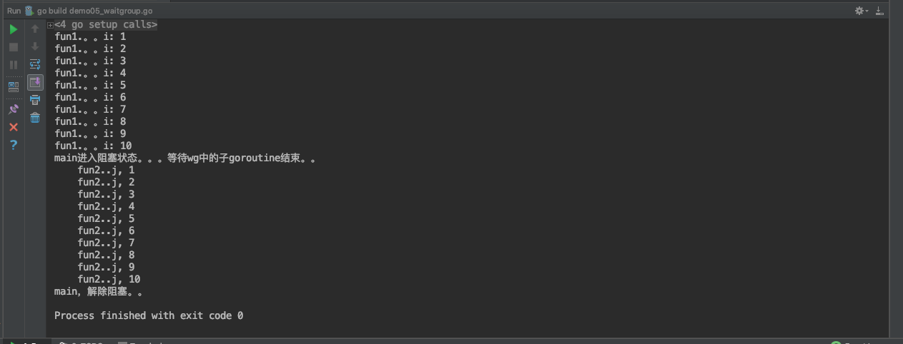


```
GOROOT=/usr/local/go #gosetup
GOPATH=/Users/ruby/go #gosetup
/usr/local/go/bin/go build -i -o /private/var/folders/kt/nlhsnpgn6lgd_q16f8j83sbh0000gn/T/___go_build_demo05_waitgroup_go /Users/ruby/go/src/l_goroutine/demo05_waitgroup.go #gosetup
/private/var/folders/kt/nlhsnpgn6lgd_q16f8j83sbh0000gn/T/___go_build_demo05_waitgroup_go #gosetup
fun1.。。i: 1
fun1.。。i: 2
fun1.。。i: 3
fun1.。。i: 4
fun1.。。i: 5
fun1.。。i: 6
fun1.。。i: 7
fun1.。。i: 8
fun1.。。i: 9
fun1.。。i: 10
main进入阻塞状态。。。等待wg中的子goroutine结束。。
	fun2..j, 1
	fun2..j, 2
	fun2..j, 3
	fun2..j, 4
	fun2..j, 5
	fun2..j, 6
	fun2..j, 7
	fun2..j, 8
	fun2..j, 9
	fun2..j, 10
main，解除阻塞。。

Process finished with exit code 0

```


## 5.2 Mutex(互斥锁)

通过上一小节，我们知道了在并发程序中，会存在临界资源问题。就是当多个协程来访问共享的数据资源，那么这个共享资源是不安全的。为了解决协程同步的问题我们使用了channel，但是Go语言也提供了传统的同步工具。

什么是锁呢？就是某个协程（线程）在访问某个资源时先锁住，防止其它协程的访问，等访问完毕解锁后其他协程再来加锁进行访问。一般用于处理并发中的临界资源问题。

Go语言包中的 sync 包提供了两种锁类型：sync.Mutex 和 sync.RWMutex。

Mutex 是最简单的一种锁类型，互斥锁，同时也比较暴力，当一个 goroutine 获得了 Mutex 后，其他 goroutine 就只能乖乖等到这个 goroutine 释放该 Mutex。

每个资源都对应于一个可称为 “互斥锁” 的标记，这个标记用来保证在任意时刻，只能有一个协程（线程）访问该资源。其它的协程只能等待。

互斥锁是传统并发编程对共享资源进行访问控制的主要手段，它由标准库sync中的Mutex结构体类型表示。sync.Mutex类型只有两个公开的指针方法，Lock和Unlock。Lock锁定当前的共享资源，Unlock进行解锁。

在使用互斥锁时，一定要注意：对资源操作完成后，一定要解锁，否则会出现流程执行异常，死锁等问题。通常借助defer。锁定后，立即使用defer语句保证互斥锁及时解锁。


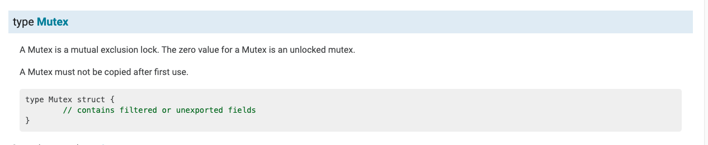

部分源码：

```go
/ A Mutex is a mutual exclusion lock.
// The zero value for a Mutex is an unlocked mutex.
//
// A Mutex must not be copied after first use.
type Mutex struct {
	state int32 //互斥锁上锁状态枚举值如下所示
	sema  uint32 //信号量，向处于Gwaitting的G发送信号
}

// A Locker represents an object that can be locked and unlocked.
type Locker interface {
	Lock()
	Unlock()
}

const (
	mutexLocked = 1 << iota // mutex is locked  ，1 互斥锁是锁定的
	mutexWoken // 2 唤醒锁
	mutexStarving
	mutexWaiterShift = iota // 统计阻塞在这个互斥锁上的goroutine数目需要移位的数值
	starvationThresholdNs = 1e6
)

```


### 5.2.1 Lock()方法：

Lock()这个方法，锁定m。如果该锁已在使用中，则调用goroutine将阻塞，直到互斥体可用。


### 5.2.2 Unlock()方法

Unlock()方法，解锁解锁m。如果m未在要解锁的条目上锁定，则为运行时错误。

锁定的互斥体不与特定的goroutine关联。允许一个goroutine锁定互斥体，然后安排另一个goroutine解锁互斥体。


### 5.2.3 示例代码：

我们针对于上次课程汇总，使用goroutine，模拟4个售票口出售火车票的案例。4个售票口同时卖票，会发生临界资源数据安全问题。我们使用互斥锁解决一下。(Go语言推崇的是使用Channel来实现数据共享，但是也还是提供了传统的同步处理方式)

示例代码：

```go
package main

import (
	"fmt"
	"time"
	"math/rand"
	"sync"
)

//全局变量，表示票
var ticket = 10 //100张票


var mutex sync.Mutex //创建锁头

var wg sync.WaitGroup //同步等待组对象
func main() {
	/*
	4个goroutine，模拟4个售票口，


	在使用互斥锁的时候，对资源操作完，一定要解锁。否则会出现程序异常，死锁等问题。
	defer语句
	 */

	 wg.Add(4)
	go saleTickets("售票口1")
	go saleTickets("售票口2")
	go saleTickets("售票口3")
	go saleTickets("售票口4")

	wg.Wait() //main要等待
	fmt.Println("程序结束了。。。")

	//time.Sleep(5*time.Second)
}

func saleTickets(name string){
	rand.Seed(time.Now().UnixNano())
	defer wg.Done()
	for{
		//上锁
		mutex.Lock() //g2
		if ticket > 0{ //ticket 1 g1
			time.Sleep(time.Duration(rand.Intn(1000))*time.Millisecond)
			fmt.Println(name,"售出：",ticket) // 1
			ticket-- // 0
		}else{
			mutex.Unlock() //条件不满足，也要解锁
			fmt.Println(name,"售罄，没有票了。。")
			break
		}
		mutex.Unlock() //解锁
	}
}

```

运行结果：


```
GOROOT=/usr/local/go #gosetup
GOPATH=/Users/ruby/go #gosetup
/usr/local/go/bin/go build -i -o /private/var/folders/kt/nlhsnpgn6lgd_q16f8j83sbh0000gn/T/___go_build_demo06_mutex_go /Users/ruby/go/src/l_goroutine/demo06_mutex.go #gosetup
/private/var/folders/kt/nlhsnpgn6lgd_q16f8j83sbh0000gn/T/___go_build_demo06_mutex_go #gosetup
售票口4 售出： 10
售票口4 售出： 9
售票口2 售出： 8
售票口1 售出： 7
售票口3 售出： 6
售票口4 售出： 5
售票口2 售出： 4
售票口1 售出： 3
售票口3 售出： 2
售票口4 售出： 1
售票口2 售罄，没有票了。。
售票口1 售罄，没有票了。。
售票口3 售罄，没有票了。。
售票口4 售罄，没有票了。。
程序结束了。。。

Process finished with exit code 0

```


## 5.3 RWMutex(读写锁)

通过对互斥锁的学习，我们已经知道了锁的概念以及用途。主要是用于处理并发中的临界资源问题。

Go语言包中的 sync 包提供了两种锁类型：sync.Mutex 和 sync.RWMutex。其中RWMutex是基于Mutex实现的，只读锁的实现使用类似引用计数器的功能。

RWMutex是读/写互斥锁。锁可以由任意数量的读取器或单个编写器持有。RWMutex的零值是未锁定的mutex。

如果一个goroutine持有一个rRWMutex进行读取，而另一个goroutine可能调用lock，那么在释放初始读取锁之前，任何goroutine都不应该期望能够获取读取锁。特别是，这禁止递归读取锁定。这是为了确保锁最终可用；被阻止的锁调用会将新的读卡器排除在获取锁之外。


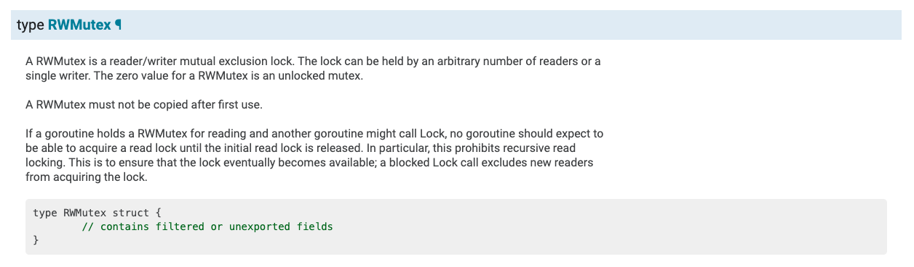


我们怎么理解读写锁呢？当有一个 goroutine 获得写锁定，其它无论是读锁定还是写锁定都将阻塞直到写解锁；当有一个 goroutine 获得读锁定，其它读锁定仍然可以继续；当有一个或任意多个读锁定，写锁定将等待所有读锁定解锁之后才能够进行写锁定。所以说这里的读锁定（RLock）目的其实是告诉写锁定：有很多人正在读取数据，你给我站一边去，等它们读（读解锁）完你再来写（写锁定）。我们可以将其总结为如下三条：

1. 同时只能有一个 goroutine 能够获得写锁定。
2. 同时可以有任意多个 gorouinte 获得读锁定。
3. 同时只能存在写锁定或读锁定（读和写互斥）。

所以，RWMutex这个读写锁，该锁可以加多个读锁或者一个写锁，其经常用于读次数远远多于写次数的场景。

读写锁的写锁只能锁定一次，解锁前不能多次锁定，读锁可以多次，但读解锁次数最多只能比读锁次数多一次，一般情况下我们不建议读解锁次数多余读锁次数。

基本遵循两大原则：

	1、可以随便读，多个goroutine同时读。
	
	2、写的时候，啥也不能干。不能读也不能写。

读写锁即是针对于读写操作的互斥锁。它与普通的互斥锁最大的不同就是，它可以分别针对读操作和写操作进行锁定和解锁操作。读写锁遵循的访问控制规则与互斥锁有所不同。在读写锁管辖的范围内，它允许任意个读操作的同时进行。但是在同一时刻，它只允许有一个写操作在进行。

并且在某一个写操作被进行的过程中，读操作的进行也是不被允许的。也就是说读写锁控制下的多个写操作之间都是互斥的，并且写操作与读操作之间也都是互斥的。但是，多个读操作之间却不存在互斥关系。

### 5.3.1 RLock()方法

```go
func (rw *RWMutex) RLock()
```

读锁，当有写锁时，无法加载读锁，当只有读锁或者没有锁时，可以加载读锁，读锁可以加载多个，所以适用于“读多写少”的场景。

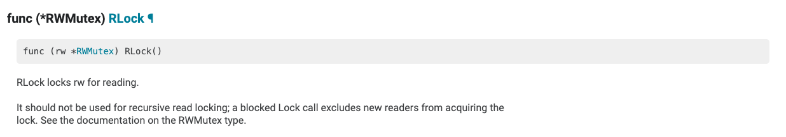


### 5.3.2 RUnlock()方法

```go
func (rw *RWMutex) RUnlock()
```

读锁解锁，RUnlock 撤销单次RLock调用，它对于其它同时存在的读取器则没有效果。若rw并没有为读取而锁定，调用RUnlock就会引发一个运行时错误。


### 5.3.3 Lock()方法：

```go
func (rw *RWMutex) Lock()
```

写锁，如果在添加写锁之前已经有其他的读锁和写锁，则Lock就会阻塞直到该锁可用，为确保该锁最终可用，已阻塞的Lock调用会从获得的锁中排除新的读取锁，即写锁权限高于读锁，有写锁时优先进行写锁定。


### 5.3.4 Unlock()方法

```go
func (rw *RWMutex) Unlock()
```

写锁解锁，如果没有进行写锁定，则就会引起一个运行时错误。

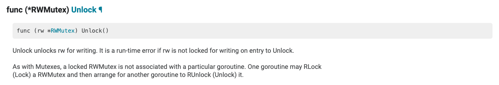


### 5.3.5 示例代码：

示例代码：

```go
package main

import (
	"fmt"
	"sync"
	"time"
)


var rwMutex *sync.RWMutex
var wg *sync.WaitGroup
func main() {
	rwMutex = new(sync.RWMutex)
	wg = new (sync.WaitGroup)

	//wg.Add(2)
	//
	////多个同时读取
	//go readData(1)
	//go readData(2)

	wg.Add(3)
	go writeData(1)
	go readData(2)
	go writeData(3)

	wg.Wait()
	fmt.Println("main..over...")
}


func writeData(i int){
	defer wg.Done()
	fmt.Println(i,"开始写：write start。。")
	rwMutex.Lock()//写操作上锁
	fmt.Println(i,"正在写：writing。。。。")
	time.Sleep(3*time.Second)
	rwMutex.Unlock()
	fmt.Println(i,"写结束：write over。。")
}

func readData(i int) {
	defer wg.Done()

	fmt.Println(i, "开始读：read start。。")

	rwMutex.RLock() //读操作上锁
	fmt.Println(i,"正在读取数据：reading。。。")
	time.Sleep(3*time.Second)
	rwMutex.RUnlock() //读操作解锁
	fmt.Println(i,"读结束：read over。。。")
}


```

运行结果：

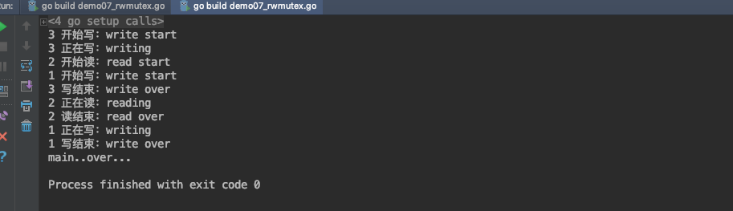


```
GOROOT=/usr/local/go #gosetup
GOPATH=/Users/ruby/go #gosetup
/usr/local/go/bin/go build -i -o /private/var/folders/kt/nlhsnpgn6lgd_q16f8j83sbh0000gn/T/___go_build_demo07_rwmutex_go /Users/ruby/go/src/l_goroutine/demo07_rwmutex.go #gosetup
/private/var/folders/kt/nlhsnpgn6lgd_q16f8j83sbh0000gn/T/___go_build_demo07_rwmutex_go #gosetup
3 开始写：write start
3 正在写：writing
2 开始读：read start
1 开始写：write start
3 写结束：write over
2 正在读：reading
2 读结束：read over
1 正在写：writing
1 写结束：write over
main..over...

Process finished with exit code 0

```


最后概括：

1. 读锁不能阻塞读锁
2. 读锁需要阻塞写锁，直到所有读锁都释放
3. 写锁需要阻塞读锁，直到所有写锁都释放
4. 写锁需要阻塞写锁


本文参考链接：

https://www.bbsmax.com/A/kPzOQY3a5x/

https://studygolang.com/articles/11322?fr=sidebar

https://www.cnblogs.com/williamjie/p/9456764.html


# channel通道


通道可以被认为是Goroutines通信的管道。类似于管道中的水从一端到另一端的流动，数据可以从一端发送到另一端，通过通道接收。

在前面讲Go语言的并发时候，我们就说过，当多个Goroutine想实现共享数据的时候，虽然也提供了传统的同步机制，但是Go语言强烈建议的是使用Channel通道来实现Goroutines之间的通信。

```
“不要通过共享内存来通信，而应该通过通信来共享内存” 这是一句风靡golang社区的经典语
```

Go语言中，要传递某个数据给另一个goroutine(协程)，可以把这个数据封装成一个对象，然后把这个对象的指针传入某个channel中，另外一个goroutine从这个channel中读出这个指针，并处理其指向的内存对象。Go从语言层面保证同一个时间只有一个goroutine能够访问channel里面的数据，为开发者提供了一种优雅简单的工具，所以Go的做法就是使用channel来通信，通过通信来传递内存数据，使得内存数据在不同的goroutine中传递，而不是使用共享内存来通信。


## 一、 什么是通道

### 1.1 通道的概念

通道是什么，通道就是goroutine之间的通道。它可以让goroutine之间相互通信。

每个通道都有与其相关的类型。该类型是通道允许传输的数据类型。(通道的零值为nil。nil通道没有任何用处，因此通道必须使用类似于map和切片的方法来定义。)

### 1.2 通道的声明

声明一个通道和定义一个变量的语法一样：

```go
//声明通道
var 通道名 chan 数据类型
//创建通道：如果通道为nil(就是不存在)，就需要先创建通道
通道名 = make(chan 数据类型)
```


示例代码：

```go
package main

import "fmt"

func main() {
	var a chan int
	if a == nil {
		fmt.Println("channel 是 nil 的, 不能使用，需要先创建通道。。")
		a = make(chan int)
		fmt.Printf("数据类型是： %T", a)
	}
}

```

运行结果：

```

channel 是 nil 的, 不能使用，需要先创建通道。。
数据类型是： chan int
```

也可以简短的声明：

```go
a := make(chan int) 
```

### 1.3 channel的数据类型

channel是引用类型的数据，在作为参数传递的时候，传递的是内存地址。

示例代码：

```go
package main

import (
	"fmt"
)

func main() {
	ch1 := make(chan int)
	fmt.Printf("%T,%p\n",ch1,ch1)

	test1(ch1)

}

func test1(ch chan int){
	fmt.Printf("%T,%p\n",ch,ch)
}


```

运行结果：


我们能够看到，ch和ch1的地址是一样的，说明它们是同一个通道。


### 1.4 通道的注意点

Channel通道在使用的时候，有以下几个注意点：

- 1.用于goroutine，传递消息的。
- 2.通道，每个都有相关联的数据类型,
  			nil chan，不能使用，类似于nil map，不能直接存储键值对
- 3.使用通道传递数据：<-
  			   chan <- data,发送数据到通道。向通道中写数据
       data <- chan,从通道中获取数据。从通道中读数据
- 4.阻塞：
  			   发送数据：chan <- data,阻塞的，直到另一条goroutine，读取数据来解除阻塞
       读取数据：data <- chan,也是阻塞的。直到另一条goroutine，写出数据解除阻塞。
  
- 5.本身channel就是同步的，意味着同一时间，只能有一条goroutine来操作。

最后：通道是goroutine之间的连接，所以通道的发送和接收必须处在不同的goroutine中。


## 二、通道的使用语法

### 2.1 发送和接收

发送和接收的语法：

```go
data := <- a // read from channel a  
a <- data // write to channel a
```

在通道上箭头的方向指定数据是发送还是接收。

另外：

```go
v, ok := <- a //从一个channel中读取
```


### 2.2 发送和接收默认是阻塞的

一个通道发送和接收数据，默认是阻塞的。当一个数据被发送到通道时，在发送语句中被阻塞，直到另一个Goroutine从该通道读取数据。相对地，当从通道读取数据时，读取被阻塞，直到一个Goroutine将数据写入该通道。

这些通道的特性是帮助Goroutines有效地进行通信，而无需像使用其他编程语言中非常常见的显式锁或条件变量。

示例代码：

```go
package main

import "fmt"

func main() {
	var ch1 chan bool       //声明，没有创建
	fmt.Println(ch1)        //<nil>
	fmt.Printf("%T\n", ch1) //chan bool
	ch1 = make(chan bool)   //0xc0000a4000,是引用类型的数据
	fmt.Println(ch1)

	go func() {
		for i := 0; i < 10; i++ {
			fmt.Println("子goroutine中，i：", i)
		}
		// 循环结束后，向通道中写数据，表示要结束了。。
		ch1 <- true

		fmt.Println("结束。。")

	}()

	data := <-ch1 // 从ch1通道中读取数据
	fmt.Println("data-->", data)
	fmt.Println("main。。over。。。。")
}

```

运行结果：


在上面的程序中，我们先创建了一个chan bool通道。然后启动了一条子Goroutine，并循环打印10个数字。然后我们向通道ch1中写入输入true。然后在主goroutine中，我们从ch1中读取数据。这一行代码是阻塞的，这意味着在子Goroutine将数据写入到该通道之前，主goroutine将不会执行到下一行代码。因此，我们可以通过channel实现子goroutine和主goroutine之间的通信。当子goroutine执行完毕前，主goroutine会因为读取ch1中的数据而阻塞。从而保证了子goroutine会先执行完毕。这就消除了对时间的需求。在之前的程序中，我们要么让主goroutine进入睡眠，以防止主要的Goroutine退出。要么通过WaitGroup来保证子goroutine先执行完毕，主goroutine才结束。

示例代码：以下代码加入了睡眠，可以更好的理解channel的阻塞

```go
package main

import (
	"fmt"
	"time"
)

func main() {
	ch1 := make(chan int)
	done := make(chan bool) // 通道
	go func() {
		fmt.Println("子goroutine执行。。。")
		time.Sleep(3 * time.Second)
		data := <-ch1 // 从通道中读取数据
		fmt.Println("data：", data)
		done <- true
	}()
	// 向通道中写数据。。
	time.Sleep(5 * time.Second)
	ch1 <- 100

	<-done
	fmt.Println("main。。over")

}

```

运行结果：


再一个例子，这个程序将打印一个数字的个位数的平方和。

```go
package main

import (  
    "fmt"
)

func calcSquares(number int, squareop chan int) {  
    sum := 0
    for number != 0 {
        digit := number % 10
        sum += digit * digit
        number /= 10
    }
    squareop <- sum
}

func calcCubes(number int, cubeop chan int) {  
    sum := 0 
    for number != 0 {
        digit := number % 10
        sum += digit * digit * digit
        number /= 10
    }
    cubeop <- sum
} 
func main() {  
    number := 589
    sqrch := make(chan int)
    cubech := make(chan int)
    go calcSquares(number, sqrch)
    go calcCubes(number, cubech)
    squares, cubes := <-sqrch, <-cubech
    fmt.Println("Final output", squares + cubes)
}
```

运行结果：

```
Final output 1536
```


### 2.3 死锁

使用通道时要考虑的一个重要因素是死锁。如果Goroutine在一个通道上发送数据，那么预计其他的Goroutine应该接收数据。如果这种情况不发生，那么程序将在运行时出现死锁。

类似地，如果Goroutine正在等待从通道接收数据，那么另一些Goroutine将会在该通道上写入数据，否则程序将会死锁。

示例代码：

```go
package main

func main() {  
    ch := make(chan int)
    ch <- 5
}
```

报错：

```
fatal error: all goroutines are asleep - deadlock!

goroutine 1 [chan send]:
main.main()
	/Users/ruby/go/src/l_goroutine/demo08_chan.go:5 +0x50
```


> 在主流的编程语言中为了保证多线程之间共享数据安全性和一致性，都会提供一套基本的同步工具集，如锁，条件变量，原子操作等等。Go语言标准库也毫不意外的提供了这些同步机制，使用方式也和其他语言也差不多。
> 除了这些基本的同步手段，Go语言还提供了一种新的同步机制: Channel，它在Go语言中是一个像int, float32等的基本类型，一个channel可以认为是一个能够在多个Goroutine之间传递某一类型的数据的管道。Go中的channel无论是实现机制还是使用场景都和Java中的BlockingQueue很接近。


## 三、 关闭通道

发送者可以通过关闭信道，来通知接收方不会有更多的数据被发送到channel上。

```go
close(ch)
```

接收者可以在接收来自通道的数据时使用额外的变量来检查通道是否已经关闭。

语法结构：

```go
v, ok := <- ch  
```

> 类似map操作，存储key，value键值对
>
> v,ok := map[key] //根据key从map中获取value，如果key存在， v就是对应的数据，如果key不存在，v是默认值


在上面的语句中，如果ok的值是true，表示成功的从通道中读取了一个数据value。如果ok是false，这意味着我们正在从一个封闭的通道读取数据。从闭通道读取的值将是通道类型的零值。

例如，如果通道是一个int通道，那么从封闭通道接收的值将为0。

示例代码：


```go
package main

import (
	"fmt"
	"time"
)

func main()  {
	ch1 := make(chan int)
	go sendData(ch1)
	/*
	子goroutine，写出数据10个
			每写一个，阻塞一次，主程序读取一次，解除阻塞

	主goroutine：循环读
			每次读取一个，堵塞一次，子程序，写出一个，解除阻塞

	发送发，关闭通道的--->接收方，接收到的数据是该类型的零值，以及false
	 */
	//主程序中获取通道的数据
	for{
		time.Sleep(1*time.Second)
		v, ok := <- ch1 //其他goroutine，显示的调用close方法关闭通道。
		if !ok{
			fmt.Println("已经读取了所有的数据，", ok)
			break
		}
		fmt.Println("取出数据：",v, ok)
	}

	fmt.Println("main...over....")
}
func sendData(ch1 chan int)  {
	// 发送方：10条数据
	for i:=0;i<10 ;i++  {
		ch1 <- i//将i写入通道中
	}
	close(ch1) //将ch1通道关闭了。
}
```

运行结果

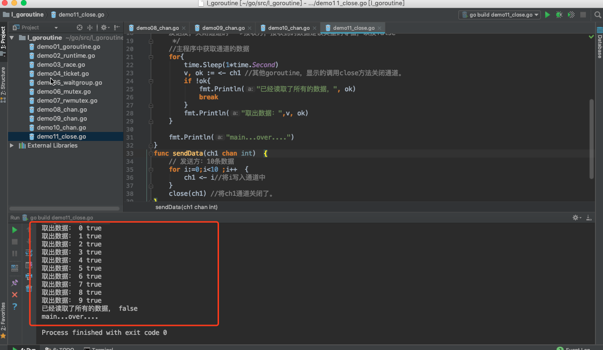


在上面的程序中，send Goroutine将0到9写入chl通道，然后关闭通道。主函数里有一个无限循环。它检查通道是否在发送数据后，使用变量ok关闭。如果ok是假的，则意味着通道关闭，因此循环结束。还可以打印接收到的值和ok的值。


## 四、通道上的范围循环

我们可以循环从通道上获取数据，直到通道关闭。for循环的for range形式可用于从通道接收值，直到它关闭为止。

使用range循环，示例代码：

```go
package main

import (
	"time"
	"fmt"
)

func main()  {
	ch1 :=make(chan int)
	go sendData(ch1)
	// for循环的for range形式可用于从通道接收值，直到它关闭为止。
	for v := range ch1{
		fmt.Println("读取数据：",v)
	}
	fmt.Println("main..over.....")
}
func sendData(ch1 chan int)  {
	for i:=0;i<10 ; i++ {
		time.Sleep(1*time.Second)
		ch1 <- i
	}
	close(ch1)//通知对方，通道关闭
}
```

运行结果：


## 五、非缓冲通道

之前学习的所有通道基本上都没有缓冲。发送和接收到一个未缓冲的通道是阻塞的。

一次发送操作对应一次接收操作，对于一个goroutine来讲，它的一次发送，在另一个goroutine接收之前都是阻塞的。同样的，对于接收来讲，在另一个goroutine发送之前，它也是阻塞的。


## 六、缓冲通道

缓冲通道就是指一个通道，带有一个缓冲区。发送到一个缓冲通道只有在缓冲区满时才被阻塞。类似地，从缓冲通道接收的信息只有在缓冲区为空时才会被阻塞。

可以通过将额外的容量参数传递给make函数来创建缓冲通道，该函数指定缓冲区的大小。

语法：

```go
ch := make(chan type, capacity)  
```

上述语法的容量应该大于0，以便通道具有缓冲区。默认情况下，无缓冲通道的容量为0，因此在之前创建通道时省略了容量参数。

示例代码：

以下的代码中，chan通道，是带有缓冲区的。

```go
package main

import (
	"fmt"
	"strconv"
	"time"
)

func main() {
	/*
	非缓存通道：make(chan T)
	缓存通道：make(chan T ,size)
		缓存通道，理解为是队列：

	非缓存，发送还是接受，都是阻塞的
	缓存通道,缓存区的数据满了，才会阻塞状态。。

	 */
	ch1 := make(chan int)           //非缓存的通道
	fmt.Println(len(ch1), cap(ch1)) //0 0
	//ch1 <- 100//阻塞的，需要其他的goroutine解除阻塞，否则deadlock

	ch2 := make(chan int, 5)        //缓存的通道，缓存区大小是5
	fmt.Println(len(ch2), cap(ch2)) //0 5
	ch2 <- 100                      //
	fmt.Println(len(ch2), cap(ch2)) //1 5

	//ch2 <- 200
	//ch2 <- 300
	//ch2 <- 400
	//ch2 <- 500
	//ch2 <- 600
	fmt.Println("--------------")
	ch3 := make(chan string, 4)
	go sendData3(ch3)
	for {
		time.Sleep(1*time.Second)
		v, ok := <-ch3
		if !ok {
			fmt.Println("读完了，，", ok)
			break
		}
		fmt.Println("\t读取的数据是：", v)
	}

	fmt.Println("main...over...")
}

func sendData3(ch3 chan string) {
	for i := 0; i < 10; i++ {
		ch3 <- "数据" + strconv.Itoa(i)
		fmt.Println("子goroutine，写出第", i, "个数据")
	}
	close(ch3)
}


```


运行结果：


## 七、双向通道

通道，channel，是用于实现goroutine之间的通信的。一个goroutine可以向通道中发送数据，另一条goroutine可以从该通道中获取数据。截止到现在我们所学习的通道，都是既可以发送数据，也可以读取数据，我们又把这种通道叫做双向通道。

```go
data := <- a // read from channel a  
a <- data // write to channel a
```


## 八、单向通道

单向通道，也就是定向通道。

之前我们学习的通道都是双向通道，我们可以通过这些通道接收或者发送数据。我们也可以创建单向通道，这些通道只能发送或者接收数据。


双向通道，实例代码：

```go
package main

import "fmt"

func main()  {
	/*
	双向：
		chan T -->
			chan <- data,写出数据，写
			data <- chan,获取数据，读
	单向：定向
		chan <- T,
			只支持写，
		<- chan T,
			只读
	 */
	ch1 := make(chan string) // 双向，可读，可写
	done := make(chan bool)
	go sendData(ch1, done)
	data :=<- ch1 //阻塞
	fmt.Println("子goroutine传来：", data)
	ch1 <- "我是main。。" // 阻塞

	<-done
	fmt.Println("main...over....")
}
//子goroutine-->写数据到ch1通道中
//main goroutine-->从ch1通道中取
func sendData(ch1 chan string, done chan bool)  {
	ch1 <- "我是小明"// 阻塞
	data := <-ch1 // 阻塞
	fmt.Println("main goroutine传来：",data)

	done <- true
}

```

运行结果：


创建仅能发送数据的通道，示例代码：

示例代码：

```go
package main

import "fmt"

func main()  {
	/*
		单向：定向
		chan <- T,
			只支持写，
		<- chan T,
			只读


		用于参数传递：
	 */
	ch1 := make(chan int)//双向，读，写
	//ch2 := make(chan <- int) // 单向，只写，不能读
	//ch3 := make(<- chan int) //单向，只读，不能写
	//ch1 <- 100
	//data :=<-ch1
	//ch2 <- 1000
	//data := <- ch2
	//fmt.Println(data)
	//	<-ch2 //invalid operation: <-ch2 (receive from send-only type chan<- int)
	//ch3 <- 100
	//	<-ch3
	//	ch3 <- 100 //invalid operation: ch3 <- 100 (send to receive-only type <-chan int)

	//go fun1(ch2)
	go fun1(ch1)
	data:= <- ch1
	fmt.Println("fun1中写出的数据是：",data)

	//fun2(ch3)
	go fun2(ch1)
	ch1 <- 200
	fmt.Println("main。。over。。")
}
//该函数接收，只写的通道
func fun1(ch chan <- int){
	// 函数内部，对于ch只能写数据，不能读数据
	ch <- 100
	fmt.Println("fun1函数结束。。")
}

func fun2(ch <-chan int){
	//函数内部，对于ch只能读数据，不能写数据
	data := <- ch
	fmt.Println("fun2函数，从ch中读取的数据是：",data)
}

```

运行结果：


## 九、time包中的通道相关函数

主要就是定时器，标准库中的Timer让用户可以定义自己的超时逻辑，尤其是在应对select处理多个channel的超时、单channel读写的超时等情形时尤为方便。

Timer是一次性的时间触发事件，这点与Ticker不同，Ticker是按一定时间间隔持续触发时间事件。

Timer常见的创建方式：

```go
t:= time.NewTimer(d)
t:= time.AfterFunc(d, f)
c:= time.After(d)
```

虽然说创建方式不同，但是原理是相同的。

Timer有3个要素：

```go
定时时间：就是那个d
触发动作：就是那个f
时间channel： 也就是t.C
```


### 9.1、time.NewTimer()

NewTimer()创建一个新的计时器，该计时器将在其通道上至少持续d之后发送当前时间。


它的返回值是一个Timer。


源代码：

```go
// NewTimer creates a new Timer that will send
// the current time on its channel after at least duration d.
func NewTimer(d Duration) *Timer {
	c := make(chan Time, 1)
	t := &Timer{
		C: c,
		r: runtimeTimer{
			when: when(d),
			f:    sendTime,
			arg:  c,
		},
	}
	startTimer(&t.r)
	return t
}
```

通过源代码我们可以看出，首先创建一个channel，关联的类型为Time，然后创建了一个Timer并返回。

- 用于在指定的Duration类型时间后调用函数或计算表达式。
- 如果只是想指定时间之后执行,使用time.Sleep()
- 使用NewTimer(),可以返回的Timer类型在计时器到期之前,取消该计时器
- 直到使用<-timer.C发送一个值,该计时器才会过期


示例代码：

```go
package main

import (
	"time"
	"fmt"
)

func main() {

	/*
		1.func NewTimer(d Duration) *Timer
			创建一个计时器：d时间以后触发，go触发计时器的方法比较特别，就是在计时器的channel中发送值
	 */
	//新建一个计时器：timer
	timer := time.NewTimer(3 * time.Second)
	fmt.Printf("%T\n", timer) //*time.Timer
	fmt.Println(time.Now())   //2019-08-15 10:41:21.800768 +0800 CST m=+0.000461190

	//此处在等待channel中的信号，执行此段代码时会阻塞3秒
	ch2 := timer.C     //<-chan time.Time
	fmt.Println(<-ch2) //2019-08-15 10:41:24.803471 +0800 CST m=+3.003225965

}

```

运行结果：


### 9.2、timer.Stop

计时器停止：


示例代码：

```go
package main

import (
	"time"
	"fmt"
)

func main() {

	/*
		1.func NewTimer(d Duration) *Timer
			创建一个计时器：d时间以后触发，go触发计时器的方法比较特别，就是在计时器的channel中发送值
	 */
	//新建一个计时器：timer
	//timer := time.NewTimer(3 * time.Second)
	//fmt.Printf("%T\n", timer) //*time.Timer
	//fmt.Println(time.Now())   //2019-08-15 10:41:21.800768 +0800 CST m=+0.000461190
	//
	////此处在等待channel中的信号，执行此段代码时会阻塞3秒
	//ch2 := timer.C     //<-chan time.Time
	//fmt.Println(<-ch2) //2019-08-15 10:41:24.803471 +0800 CST m=+3.003225965


	fmt.Println("-------------------------------")

	//新建计时器，一秒后触发

	timer2 := time.NewTimer(5 * time.Second)

	//新开启一个线程来处理触发后的事件

	go func() {

		//等触发时的信号

		<-timer2.C

		fmt.Println("Timer 2 结束。。")

	}()

	//由于上面的等待信号是在新线程中，所以代码会继续往下执行，停掉计时器

	time.Sleep(3*time.Second)
	stop := timer2.Stop()

	if stop {

		fmt.Println("Timer 2 停止。。")

	}

}

```

运行结果：


### 9.3、time.After()

在等待持续时间之后，然后在返回的通道上发送当前时间。它相当于NewTimer(d).C。在计时器触发之前，垃圾收集器不会恢复底层计时器。如果效率有问题，使用NewTimer代替，并调用Timer。如果不再需要计时器，请停止。

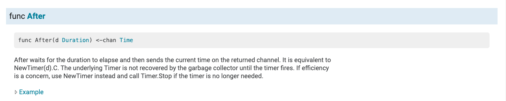


源码：

```go
// After waits for the duration to elapse and then sends the current time
// on the returned channel.
// It is equivalent to NewTimer(d).C.
// The underlying Timer is not recovered by the garbage collector
// until the timer fires. If efficiency is a concern, use NewTimer
// instead and call Timer.Stop if the timer is no longer needed.
func After(d Duration) <-chan Time {
	return NewTimer(d).C
}
```

示例代码：

```go
package main

import (
	"time"
	"fmt"
)

func main() {

	/*
		func After(d Duration) <-chan Time
			返回一个通道：chan，存储的是d时间间隔后的当前时间。
	 */
	ch1 := time.After(3 * time.Second) //3s后
	fmt.Printf("%T\n", ch1) // <-chan time.Time
	fmt.Println(time.Now()) //2019-08-15 09:56:41.529883 +0800 CST m=+0.000465158
	time2 := <-ch1
	fmt.Println(time2) //2019-08-15 09:56:44.532047 +0800 CST m=+3.002662179


}

```

运行结果：


## 十、select语句

select 是 Go 中的一个控制结构。select 语句类似于 switch 语句，但是select会随机执行一个可运行的case。如果没有case可运行，它将阻塞，直到有case可运行。

select语句的语法结构和switch语句很相似，也有case语句和default语句：

```go
select {
    case communication clause  :
       statement(s);      
    case communication clause  :
       statement(s); 
    /* 你可以定义任意数量的 case */
    default : /* 可选 */
       statement(s);
}
```

说明：

- 每个case都必须是一个通信

- 所有channel表达式都会被求值

- 所有被发送的表达式都会被求值

- 如果有多个case都可以运行，select会随机公平地选出一个执行。其他不会执行。 

- 否则：

  如果有default子句，则执行该语句。

  如果没有default字句，select将阻塞，直到某个通信可以运行；Go不会重新对channel或值进行求值。


示例代码：

```go
package main

import (
	"fmt"
	"time"
)

func main() {
	/*
	分支语句：if，switch，select
	select 语句类似于 switch 语句，
		但是select会随机执行一个可运行的case。
		如果没有case可运行，它将阻塞，直到有case可运行。
	 */

	ch1 := make(chan int)
	ch2 := make(chan int)

	go func() {
		time.Sleep(2 * time.Second)
		ch2 <- 200
	}()
	go func() {
		time.Sleep(2 * time.Second)
		ch1 <- 100
	}()

	select {
	case num1 := <-ch1:
		fmt.Println("ch1中取数据。。", num1)
	case num2, ok := <-ch2:
		if ok {
			fmt.Println("ch2中取数据。。", num2)
		}else{
			fmt.Println("ch2通道已经关闭。。")
		}


	}
}

```

运行结果：可能执行第一个case，打印100，也可能执行第二个case，打印200。(多运行几次，结果就不同了)


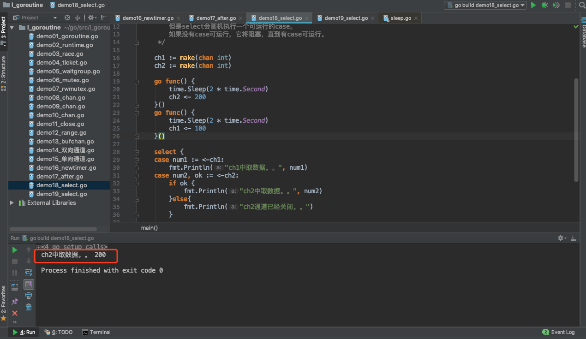


select语句结合time包的和chan相关函数，示例代码：

```go
package main

import (
	"fmt"
	"time"
)

func main() {
	ch1 := make(chan int)
	ch2 := make(chan int)

	//go func() {
	//	ch1 <- 100
	//}()

	select {
	case <-ch1:
		fmt.Println("case1可以执行。。")
	case <-ch2:
		fmt.Println("case2可以执行。。")
	case <-time.After(3 * time.Second):
		fmt.Println("case3执行。。timeout。。")

	//default:
	//	fmt.Println("执行了default。。")
	}
}

```


运行结果：


## 十一、Go语言的CSP模型


go语言的最大两个亮点，一个是goroutine，一个就是chan了。二者合体的典型应用CSP，基本就是大家认可的并行开发神器，简化了并行程序的开发难度，我们来看一下CSP。 


### 11.1、CSP是什么

CSP 是 Communicating Sequential Process 的简称，中文可以叫做通信顺序进程，是一种并发编程模型，是一个很强大的并发数据模型，是上个世纪七十年代提出的，用于描述两个独立的并发实体通过共享的通讯 channel(管道)进行通信的并发模型。相对于Actor模型，CSP中channel是第一类对象，它不关注发送消息的实体，而关注与发送消息时使用的channel。

严格来说，CSP 是一门形式语言（类似于 ℷ calculus），用于描述并发系统中的互动模式，也因此成为一众面向并发的编程语言的理论源头，并衍生出了 Occam/Limbo/Golang…

而具体到编程语言，如 Golang，其实只用到了 CSP 的很小一部分，即理论中的 Process/Channel（对应到语言中的 goroutine/channel）：这两个并发原语之间没有从属关系， Process 可以订阅任意个 Channel，Channel 也并不关心是哪个 Process 在利用它进行通信；Process 围绕 Channel 进行读写，形成一套有序阻塞和可预测的并发模型。


### 11.2、Golang CSP

与主流语言通过共享内存来进行并发控制方式不同，Go 语言采用了 CSP 模式。这是一种用于描述两个独立的并发实体通过共享的通讯 Channel（管道）进行通信的并发模型。

Golang 就是借用CSP模型的一些概念为之实现并发进行理论支持，其实从实际上出发，go语言并没有，完全实现了CSP模型的所有理论，仅仅是借用了 process和channel这两个概念。process是在go语言上的表现就是 goroutine 是实际并发执行的实体，每个实体之间是通过channel通讯来实现数据共享。


Go语言的CSP模型是由协程Goroutine与通道Channel实现：

- 
  Go协程goroutine: 是一种轻量线程，它不是操作系统的线程，而是将一个操作系统线程分段使用，通过调度器实现协作式调度。是一种绿色线程，微线程，它与Coroutine协程也有区别，能够在发现堵塞后启动新的微线程。
- 通道channel: 类似Unix的Pipe，用于协程之间通讯和同步。协程之间虽然解耦，但是它们和Channel有着耦合。

 


### 11.3、Channel

Goroutine 和 channel 是 Go 语言并发编程的 两大基石。Goroutine 用于执行并发任务，channel 用于 goroutine 之间的同步、通信。

Channel 在 gouroutine 间架起了一条管道，在管道里传输数据，实现 gouroutine 间的通信；由于它是线程安全的，所以用起来非常方便；channel 还提供 “先进先出” 的特性；它还能影响 goroutine 的阻塞和唤醒。

相信大家一定见过一句话：

> Do not communicate by sharing memory; instead, share memory by communicating.

不要通过共享内存来通信，而要通过通信来实现内存共享。

这就是 Go 的并发哲学，它依赖 CSP 模型，基于 channel 实现。


**channel 实现 CSP**

Channel 是 Go 语言中一个非常重要的类型，是 Go 里的第一对象。通过 channel，Go 实现了通过通信来实现内存共享。Channel 是在多个 goroutine 之间传递数据和同步的重要手段。

使用原子函数、读写锁可以保证资源的共享访问安全，但使用 channel 更优雅。

channel 字面意义是 “通道”，类似于 Linux 中的管道。声明 channel 的语法如下：

```go
chan T // 声明一个双向通道
chan<- T // 声明一个只能用于发送的通道
<-chan T // 声明一个只能用于接收的通道
```

单向通道的声明，用 `<-` 来表示，它指明通道的方向。你只要明白，代码的书写顺序是从左到右就马上能掌握通道的方向是怎样的。

因为 channel 是一个引用类型，所以在它被初始化之前，它的值是 nil，channel 使用 make 函数进行初始化。可以向它传递一个 int 值，代表 channel 缓冲区的大小（容量），构造出来的是一个缓冲型的 channel；不传或传 0 的，构造的就是一个非缓冲型的 channel。

两者有一些差别：非缓冲型 channel 无法缓冲元素，对它的操作一定顺序是 “发送 -> 接收 -> 发送 -> 接收 -> ……”，如果想连续向一个非缓冲 chan 发送 2 个元素，并且没有接收的话，第一次一定会被阻塞；对于缓冲型 channel 的操作，则要 “宽松” 一些，毕竟是带了 “缓冲” 光环。


对 chan 的发送和接收操作都会在编译期间转换成为底层的发送接收函数。

Channel 分为两种：带缓冲、不带缓冲。对不带缓冲的 channel 进行的操作实际上可以看作 “同步模式”，带缓冲的则称为 “异步模式”。

同步模式下，发送方和接收方要同步就绪，只有在两者都 ready 的情况下，数据才能在两者间传输（后面会看到，实际上就是内存拷贝）。否则，任意一方先行进行发送或接收操作，都会被挂起，等待另一方的出现才能被唤醒。

异步模式下，在缓冲槽可用的情况下（有剩余容量），发送和接收操作都可以顺利进行。否则，操作的一方（如写入）同样会被挂起，直到出现相反操作（如接收）才会被唤醒。

小结一下：同步模式下，必须要使发送方和接收方配对，操作才会成功，否则会被阻塞；异步模式下，缓冲槽要有剩余容量，操作才会成功，否则也会被阻塞。


简单来说，CSP 模型由并发执行的实体（线程或者进程或者协程）所组成，实体之间通过发送消息进行通信，
这里发送消息时使用的就是通道，或者叫 channel。

CSP 模型的关键是关注 channel，而不关注发送消息的实体。Go 语言实现了 CSP 部分理论，goroutine 对应 CSP 中并发执行的实体，channel 也就对应着 CSP 中的 channel。


### 11.4、Goroutine

Goroutine 是实际并发执行的实体，它底层是使用协程(coroutine)实现并发，coroutine是一种运行在用户态的用户线程，类似于 greenthread，go底层选择使用coroutine的出发点是因为，它具有以下特点：

- 用户空间 避免了内核态和用户态的切换导致的成本
- 可以由语言和框架层进行调度
- 更小的栈空间允许创建大量的实例


可以看到第二条 用户空间线程的调度不是由操作系统来完成的，像在java 1.3中使用的greenthread的是由JVM统一调度的(后java已经改为内核线程)，还有在ruby中的fiber(半协程) 是需要在重新中自己进行调度的，而goroutine是在golang层面提供了调度器，并且对网络IO库进行了封装，屏蔽了复杂的细节，对外提供统一的语法关键字支持，简化了并发程序编写的成本。


### 11.5、Goroutine 调度器

Go并发调度: G-P-M模型

在操作系统提供的内核线程之上，Go搭建了一个特有的两级线程模型。goroutine机制实现了M : N的线程模型，goroutine机制是协程（coroutine）的一种实现，golang内置的调度器，可以让多核CPU中每个CPU执行一个协程。


### 11.6、最后

Golang 的 channel 将 goroutine 隔离开，并发编程的时候可以将注意力放在 channel 上。在一定程度上，这个和消息队列的解耦功能还是挺像的。如果大家感兴趣，还是来看看 channel 的源码吧，对于更深入地理解 channel 还是挺有用的。

Go 通过 channel 实现 CSP 通信模型，主要用于 goroutine 之间的消息传递和事件通知。

有了 channel 和 goroutine 之后，Go 的并发编程变得异常容易和安全，得以让程序员把注意力留到业务上去，实现开发效率的提升。

要知道，技术并不是最重要的，它只是实现业务的工具。一门高效的开发语言让你把节省下来的时间，留着去做更有意义的事情，比如写写文章。


> CSP 最早是由 Tony Hoare在 1977 年提出，据说老爷子至今仍在更新这个理论模型，有兴趣的朋友可以自行查阅电子版本：http://www.usingcsp.com/cspbook.pdf。
>
> 


参考文档：https://learnku.com/articles/32142


# 反射reflect
## 一、引入

先看官方Doc中Rob Pike给出的关于反射的定义：

```
Reflection in computing is the ability of a program to examine its own structure, particularly through types; it’s a form of metaprogramming. It’s also a great source of confusion.
(在计算机领域，反射是一种让程序——主要是通过类型——理解其自身结构的一种能力。它是元编程的组成之一，同时它也是一大引人困惑的难题。)

```

维基百科中的定义：

```
在计算机科学中，反射是指计算机程序在运行时（Run time）可以访问、检测和修改它本身状态或行为的一种能力。用比喻来说，反射就是程序在运行的时候能够“观察”并且修改自己的行为。
```


不同语言的反射模型不尽相同，有些语言还不支持反射。《Go 语言圣经》中是这样定义反射的：

> Go 语言提供了一种机制在运行时更新变量和检查它们的值、调用它们的方法，但是在编译时并不知道这些变量的具体类型，这称为反射机制。


为什么要用反射

需要反射的 2 个常见场景：

1. 有时你需要编写一个函数，但是并不知道传给你的参数类型是什么，可能是没约定好；也可能是传入的类型很多，这些类型并不能统一表示。这时反射就会用的上了。
2. 有时候需要根据某些条件决定调用哪个函数，比如根据用户的输入来决定。这时就需要对函数和函数的参数进行反射，在运行期间动态地执行函数。

但是对于反射，还是有几点不太建议使用反射的理由：

1. 与反射相关的代码，经常是难以阅读的。在软件工程中，代码可读性也是一个非常重要的指标。
2. Go 语言作为一门静态语言，编码过程中，编译器能提前发现一些类型错误，但是对于反射代码是无能为力的。所以包含反射相关的代码，很可能会运行很久，才会出错，这时候经常是直接 panic，可能会造成严重的后果。
3. 反射对性能影响还是比较大的，比正常代码运行速度慢一到两个数量级。所以，对于一个项目中处于运行效率关键位置的代码，尽量避免使用反射特性。


## 二、相关基础

反射是如何实现的？我们以前学习过 interface，它是 Go 语言实现抽象的一个非常强大的工具。当向接口变量赋予一个实体类型的时候，接口会存储实体的类型信息，反射就是通过接口的类型信息实现的，反射建立在类型的基础上。

Go 语言在 reflect 包里定义了各种类型，实现了反射的各种函数，通过它们可以在运行时检测类型的信息、改变类型的值。在进行更加详细的了解之前，我们需要重新温习一下Go语言相关的一些特性，所谓温故知新，从这些特性中了解其反射机制是如何使用的。

| 特点                   | 说明                                                         |
| ---------------------- | ------------------------------------------------------------ |
| go语言是静态类型语言。 | 编译时类型已经确定，比如对已基本数据类型的再定义后的类型，反射时候需要确认返回的是何种类型。 |
|空接口interface{}|go的反射机制是要通过接口来进行的，而类似于Java的Object的空接口可以和任何类型进行交互，因此对基本数据类型等的反射也直接利用了这一特点|
Go语言的类型：

- 变量包括（type, value）两部分

  ​	理解这一点就知道为什么nil != nil了

- type 包括 static type和concrete type. 简单来说 static type是你在编码是看见的类型(如int、string)，concrete type是runtime系统看见的类型

- 类型断言能否成功，取决于变量的concrete type，而不是static type。因此，一个 reader变量如果它的concrete type也实现了write方法的话，它也可以被类型断言为writer。


Go是静态类型语言。每个变量都拥有一个静态类型，这意味着每个变量的类型在编译时都是确定的：int，float32, *AutoType, []byte,  chan []int 诸如此类。

在反射的概念中， 编译时就知道变量类型的是静态类型；运行时才知道一个变量类型的叫做动态类型。

- 静态类型
  静态类型就是变量声明时的赋予的类型。比如：

 ```go
type MyInt int // int 就是静态类型

type A struct{
    Name string  // string就是静态
}
var i *int  // *int就是静态类型

 ```


- 动态类型
  动态类型：运行时给这个变量赋值时，这个值的类型(如果值为nil的时候没有动态类型)。一个变量的动态类型在运行时可能改变，这主要依赖于它的赋值（前提是这个变量是接口类型）。

```go
var A interface{} // 静态类型interface{}
A = 10            // 静态类型为interface{}  动态为int
A = "String"      // 静态类型为interface{}  动态为string
var M *int
A = M             // A的值可以改变

```


Go语言的反射就是建立在类型之上的，Golang的指定类型的变量的类型是静态的（也就是指定int、string这些的变量，它的type是static type），在创建变量的时候就已经确定，反射主要与Golang的interface类型相关（它的type是concrete type），只有interface类型才有反射一说。


在Golang的实现中，每个interface变量都有一个对应pair，pair中记录了实际变量的值和类型:

```go
(value, type)
```

value是实际变量值，type是实际变量的类型。一个interface{}类型的变量包含了2个指针，一个指针指向值的类型【对应concrete type】，另外一个指针指向实际的值【对应value】。

例如，创建类型为*os.File的变量，然后将其赋给一个接口变量r：

```go
tty, err := os.OpenFile("/dev/tty", os.O_RDWR, 0)

var r io.Reader
r = tty
```

接口变量r的pair中将记录如下信息：(tty, *os.File)，这个pair在接口变量的连续赋值过程中是不变的，将接口变量r赋给另一个接口变量w:

```go
var w io.Writer
w = r.(io.Writer)
```

接口变量w的pair与r的pair相同，都是:(tty, *os.File)，即使w是空接口类型，pair也是不变的。

interface及其pair的存在，是Golang中实现反射的前提，理解了pair，就更容易理解反射。反射就是用来检测存储在接口变量内部(值value；类型concrete type) pair对的一种机制。

所以我们要理解两个基本概念 Type 和 Value，它们也是 Go语言包中 reflect 空间里最重要的两个类型。

## 三、Type和Value

我们一般用到的包是reflect包。

既然反射就是用来检测存储在接口变量内部(值value；类型concrete type) pair对的一种机制。那么在Golang的reflect反射包中有什么样的方式可以让我们直接获取到变量内部的信息呢？ 它提供了两种类型（或者说两个方法）让我们可以很容易的访问接口变量内容，分别是reflect.ValueOf() 和 reflect.TypeOf()，看看官方的解释

```go
// ValueOf returns a new Value initialized to the concrete value
// stored in the interface i.  ValueOf(nil) returns the zero 
func ValueOf(i interface{}) Value {...}

翻译一下：ValueOf用来获取输入参数接口中的数据的值，如果接口为空则返回0


// TypeOf returns the reflection Type that represents the dynamic type of i.
// If i is a nil interface value, TypeOf returns nil.
func TypeOf(i interface{}) Type {...}

翻译一下：TypeOf用来动态获取输入参数接口中的值的类型，如果接口为空则返回nil

```


reflect.TypeOf()是获取pair中的type，reflect.ValueOf()获取pair中的value。

首先需要把它转化成reflect对象(reflect.Type或者reflect.Value，根据不同的情况调用不同的函数。

```go
t := reflect.TypeOf(i) //得到类型的元数据,通过t我们能获取类型定义里面的所有元素
v := reflect.ValueOf(i) //得到实际的值，通过v我们获取存储在里面的值，还可以去改变值
```


示例代码：

```go
package main

import (
	"fmt"
	"reflect"
)

func main() {
	//反射操作：通过反射，可以获取一个接口类型变量的 类型和数值
	var x float64 =3.4

	fmt.Println("type:",reflect.TypeOf(x)) //type: float64
	fmt.Println("value:",reflect.ValueOf(x)) //value: 3.4

	fmt.Println("-------------------")
	//根据反射的值，来获取对应的类型和数值
	v := reflect.ValueOf(x)
	fmt.Println("kind is float64: ",v.Kind() == reflect.Float64)
	fmt.Println("type : ",v.Type())
	fmt.Println("value : ",v.Float())
}

```

运行结果：

```
type: float64
value: 3.4
-------------------
kind is float64:  true
type :  float64
value :  3.4

```

说明

1. reflect.TypeOf： 直接给到了我们想要的type类型，如float64、int、各种pointer、struct 等等真实的类型
2. reflect.ValueOf：直接给到了我们想要的具体的值，如1.2345这个具体数值，或者类似&{1 "Allen.Wu" 25} 这样的结构体struct的值
3. 也就是说明反射可以将“接口类型变量”转换为“反射类型对象”，反射类型指的是reflect.Type和reflect.Value这两种

Type 和 Value 都包含了大量的方法，其中第一个有用的方法应该是 Kind，这个方法返回该类型的具体信息：Uint、Float64 等。Value 类型还包含了一系列类型方法，比如 Int()，用于返回对应的值。以下是Kind的种类：

```go

// A Kind represents the specific kind of type that a Type represents.
// The zero Kind is not a valid kind.
type Kind uint

const (
	Invalid Kind = iota
	Bool
	Int
	Int8
	Int16
	Int32
	Int64
	Uint
	Uint8
	Uint16
	Uint32
	Uint64
	Uintptr
	Float32
	Float64
	Complex64
	Complex128
	Array
	Chan
	Func
	Interface
	Map
	Ptr
	Slice
	String
	Struct
	UnsafePointer
)

```


## 四、反射的规则

其实反射的操作步骤非常的简单，就是通过实体对象获取反射对象(Value、Type)，然后操作相应的方法即可。

下图描述了实例、Value、Type 三者之间的转换关系：


反射 API 的分类总结如下：

**1) 从实例到 Value**

通过实例获取 Value 对象，直接使用 reflect.ValueOf() 函数。例如：

```go
func ValueOf(i interface {}) Value
```

**2) 从实例到 Type**

通过实例获取反射对象的 Type，直接使用 reflect.TypeOf() 函数。例如：

```go
func TypeOf(i interface{}) Type
```

**3) 从 Type 到 Value**

Type 里面只有类型信息，所以直接从一个 Type 接口变量里面是无法获得实例的 Value 的，但可以通过该 Type 构建一个新实例的 Value。reflect 包提供了两种方法，示例如下：

```go
//New 返回的是一个 Value，该 Value 的 type 为 PtrTo(typ)，即 Value 的 Type 是指定 typ 的指针类型
func New(typ Type) Value
//Zero 返回的是一个 typ 类型的零佳，注意返回的 Value 不能寻址，位不可改变
func Zero(typ Type) Value
```

如果知道一个类型值的底层存放地址，则还有一个函数是可以依据 type 和该地址值恢复出 Value 的。例如：

```go
func NewAt(typ Type, p unsafe.Pointer) Value
```

**4) 从 Value 到 Type**

从反射对象 Value 到 Type 可以直接调用 Value 的方法，因为 Value 内部存放着到 Type 类型的指针。例如：

```go
func (v Value) Type() Type
```


**5) 从 Value 到实例**

Value 本身就包含类型和值信息，reflect 提供了丰富的方法来实现从 Value 到实例的转换。例如：

```go
//该方法最通用，用来将 Value 转换为空接口，该空接口内部存放具体类型实例
//可以使用接口类型查询去还原为具体的类型
func (v Value) Interface() （i interface{})

//Value 自身也提供丰富的方法，直接将 Value 转换为简单类型实例，如果类型不匹配，则直接引起 panic
func (v Value) Bool () bool
func (v Value) Float() float64
func (v Value) Int() int64
func (v Value) Uint() uint64
```


**6) 从 Value 的指针到值**

从一个指针类型的 Value 获得值类型 Value 有两种方法，示例如下。

```go
//如果 v 类型是接口，则 Elem() 返回接口绑定的实例的 Value，如采 v 类型是指针，则返回指针值的 Value，否则引起 panic
func (v Value) Elem() Value
//如果 v 是指针，则返回指针值的 Value，否则返回 v 自身，该函数不会引起 panic
func Indirect(v Value) Value
```


**7) Type 指针和值的相互转换**

指针类型 Type 到值类型 Type。例如：

```go
//t 必须是 Array、Chan、Map、Ptr、Slice，否则会引起 panic
//Elem 返回的是其内部元素的 Type
t.Elem() Type
```


值类型 Type 到指针类型 Type。例如：

```go
//PtrTo 返回的是指向 t 的指针型 Type
func PtrTo(t Type) Type
```


**8) Value 值的可修改性**

Value 值的修改涉及如下两个方法：

```go
//通过 CanSet 判断是否能修改
func (v Value ) CanSet() bool
//通过 Set 进行修改
func (v Value ) Set(x Value)
```


Value 值在什么情况下可以修改？我们知道实例对象传递给接口的是一个完全的值拷贝，如果调用反射的方法 reflect.ValueOf() 传进去的是一个值类型变量， 则获得的 Value 实际上是原对象的一个副本，这个 Value 是无论如何也不能被修改的。

**根据 Go 官方关于反射的博客，反射有三大定律：**

> 1. Reflection goes from interface value to reflection object.
> 2. Reflection goes from reflection object to interface value.
> 3. To modify a reflection object, the value must be settable.

第一条是最基本的：反射可以从接口值得到反射对象。

​		反射是一种检测存储在 interface中的类型和值机制。这可以通过 TypeOf函数和 ValueOf函数得到。

第二条实际上和第一条是相反的机制，反射可以从反射对象获得接口值。

​		它将 ValueOf的返回值通过 Interface()函数反向转变成 interface变量。

前两条就是说 接口型变量和 反射类型对象可以相互转化，反射类型对象实际上就是指的前面说的 reflect.Type和 reflect.Value。

第三条不太好懂：如果需要操作一个反射变量，则其值必须可以修改。

​		反射变量可设置的本质是它存储了原变量本身，这样对反射变量的操作，就会反映到原变量本身；反之，如果反射变量不能代表原变量，那么操作了反射变量，不会对原变量产生任何影响，这会给使用者带来疑惑。所以第二种情况在语言层面是不被允许的。


## 五、反射的使用

### 5.1 从relfect.Value中获取接口interface的信息

当执行reflect.ValueOf(interface)之后，就得到了一个类型为”relfect.Value”变量，可以通过它本身的Interface()方法获得接口变量的真实内容，然后可以通过类型判断进行转换，转换为原有真实类型。不过，我们可能是已知原有类型，也有可能是未知原有类型，因此，下面分两种情况进行说明。

#### 已知原有类型

已知类型后转换为其对应的类型的做法如下，直接通过Interface方法然后强制转换，如下：

```go
realValue := value.Interface().(已知的类型)
```

示例代码：

```go
package main

import (
	"fmt"
	"reflect"
)

func main() {
	var num float64 = 1.2345

	pointer := reflect.ValueOf(&num)
	value := reflect.ValueOf(num)

	// 可以理解为“强制转换”，但是需要注意的时候，转换的时候，如果转换的类型不完全符合，则直接panic
	// Golang 对类型要求非常严格，类型一定要完全符合
	// 如下两个，一个是*float64，一个是float64，如果弄混，则会panic
	convertPointer := pointer.Interface().(*float64)
	convertValue := value.Interface().(float64)

	fmt.Println(convertPointer)
	fmt.Println(convertValue)
}
```

运行结果：

```
0xc000098000
1.2345
```

说明

1. 转换的时候，如果转换的类型不完全符合，则直接panic，类型要求非常严格！
2. 转换的时候，要区分是指针还是指
3. 也就是说反射可以将“反射类型对象”再重新转换为“接口类型变量”


#### 未知原有类型

很多情况下，我们可能并不知道其具体类型，那么这个时候，该如何做呢？需要我们进行遍历探测其Filed来得知，示例如下:

```go
package main

import (
	"fmt"
	"reflect"
)


type Person struct {
	Name string
	Age int
	Sex string
}

func (p Person)Say(msg string)  {
	fmt.Println("hello，",msg)
}
func (p Person)PrintInfo()  {
	fmt.Printf("姓名：%s,年龄：%d，性别：%s\n",p.Name,p.Age,p.Sex)
}


func main() {
	p1 := Person{"王二狗",30,"男"}

	DoFiledAndMethod(p1)

}

// 通过接口来获取任意参数
func DoFiledAndMethod(input interface{}) {

	getType := reflect.TypeOf(input) //先获取input的类型
	fmt.Println("get Type is :", getType.Name()) // Person
	fmt.Println("get Kind is : ", getType.Kind()) // struct

	getValue := reflect.ValueOf(input)
	fmt.Println("get all Fields is:", getValue) //{王二狗 30 男}

	// 获取方法字段
	// 1. 先获取interface的reflect.Type，然后通过NumField进行遍历
	// 2. 再通过reflect.Type的Field获取其Field
	// 3. 最后通过Field的Interface()得到对应的value
	for i := 0; i < getType.NumField(); i++ {
		field := getType.Field(i)
		value := getValue.Field(i).Interface() //获取第i个值
		fmt.Printf("字段名称:%s, 字段类型:%s, 字段数值:%v \n", field.Name, field.Type, value)
	}

	// 通过反射，操作方法
	// 1. 先获取interface的reflect.Type，然后通过.NumMethod进行遍历
	// 2. 再公国reflect.Type的Method获取其Method
	for i := 0; i < getType.NumMethod(); i++ {
		method := getType.Method(i)
		fmt.Printf("方法名称:%s, 方法类型:%v \n", method.Name, method.Type)
	}
}

```


运行结果：

```
get Type is : Person
get Kind is :  struct
get all Fields is: {王二狗 30 男}
字段名称:Name, 字段类型:string, 字段数值:王二狗 
字段名称:Age, 字段类型:int, 字段数值:30 
字段名称:Sex, 字段类型:string, 字段数值:男 
方法名称:PrintInfo, 方法类型:func(main.Person) 
方法名称:Say, 方法类型:func(main.Person, string) 
```


说明

通过运行结果可以得知获取未知类型的interface的具体变量及其类型的步骤为：

1. 先获取interface的reflect.Type，然后通过NumField进行遍历
2. 再通过reflect.Type的Field获取其Field
3. 最后通过Field的Interface()得到对应的value

通过运行结果可以得知获取未知类型的interface的所属方法（函数）的步骤为：

1. 先获取interface的reflect.Type，然后通过NumMethod进行遍历
2. 再分别通过reflect.Type的Method获取对应的真实的方法（函数）
3. 最后对结果取其Name和Type得知具体的方法名
4. 也就是说反射可以将“反射类型对象”再重新转换为“接口类型变量”
5. struct 或者 struct 的嵌套都是一样的判断处理方式


如果是struct的话，可以使用Elem()

```go
tag := t.Elem().Field(0).Tag //获取定义在struct里面的Tag属性
name := v.Elem().Field(0).String() //获取存储在第一个字段里面的值
```


### 5.2 通过reflect.Value设置实际变量的值

reflect.Value是通过reflect.ValueOf(X)获得的，只有当X是指针的时候，才可以通过reflec.Value修改实际变量X的值，即：要修改反射类型的对象就一定要保证其值是“addressable”的。

这里需要一个方法：


解释起来就是：Elem返回接口v包含的值或指针v指向的值。如果v的类型不是interface或ptr，它会恐慌。如果v为零，则返回零值。


```go
package main

import (
	"fmt"
	"reflect"
)

func main() {

	var num float64 = 1.2345
	fmt.Println("old value of pointer:", num)

	// 通过reflect.ValueOf获取num中的reflect.Value，注意，参数必须是指针才能修改其值
	pointer := reflect.ValueOf(&num)
	newValue := pointer.Elem()

	fmt.Println("type of pointer:", newValue.Type())
	fmt.Println("settability of pointer:", newValue.CanSet())

	// 重新赋值
	newValue.SetFloat(77)
	fmt.Println("new value of pointer:", num)

	////////////////////
	// 如果reflect.ValueOf的参数不是指针，会如何？
	//pointer = reflect.ValueOf(num)
	//newValue = pointer.Elem() // 如果非指针，这里直接panic，“panic: reflect: call of reflect.Value.Elem on float64 Value”
}

```

运行结果：

```
old value of pointer: 1.2345
type of pointer: float64
settability of pointer: true
new value of pointer: 77
```

说明

1. 需要传入的参数是* float64这个指针，然后可以通过pointer.Elem()去获取所指向的Value，**注意一定要是指针**。
2. 如果传入的参数不是指针，而是变量，那么
   - 通过Elem获取原始值对应的对象则直接panic
   - 通过CanSet方法查询是否可以设置返回false
3. newValue.CantSet()表示是否可以重新设置其值，如果输出的是true则可修改，否则不能修改，修改完之后再进行打印发现真的已经修改了。
4. reflect.Value.Elem() 表示获取原始值对应的反射对象，只有原始对象才能修改，当前反射对象是不能修改的
5. 也就是说如果要修改反射类型对象，其值必须是“addressable”【对应的要传入的是指针，同时要通过Elem方法获取原始值对应的反射对象】
6. struct 或者 struct 的嵌套都是一样的判断处理方式


### 5.3 通过reflect.Value来进行方法的调用

这算是一个高级用法了，前面我们只说到对类型、变量的几种反射的用法，包括如何获取其值、其类型、以及如何重新设置新值。但是在项目应用中，另外一个常用并且属于高级的用法，就是通过reflect来进行方法【函数】的调用。比如我们要做框架工程的时候，需要可以随意扩展方法，或者说用户可以自定义方法，那么我们通过什么手段来扩展让用户能够自定义呢？关键点在于用户的自定义方法是未可知的，因此我们可以通过reflect来搞定。

Call()方法：


**通过反射，调用方法。**

先获取结构体对象，然后

示例代码：

```go
package main

import (
	"fmt"
	"reflect"
)


type Person struct {
	Name string
	Age int
	Sex string
}

func (p Person)Say(msg string)  {
	fmt.Println("hello，",msg)
}
func (p Person)PrintInfo()  {
	fmt.Printf("姓名：%s,年龄：%d，性别：%s\n",p.Name,p.Age,p.Sex)
}

func (p Person) Test(i,j int,s string){
	fmt.Println(i,j,s)
}


// 如何通过反射来进行方法的调用？
// 本来可以用结构体对象.方法名称()直接调用的，
// 但是如果要通过反射，
// 那么首先要将方法注册，也就是MethodByName，然后通过反射调动mv.Call

func main() {
	p2 := Person{"Ruby",30,"男"}
	// 1. 要通过反射来调用起对应的方法，必须要先通过reflect.ValueOf(interface)来获取到reflect.Value，
	// 得到“反射类型对象”后才能做下一步处理
	getValue := reflect.ValueOf(p2)

	// 2.一定要指定参数为正确的方法名
	// 先看看没有参数的调用方法

	methodValue1 := getValue.MethodByName("PrintInfo")
	fmt.Printf("Kind : %s, Type : %s\n",methodValue1.Kind(),methodValue1.Type())
	methodValue1.Call(nil) //没有参数，直接写nil

	args1 := make([]reflect.Value, 0) //或者创建一个空的切片也可以
	methodValue1.Call(args1)

	// 有参数的方法调用
	methodValue2 := getValue.MethodByName("Say")
	fmt.Printf("Kind : %s, Type : %s\n",methodValue2.Kind(),methodValue2.Type())
	args2 := []reflect.Value{reflect.ValueOf("反射机制")}
	methodValue2.Call(args2)

	methodValue3 := getValue.MethodByName("Test")
	fmt.Printf("Kind : %s, Type : %s\n",methodValue3.Kind(),methodValue3.Type())
	args3 := []reflect.Value{reflect.ValueOf(100), reflect.ValueOf(200),reflect.ValueOf("Hello")}

	methodValue3.Call(args3)
}

```

运行结果：

```
Kind : func, Type : func()
姓名：Ruby,年龄：30，性别：男
姓名：Ruby,年龄：30，性别：男
Kind : func, Type : func(string)
hello， 反射机制
Kind : func, Type : func(int, int, string)
100 200 Hello
```


**通过反射，调用函数。**

首先我们要先确认一点，函数像普通的变量一样，之前的章节中我们在讲到函数的本质的时候，是可以把函数作为一种变量类型的，而且是引用类型。如果说Fun()是一个函数，那么f1 := Fun也是可以的，那么f1也是一个函数，如果直接调用f1()，那么运行的就是Fun()函数。

那么我们就先通过ValueOf()来获取函数的反射对象，可以判断它的Kind，是一个func，那么就可以执行Call()进行函数的调用。

示例代码：

```go
package main

import (
	"fmt"
	"reflect"
)

func main() {
	//函数的反射
	f1 := fun1
	value := reflect.ValueOf(f1)
	fmt.Printf("Kind : %s , Type : %s\n",value.Kind(),value.Type()) //Kind : func , Type : func()

	value2 := reflect.ValueOf(fun2)
	fmt.Printf("Kind : %s , Type : %s\n",value2.Kind(),value2.Type()) //Kind : func , Type : func(int, string)


	//通过反射调用函数
	value.Call(nil)

	value2.Call([]reflect.Value{reflect.ValueOf(100),reflect.ValueOf("hello")})

}

func fun1(){
	fmt.Println("我是函数fun1()，无参的。。")
}

func fun2(i int, s string){
	fmt.Println("我是函数fun2()，有参数。。",i,s)
}

```


**说明**

1. 要通过反射来调用起对应的方法，必须要先通过reflect.ValueOf(interface)来获取到reflect.Value，得到“反射类型对象”后才能做下一步处理
2. reflect.Value.MethodByName这个MethodByName，需要指定准确真实的方法名字，如果错误将直接panic，MethodByName返回一个函数值对应的reflect.Value方法的名字。
3. []reflect.Value，这个是最终需要调用的方法的参数，可以没有或者一个或者多个，根据实际参数来定。
4. reflect.Value的 Call 这个方法，这个方法将最终调用真实的方法，参数务必保持一致，如果reflect.Value.Kind不是一个方法，那么将直接panic。
5. 本来可以用对象访问方法直接调用的，但是如果要通过反射，那么首先要将方法注册，也就是MethodByName，然后通过反射调用methodValue.Call

## 


本文参照：

http://www.sohu.com/a/313420275_657921

https://studygolang.com/articles/12348?fr=sidebar

http://c.biancheng.net/golang/


